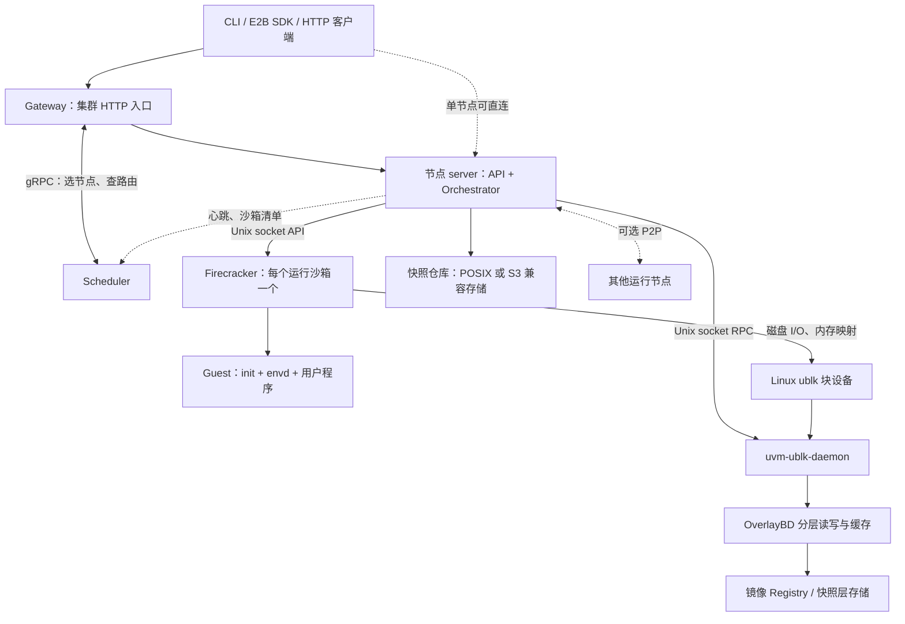
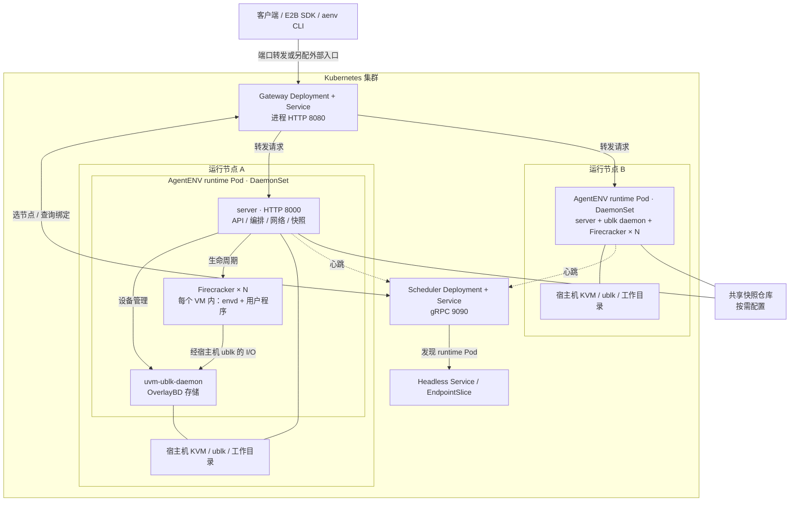

# AgentENV 架构分析

基于本地代码版本 `8ff079c`（workspace 版本 `0.2.2`）静态分析；未实际部署或测量性能。

**AgentENV 是面向 AI Agent 的有状态沙箱基础设施：以 Firecracker microVM 隔离执行，以 OverlayBD + ublk 统一承载磁盘和内存快照，再通过网关、调度器扩展到多节点。** 它负责环境的创建、执行、暂停、恢复和分叉，不负责模型推理或 Agent 决策。

## 1. 解决什么问题

| 问题 | 核心做法 |
|---|---|
| Agent 执行代码需要隔离，并需要命令、文件、终端等操作接口 | 每个运行沙箱使用独立 microVM，通过 guest 内的 envd 提供操作能力，对外提供 E2B 兼容 API |
| 环境镜像种类多，完整下载、解包和本地留存成本高 | OCI 镜像转换/解析为 OverlayBD 分层块镜像，按需读取远端数据，本地只保留有容量限制的缓存 |
| 环境闲置但仍占用 CPU、内存，重新启动又丢失上下文 | 保存 VM 状态、内存和磁盘增量，暂停释放运行资源，恢复时按需加载 |
| 同一环境需要并行试验、回滚和复用 | 共享不可变快照层，为新沙箱建立独立可写层，实现低复制成本的 fork |
| 单机容量不足，跨机器访问与分发复杂 | Gateway 统一入口，Scheduler 维护节点与路由绑定，共享仓库保存快照，可选 P2P 加速分发 |

## 2. 逻辑架构与模块



| 模块 | 主要代码 | 职责 |
|---|---|---|
| 客户端与 API | `crates/aenv/`、`src/api/` | CLI、鉴权、沙箱/模板/快照/卷 API；代理 guest 服务的 HTTP、SSE、WebSocket |
| 集群控制面（Go） | `services/gateway/`、`services/scheduler/` | 新建请求选节点，已有沙箱按 ID 路由；列表聚合、节点发现、心跳、P2P 制品位置索引 |
| 节点编排（Rust） | `src/orchestrator/` | 生命周期状态机、超时与自动回收、并发操作协调、暂停状态持久化及资源清理 |
| 沙箱运行时 | `src/sandbox/`、`tools-image/` | Firecracker 进程、guest 启动、envd 通信、网络隔离、附加磁盘；网络/块设备/Firecracker 预热池 |
| 镜像与模板 | `src/image/`、`src/template/` | OCI 镜像解析、层转换和缓存；构建并发布可复用模板，支持 Dockerfile/BuildKit 构建 |
| 快照与卷 | `src/snapshot/`、`src/volume.rs` | 快照提交与恢复、仓库后端、快照导出、持久卷及分叉；模板建立在快照机制之上 |
| 存储数据面 | `storage/overlaybd/`、`storage/ublk/`、`storage/ublk-daemon/`、`storage/util/` | 分层块映射、压缩、远程按需读取、io_uring I/O、ublk 设备管理 |
| 配套能力 | `src/p2p/`、`src/observability/`、`src/setup/`、`src/sandbox/custom_extension/` | 节点间制品传输、指标和心跳、依赖准备、生命周期扩展钩子 |

上述多数逻辑模块运行在同一个节点 `server` 进程中，并非各自独立的微服务。`thirdparty/envd/` 主要是 Rust 客户端集成；真正运行在 guest 中的 envd 由 `tools-image` 从上游构建。

## 3. 关键实现原理

### 创建与执行

1. 集群入口由 Gateway 调用 Scheduler 选择节点；当前策略为轮询或随机，可先按配置的资源阈值过滤节点。创建成功后记录“沙箱 ID → 节点”，后续请求直接查绑定。
2. 节点 Orchestrator 解析模板/快照、准备分层磁盘和网络，启动或领取预热的 Firecracker 进程。
3. 冷启动先从 tools 盘 `/dev/vda` 运行 init，再切换到用户 rootfs `/dev/vdb`；envd 就绪后提供命令执行、文件操作及交互流。快照启动则直接恢复已有 VM 状态。
4. 网络使用每沙箱独立 netns、TAP、veth 和 iptables；出站域名策略通过读取 HTTP Host/TLS SNI 的代理实施。入站服务通过节点反向代理访问。

### 分层磁盘与按需加载

读路径为 **guest → virtio 块设备 → 宿主机 ublk → daemon 内 OverlayBD → 本地缓存/远端层**。OverlayBD 根据块范围索引从上层向下层查找数据，写入只进入当前可写 upper 层。快照时封存 upper 为只读层，并建立新 upper，避免每次复制完整磁盘。

普通 OCI 镜像仍涉及首次层转换；按需加载不意味着任意原始镜像首次导入都没有下载、解包成本。转换产物与远端数据块缓存可复用。

### 内存快照、恢复与分叉

- **捕获：** 暂停 VM，保存 Firecracker 设备/CPU 状态；查询脏页或已驻留内存范围，通过 `process_vm_readv` 读取并生成 OverlayBD 内存增量层，同时捕获 rootfs 和附加盘状态。
- **恢复：** 将内存层堆叠为只读 ublk 设备，作为 Firecracker 的 `BackendType::File` 内存后端进行映射；首次访问触发按需读取，写入产生私有 COW 页。
- **共享：** 同一快照的多个沙箱可引用同一个内存块设备，复用宿主机页缓存；磁盘只读底层共享、可写层独立，形成分叉环境。
- **加速：** 预热池减少进程与设备创建开销，后台下载/P2P 减少后续缺页和远端读取成本。

当前主路径是 **ublk 支撑的内存恢复**；`storage/uffd-core/` 保留了另一种实现，但未列入 workspace 构建。

### 状态与持久化

需要区分三类数据：节点本地 RocksDB/文件保存暂停沙箱等元数据及状态；快照仓库保存已提交的可复用快照与层；本地缓存保存可重新获取的镜像/制品。默认仓库后端为 `posix_fs`，也支持 S3 兼容对象存储。

**本地 pause 不等于跨节点容灾。** 跨节点复用依赖可访问的共享仓库及兼容的 CPU/虚拟化配置；Kubernetes 的 hostPath 本身不提供共享存储。进程异常退出也不能保证保留尚未捕获的运行中状态。

## 4. 部署时实际有哪些进程

| 进程/服务 | 数量与位置 | 是否必需 |
|---|---|---|
| `server` | 每运行节点一个，默认 HTTP `8000` | 必需；包含 API、编排、网络管理、快照、P2P/指标等逻辑 |
| `uvm-ublk-daemon` | 每节点由 server 启动和监控 | 主存储路径必需；集中管理多个 ublk 设备，不是每块盘启动一个进程 |
| `firecracker` | 每个运行沙箱一个，另有预热池和内部构建 worker | 必需；宿主机进程承载独立 guest 内核 |
| guest `init`、`envd`、用户程序 | 每个已启动 guest 内 | 沙箱内部进程，不是宿主机的独立容器服务 |
| `gateway` | 集群入口，默认监听 `8080` | 多节点统一入口使用，单节点可省略 |
| `scheduler` | 集群控制面，默认 gRPC `9090` | 多节点使用，默认部署为单副本 |
| Registry / POSIX 共享存储 / 对象存储 | 外部依赖或既有基础设施 | 依镜像来源与仓库配置决定；不要求全部部署 |
| Redis | 外部服务 | 可选，只用于调度路由绑定；默认示例不部署 |
| BuildKit worker 内的 `buildkitd` | Dockerfile 构建时的内部 microVM | 按需；构建结束清理 worker，缓存通过卷快照复用 |

P2P、出站代理、指标采集和 RocksDB 都不要求独立服务进程。`containerd-plain-snapshotter/` 是附带工具，默认 microVM 运行链路不依赖它。

部署形态：

- **单节点：** systemd 或 Docker 启动 server，由它拉起 daemon 和 Firecracker；CLI 可在另一台机器运行。
- **Docker Compose：** 示例包含 Gateway、Scheduler、两个 runtime 容器，共享快照与鉴权卷；入口是宿主机 `8000 → Gateway:8080`。两个 runtime 容器不代表两台物理机器。
- **Kubernetes：** Gateway/Scheduler 用 Deployment，runtime 用特权 DaemonSet；Scheduler 通过 headless Service 的 EndpointSlice 发现节点。每个沙箱由节点内部启动 Firecracker，**并非每沙箱一个 Pod**。
- **宿主机条件：** 项目要求 Linux 6.8+、ublk/io_uring、默认 KVM 模式下的 `/dev/kvm`，以及网络命名空间等权限；PVM 为另一种配置路径。应使用 `config/deps_manifest.toml` 指定的 Firecracker、guest 内核和 tools 版本，尤其快照接口包含项目定制扩展。

## 5. K8S 部署组件与部署视图

**AgentENV 支持 K8S 部署。K8S 管理 AgentENV 服务 Pod，AgentENV 在 runtime Pod 内管理 Firecracker 沙箱；每个沙箱不是一个独立 Pod。**

| 组件 | K8S 部署形态 | 职责 |
|---|---|---|
| Gateway | Deployment + ClusterIP Service | 统一 HTTP 入口；请求调度、按沙箱 ID 转发、聚合查询 |
| Scheduler | Deployment + Service，默认单副本 | 选择 runtime 节点，维护沙箱与节点绑定，接收心跳 |
| AgentENV runtime | 特权 DaemonSet，每个符合条件的节点一个 Pod | 管理本节点沙箱、网络、镜像、快照和卷 |
| 节点发现 | Headless Service + EndpointSlice | Scheduler 动态发现就绪的 runtime Pod |
| 配置与权限 | ConfigMap、Secret、ServiceAccount、RBAC | 提供运行配置与密钥，授权读取节点发现信息 |
| 节点存储与设备 | hostPath 挂载工作目录和 `/dev` | 保存本地状态与缓存，访问 KVM、ublk 等宿主机设备 |
| 共享快照仓库 | 另行配置共享 POSIX 存储或 S3 兼容存储 | 支持跨节点复用已提交快照；hostPath 本身不共享 |

### 部署视图

下图展示逻辑部署关系；Gateway 和 Scheduler Pod 的实际节点位置由 K8S 决定。



### Pod 内进程与管理边界

一个 runtime Pod 内包含一个 `server` 主进程、由它启动的 `uvm-ublk-daemon`，以及多个 Firecracker 进程（运行沙箱、预热池或内部构建 worker）。`envd` 和用户程序运行在各自的 guest 中；OverlayBD 是存储实现，不是单独的 K8S 服务。

创建链路为 **Gateway → Scheduler 选择 runtime → runtime 创建 microVM**，无需新建 Pod。K8S 调度的是 Gateway、Scheduler 和 runtime 服务 Pod；AgentENV Scheduler 分配的是沙箱到 runtime 实例。

磁盘、网络也由 AgentENV 准备：存储组件将分层镜像暴露为虚拟磁盘，网络模块创建 netns/TAP/veth 并配置路由与策略。默认不会为每个沙箱申请 PVC，也不会为每个沙箱调用 CNI 创建 Pod 网卡。K8S 提供外层 Pod 网络、设备和目录挂载。

### 部署入口与必要配置

配置位于 [deploy/k8s](deploy/k8s)，关键清单为 [runtime DaemonSet](deploy/k8s/base/agentenv-daemonset.yaml)、[Gateway Deployment](deploy/k8s/base/gateway-deployment.yaml) 和 [Scheduler Deployment](deploy/k8s/base/scheduler-deployment.yaml)。

```bash
make k8s-render   # 渲染部署配置
make k8s-apply    # 应用到集群
```

宿主机需满足前述 Linux、KVM、ublk/io_uring 和权限要求。默认 Gateway Service 为 ClusterIP，对外访问需端口转发或另配入口；跨节点快照仓库也需按环境配置。K8S 可以重建服务 Pod，但不会自动迁移运行中的 VM；恢复取决于已持久化的状态和存储可用性。

## 6. 阅读与使用时的关键判断

1. **核心优势在存储与状态复用。** 磁盘和内存都分层、增量、按需加载，使大量异构环境与频繁暂停/分叉更经济；Gateway/Scheduler 主要解决横向扩展和请求定位。
2. **控制面不等于完整高可用系统。** 默认绑定在内存中，可由心跳重建；代码支持 Redis 绑定及 `--query-only` 查询实例，但节点观测和制品索引仍在内存，不能据此推断已实现全状态复制或自动 VM 故障迁移。
3. **以代码为准。** 现有 `docs/src/internals/architecture.md` 中“绑定全部仅在内存”等描述已落后于实现；当前 Scheduler 还维护 P2P 制品位置索引，实际字节传输仍发生在节点间。
4. README 的毫秒级启动/暂停、超分比例是项目给出的性能数据，本次未验证，不应视为任意镜像、硬件或远端存储条件下的保证。

源码入口：[节点启动](src/bin/server.rs) · [生命周期](src/orchestrator/service.rs) · [VM 运行时](src/sandbox/firecracker/sandbox.rs) · [快照捕获](src/sandbox/firecracker/overlaybd_snapshot.rs) · [存储守护进程](storage/ublk-daemon/src/client.rs) · [调度器启动](services/scheduler/cmd/main.go) · [默认配置](config/default.toml) · [Compose 部署](deploy/docker-compose.yml)
