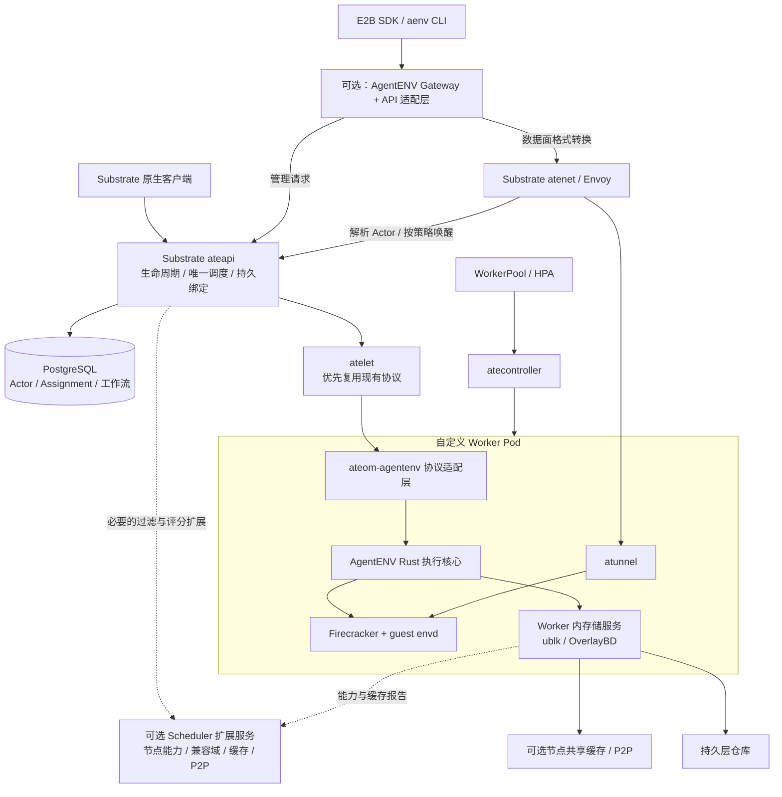

# AgentENV 作为 Substrate 执行后端：适配与集群能力扩展设计

版本 v2.3，修订日期：2026-10-08。基于本地 **AgentENV v0.2.3（`6cccaa7842bd5be2051111d4f74d9e37aa721244`）**、**Substrate v0.4.0（`756c2a53741121e728f4cc3066c8a19e575b4919`）** 的源码与部署配置分析，两个 checkout 在设计基线核对时均无工作区改动；本次实施已产生未提交源码修改。原文基线分别落后 9 和 227 个提交。第一轮 [Claude 评审](claude方案审视.md) 裁决见详细设计第 20 节；第二轮复核 [Claude 评审](claude审视-1.md) 的依据见详细设计第 21 节及 [Codex 回复 §8](codex审视.md#8-对-claude-第二轮评审的回复v21)，不将评审本身当作源码证据。v2.2 根据用户确认，明确最终交付为普通 K8S 上保留 AgentENV 现有主要功能及 SDK/API，允许配置专用工作节点和必要设备权限。仍采用“Substrate 新增 AgentENV 执行后端”路线；Gateway/Scheduler 优先评估独立运行与扩展接入，不要求将所有能力搬入 Substrate。继续遵循适配层优先、核心最小必要改动。以下目标架构现为已批准的实施目标，仓库仍没有完整融合实现；首批代码及组件测试状态见文末 v2.3 记录，尚未进行完整集成或性能验证。

详细的模块改动、适配协议、存储与生命周期实现、部署和验收见 [Substrate 与 AgentENV 软件实现设计](Substrate_AgentENV软件实现设计.md)。本文保留总体方案与可行性分析，具体开发拆分以详细设计中的阶段边界为准。

## 1. 结论

**“像支持 gVisor、microVM 一样，再支持 AgentENV”的思路基本成立，但准确对象是 AgentENV 执行栈，不是整个 AgentENV 集群。** AgentENV 是平台，Firecracker 才是 VMM；新增后端封装 Firecracker + OverlayBD + ublk + envd，并遵守 Substrate 的 Worker/Actor 生命周期协议。

> 最终目标：在普通 Kubernetes 集群中，通过 Substrate 管理 AgentENV 执行栈，保留现有主要用户功能与 SDK/API。用户已允许配置专用工作节点及必要设备权限。新增 `ateom-agentenv` 是执行接入方案；Gateway/API 兼容属于最终必需能力，Scheduler 信息/性能扩展仍可按需接入。保留服务进程与否不是判断标准，是否存在互相冲突的执行位置和生命周期权威才是。

实施仍可先接通原生 Actor → AgentENV Worker，再接入 Gateway/API 与业务能力；但原生后端跑通只是中间成果，不能替代最终用户功能验收。M1/M2/M3 是里程碑，不是三个互斥产品。以下类名、服务名和接口是建议设计，不是现成配置。

### 普通 K8S 的交付边界

- 采用标准 Kubernetes 资源及可安装扩展，不把 GKE/GCP 或自有 Kubernetes/kubelet fork 作为前提。控制面与普通服务按常规方式部署，执行 Worker 调度到具有 KVM、ublk/io_uring、网络/cgroup/设备能力的专用节点。
- 当前 Substrate 的 [kind 安装脚本](substrate/hack/create-kind-cluster.sh) 启用了 PodCertificateRequest、ClusterTrustBundle 等功能，相应 [部署清单](substrate/manifests/ate-install/ate-api-server.yaml) 使用证书投影。目标集群是否具备这些 API/投影须在 P0 检查；无法开启时必须适配证书分发/轮换并保留认证，不能因有 KVM 就宣称可直接安装。
- 交付可重复安装配置、节点准备/环境预检、PG/对象存储/镜像/身份/入口的通用配置，以及升级、备份恢复、受控缩容和故障诊断流程；通过用户目标集群实测，不仅验证 kind demo。
- 原版已实现的主要沙箱、命令/终端、文件、网络、暂停/快照/恢复、fork、模板/构建、卷、超时/指标和扩展接口纳入最终验收；固定 E2B Python/TypeScript SDK 与 aenv CLI 的基线版本。现阶段返回 UNSUPPORTED 的必需能力继续实现，不能凭“已声明限制”算最终交付完成。

详细环境边界、11 个功能组及验收步骤见软件实现设计 §1.3、§14.3、§17.4。工作节点权限已经确认；具体 Kubernetes/CRI/CNI、硬件及控制面能力由 P0 采集。功能范围以 AgentENV 当前 tag 的实际实现为基线，不外推为 E2B 云平台全部 API 或未来版本全部能力。

### “运行在 Substrate 上”的三个不同含义

| 形态 | 是否可行 | 是否符合本方案目标 |
|---|---|---|
| AgentENV 执行栈实现 Ateom 协议，成为 Worker 后端 | 可行但需适配与有限核心修改 | **推荐主线**：Actor 真正由 Substrate 管理，沙箱在对应 Worker 内运行 |
| Gateway/Scheduler 作为 K8S Deployment 与 Substrate 一起部署 | 服务可独立部署；要参与同一 Actor 管理仍需协议适配 | 推荐作为控制面扩展的承载方式；同集群部署本身不等于功能接入 |
| 把 Gateway/Scheduler 或完整 runtime 当普通 Actor 托管 | 普通服务有条件可运行；完整 runtime 还涉及嵌套虚拟化/设备权限 | 不推荐作为平台核心依赖：存在暂停、寻址和引导依赖问题，且不自动获得后端集成 |

### 新后端的建模选择

当前 `sandboxClass` 只接受 `gvisor` / `microvm`，其中 microvm 实现绑定 Kata + Cloud Hypervisor。不能只写 `sandboxClass: agentenv` 就运行。

- **首选：增加独立 `agentenv`（或 `firecracker`）类及 `ateom-agentenv` 镜像。** 对类型/校验、资产准备、Worker 设备形态和快照识别做有限修改；类名用于后端与快照隔离，不表示 AgentENV 是新的虚拟化技术。
- **另一种：在 microvm 下增加 provider。** 语义更细，但需要 Worker、模板、SandboxConfig、快照和调度都携带 provider，未必比新增类改动少；没有多 provider 的明确需求时不先建设通用框架。
- **M1 用 `maxActors=1` 收敛验证面；M2 优先验证有界多 Actor Worker。** 当前原生 gvisor/microvm 已支持多个 Actor、独立网络会话和 per-actor cgroup；单 Actor 是本项目起步策略，不是上游限制。执行服务从第一版按 Actor UID 建会话表，生命周期锁按 Actor 分配。
- **M1 采用 Worker 内设备管理服务/ublk daemon；M2 首选 Worker 内多 Actor 共享，节点服务先只共享不可变层缓存。** 跨 Pod 共享设备的节点 broker 为有收益证据后的可选部署形态，不再是后端闭环的前置条件。设备权限问题两种形态都必须验证。完整 ADR 见详细设计 §1.2。

### Gateway / Scheduler 能否直接运行及如何扩展

| 组件 | 原样运行的结果 | 推荐接法 |
|---|---|---|
| AgentENV Gateway | 仍调用旧 Scheduler、把管理请求转发旧 runtime；不会自动调用 Substrate 创建 Actor | 保留为独立入口 Deployment，修改后端连接或增加协议适配服务；管理请求转 Substrate API，数据面复用 atenet/atunnel |
| AgentENV Scheduler | 仍选择节点并维护沙箱→节点绑定，与 Substrate Worker 分配产生两套位置来源 | 首期不参与最终分配；可保留/裁剪为节点能力、CPU 兼容、P2P 目录服务，后续提供候选建议或评分 |
| AgentENV runtime | 原样由自己的 Orchestrator 决定生命周期，与 Substrate 工作流冲突；多 VM 本身已不与 Worker 模型冲突 | 抽取执行核心，M1 限制一个 Actor，后续受控多 Actor；禁用旧自主编排，VMM 归属 Worker 下对应 Actor cgroup |

Gateway 尽量原样保留时，可以实验“兼容代理服务同时实现旧 Scheduler RPC 和旧 runtime HTTP”来承接其请求。但这要求模拟完整旧协议与生命周期，并正确处理创建后 RecordAssignment、长连接和构建路由，可能比修改 Gateway 的上游接口更复杂。因此以 API 契约兼容为目标，不强求保留二进制零改动。

Scheduler 若继续以原进程提供查询能力，旧 `Schedule` / `RecordAssignment` 不得再作为融合 Actor 的分配权威；绑定查询应投影自 Substrate。建议仅暴露所需信息接口，最终候选筛选、容量预留和 Assignment 提交仍由 Substrate 完成。若把它作为策略服务，Substrate 需一个小范围调用点：提交候选 Worker 及节点信息，取回约束/评分结果后再校验与事务绑定；不是先选 Node 再启动第二轮独立调度。

### 实施原则

**不是要求 Substrate 一行不改，而是尽量不把 AgentENV 的实现搬进 Substrate 核心。** 优先级为：现有 API/配置 → 外部适配层 → 小范围扩展接口 → 确有必要的核心逻辑修改。

- 协议、身份格式、参数和错误码转换放在适配层；存储数据路径、缓存与 P2P 放在执行/节点服务。
- Actor 状态、Worker 分配、原子容量校验和生命周期转换由 Substrate 统一负责，不能为了少改源码而在外部再造一套权威状态机。
- 调度扩展只接入必要的约束和评分；节点能力和缓存信息由外部采集。扩展接口是拟新增设计，不是假设 Substrate 已有通用插件体系。
- 不追求减少进程数量。Gateway/Scheduler 可以保留为独立扩展服务，但不能绕过 Substrate 为同一 Actor 建立第二套分配与生命周期权威。

## 2. 首先澄清：“与 K8S 更深结合”具体是什么

| 维度 | AgentENV 当前实现 | Substrate 当前实现 |
|---|---|---|
| 执行容量 | 每节点一个 runtime DaemonSet Pod，内部运行多个 VM | WorkerPool CRD → Controller → Deployment → 多个预备 Worker Pod |
| 活动实例 | 多个沙箱由一个 runtime 管理 | 原生 Worker 支持多 Actor，`--max-actors` 默认 1000；仍同时受 CPU/内存容量约束，此默认值不是可运行 1000 台 VM 的保证 |
| K8S 调度粒度 | 节点服务 Pod | 执行容量 Worker Pod，可配置 requests/limits、亲和性、优先级等 |
| 动态任务调度 | AgentENV Scheduler 选节点 | Substrate 控制面选满足槽位与资源容量的 Worker；同样绕过 kube-scheduler 的逐任务调度 |
| 状态模型 | 节点生命周期状态 + 本地持久化 + 快照仓库 | Actor/Worker/ActorTemplate 存 PostgreSQL；WorkerPool/SandboxConfig 等是 K8S 资源 |
| 扩缩容 | 当前示例以节点 DaemonSet 为主 | WorkerPool 有 scale 接口，仓库提供通过指标接 HPA 的示例；仍需安装和配置指标链路 |
| 网络治理 | AgentENV 管 netns/TAP/veth、iptables、入站代理 | Worker Pod 外层网络 + 内部沙箱网络 + atunnel/atenet 的 Actor 身份与路由 |
| 持久卷 | 自有分层卷和快照管理 | 可引用 StorageClass，通过 CSIDriverConfig 直接调用 CSI；**不是每 Actor 创建 PVC/PV** |

因此，Substrate 更深地接入了 **K8S 执行容量与基础设施管理**，但 Actor 不是 Pod/CRD，暂停恢复也不是 kubelet 原生操作。不能把目标理解成“迁过去以后存储、网络和快照都由 K8S 自动解决”。

## 3. 路线选择（以新增 AgentENV 后端为主线）

| 路线 | 保留什么 | 主要代价 | 判断 |
|---|---|---|---|
| A. 业务迁移到 Substrate 现有 gVisor / microVM | 业务镜像、文件数据；按需新增 E2B 接口兼容层 | 替换执行/快照体系，重建模板，验证 SDK、命令、终端、卷和网络语义 | 适合不依赖 AgentENV 存储与快照优势的场景 |
| B. 新增 AgentENV 后端 + 按需集群扩展 | AgentENV 执行存储栈；可继续使用 Gateway，并按需保留 Scheduler 辅助能力 | Ateom 适配和后端登记先行；入口及策略扩展随后接入 | **本方案确定的目标路线** |
| C. AgentENV 增加 K8S Operator/资源模型 | 基本保留现有系统 | 新建 CRD/控制器、容量指标与运维流程；不会自动变成 Substrate 的 Worker 模型 | 如果诉求只是 K8S 管理便利，应优先评估 |

仅将完整 AgentENV server 放到普通 Substrate Actor 里，会形成“沙箱内部再管理沙箱”，涉及嵌套虚拟化、权限和双重生命周期；既不自然获得 Worker 级资源治理，也增加故障复杂度，不建议作为目标架构。

## 4. 后端接入与可选控制面扩展

### 4.1 目标部署视图

以下为拟实现架构，模块名称不代表仓库已有这些独立组件。

最终部署包含：外部 API 兼容服务、现有 atenet/ateapi/atecontroller/atelet、自定义 Worker Pods，以及按需部署的节点缓存/辅助服务和持久化依赖。Substrate 原生入口继续保留；兼容层与原生入口共享同一 Actor 状态和位置来源。

AgentENV Gateway 可作为独立入口保留，协议兼容逻辑通过内部改造或外部适配完成，通用数据面优先复用 atenet。AgentENV Scheduler 的调度/绑定职责由 Substrate 接管，资源采集、CPU 兼容计算和 P2P 目录拆到辅助服务；只有必须影响分配决策的部分通过小范围核心扩展接入。原 runtime 拆成 Worker 内执行核心与存储会话服务；节点共享缓存与跨 Pod 设备 broker 分开决策。

### 4.2 Gateway 如何融合

| AgentENV Gateway 当前能力 | 融合位置 | 改造方式 |
|---|---|---|
| E2B/AgentENV HTTP 路径、参数、错误响应 | 统一入口的兼容适配层 | 将管理请求翻译成统一控制面操作；保留客户端契约，不再把管理请求直接代理到旧 runtime |
| header、域名、路径中的沙箱 ID 解析 | 外部前置适配，必要时小范围 ext_proc 扩展 | 将外部 ID 转为 Actor 身份与目标端口，复用现有解析测试；清除外部伪造的内部身份字段 |
| `Schedule` / `LookupNode` | ateapi 的创建/恢复工作流及位置解析 | 入口不独立选节点；已有 Actor 通过同一工作流查询或按策略唤醒 |
| 创建成功后 `RecordAssignment` | PostgreSQL Assignment 与工作流 | 删除“从 HTTP 响应提取 ID 后补写路由”的权威写入方式；控制面先保留容量，再执行、确认就绪 |
| HTTP/SSE/WebSocket 与 envd 流式代理 | atenet/Envoy → atunnel → guest | 复用 Actor 路由与隧道；补齐和验证 E2B Connect-RPC、双向流、PTY、断开取消等兼容语义 |
| 多节点列表聚合 | ateapi 的持久记录与观测视图 | 生命周期列表不再全节点扇出；实时指标走采样视图，并标记采样时间与缺失节点 |
| API key / 沙箱 token | 统一身份与授权适配 | 管理身份、沙箱访问 token 分开处理；显式映射到允许的 Actor/atespace/操作 |
| 模板、构建、快照、卷请求路由 | 外部兼容业务服务 + 现有 ateapi | 优先编排现有 API；涉及生命周期原子性或缺失契约时再扩展核心，不能只兼容 `/sandboxes` 就声称覆盖全部 API |

需要补充的重要语义：AgentENV 创建 API 常要求返回可用沙箱；Substrate `CreateActor` 可先产生 suspended 记录。因此兼容入口应执行“创建记录 + Resume + 等待就绪”，并有幂等请求 ID、超时查询和失败清理，不能把仅创建记录当成沙箱已启动。

**现有 Substrate 身份认证不等于完整权限系统。** v0.4.0 已落地默认关闭的实验性 OpenFGA，Actor/ActorTemplate 等已登记 CRUD 有授权检查，但 Resume/Pause/Suspend/Revert/Tag 等尚未登记；旧 `docs/authentication.md` 的无授权描述已滞后。融合入口仍须完整校验作用域，并逐步对齐原生 principal/关系；atespace 名称、E2B ID 或 Kubernetes RBAC 不能代替 Actor 授权。数据面按 envd/traffic token 与公开端口策略校验，不能误要求所有请求携带管理 API key。

### 4.3 Scheduler 如何融合

AgentENV Scheduler 是一个独立 Go 服务；Substrate 的调度已在 ateapi 内部。两边都用 Go，算法和测试有复用机会，但持久化模型、身份和指标仍需转换。首期直接使用 Substrate 调度；外部服务提供资源/兼容信息，不调用旧 Scheduler 先行定节点。

| AgentENV Scheduler 当前能力 | 融合目标 | 处理原则 |
|---|---|---|
| 节点轮询/随机选择、资源阈值过滤 | ateapi `scheduling` 的候选过滤/评分 | 基本单位变为 Worker，同时检查所在 Node 的共享资源；不再先由旧 Scheduler 定节点、再由 Substrate 二次调度 |
| 沙箱 → 节点绑定，内存/可选 Redis | Actor → Worker → Node 的持久 Assignment | PostgreSQL 为唯一权威；旧 Redis 仅可作失效可控的缓存或迁移读取源，不双写成另一权威 |
| EndpointSlice 节点发现 | atelet/Worker 注册与 K8S 控制器 | WorkerPod UID 是执行身份，Node UID 是宿主身份；Pod IP 只作可变地址，不直接作为稳定身份 |
| 心跳、生命周期事件、节点资源指标 | 外部节点采集服务；必要时扩展 atelet 报告 | 保留 CPU/内存、启动压力、暂停状态、磁盘与服务代际；心跳用于观测和对账，不覆盖控制面的分配结果 |
| CPU 配置求交与返回 | 后端能力/兼容域服务 | 复用求交逻辑，按硬件/运行时兼容域维护；快照记录兼容版本，不能随集群节点变化静默改变旧快照要求 |
| P2P peer 与 artifact 位置索引 | 外部制品目录服务，优先不内嵌 ateapi | 保留查询/发布/撤销能力；可重建、有 TTL，失效后回源持久仓库；不把 artifact 字节写入 PostgreSQL |
| 暂停资源计数、drain 状态 | 控制面资源模型与节点观测 | 区分已释放的 CPU/RAM、逻辑恢复需求和仍占用的磁盘；停止新分配时仍允许清理与已有路由 |

拟议统一调度流程：

1. **硬约束过滤：** sandbox backend、WorkerPool/标签、Actor 资源规格、Worker 可用容量、KVM/PVM/CPU 兼容；本地 pause 通过 `RequiredNodes` 固定可恢复节点。
2. **节点准入：** 检查 heartbeat 新鲜度、drain、节点内存压力、磁盘/ublk 容量与启动并发。共享资源的预留需要节点维度协调或受控准入，不能只靠滞后的心跳。
3. **候选选择：** 当前 Substrate 是 power-of-two-choices：随机抽取两个合格 Worker，比较 Actor 槽位与已分配 CPU/内存的主导利用率，选择较轻者。M1 直接复用；M3 将缓存评分作为受负载约束的择优信号，信息缺失退回此算法。AgentENV 两种策略仍忽略镜像 hint，两侧都不能宣称已有缓存感知调度。
4. **原子绑定：** 复用 Substrate `BindActorToWorker` 的事务锁、唯一 Actor 绑定与容量校验；冲突重新选取。数据库事务不跨 VM 启动或远端下载持有。
5. **执行确认：** 由 atelet/后端执行；就绪后发布可路由状态，按失败阶段对账后释放预留。atenet 入站唤醒已有有限 request parking（默认重试预算 5s、容量 1024），但它不是 ateapi 的持久任务队列，也不自动覆盖 bridge 的直接 Create/Resume 调用；后者另设幂等、期限和查询结果。HPA 异步补容量。

K8S 仍负责将 Worker Pod 放置到节点，融合调度器选择已有 Worker。缓存评分只能在现有容量上择优；如要影响新 Pod 的节点位置，应由池控制器配置亲和性等机制，不能假设 Actor 调度会移动已经运行的 Worker Pod。

### 4.4 状态权威和运行边界

| 数据/决策 | 唯一权威 | 可重建视图 |
|---|---|---|
| Actor 状态、当前 Worker、核心操作进度 | ateapi + PostgreSQL | 网关路由缓存、旧接口查询结果 |
| 外部沙箱 ID、兼容请求幂等映射 | 适配层持久映射（优先复用现有 metadata/确定性身份） | 仅关联 Actor UID，不保存另一份可独立修改的运行位置 |
| WorkerPool 期望容量、Pod 身份与位置 | K8S；控制面登记执行容量与占用 | atelet Worker 观测缓存 |
| 快照 manifest、共享层所有权/保留引用 | 统一快照目录；制品在持久仓库 | 节点缓存、P2P 位置索引 |
| VM 进程、ublk 设备的实际存在状态 | 执行后端/节点存储服务观测，交控制面对账 | 节点心跳 |

先核对并复用既有操作/资源版本与重试机制；只在现有契约不足时，增加操作 ID、Assignment 代际与后端 fencing 校验，阻止旧 Worker/延迟 RPC 修改新分配；网络分区时未经确认停机或有效隔离，不能仅凭心跳过期就在别处启动第二份同一 Actor。控制面重启后由持久工作流和节点对账恢复，不让节点沙箱清单自行重建另一套权威路由。

当前已有多 Actor 执行路径，`actorsPerAteom` 所在旧文件已删除；proto 中个别“at most one”注释尚未同步，应以 `hosted.go` 与容量注册实现为准。M1 上限为 1，M2 在同一受控 executor 中渐进提高上限；不启动旧 Orchestrator 形成第二生命周期权威。

**多 Actor 不等于内存超分。** 当前 Worker 由 Pod limits 上报容量，调度/绑定按 ActorTemplate limits 累加扣减，不能把共享 page cache 的实际节省自动转为更多逻辑 VM 容量。K8S 按 requests 放置 Pod，并非按 limits 总和放置。M2 先证明同 Worker 共享、固定开销与密度收益；若要恢复 standalone 的统计超分，必须另立 guest 配置容量、调度预留和物理限额的模型，配套准入/OOM/balloon 策略，禁止通过虚报容量绕过上限。

### 4.5 端到端流程

- **创建：** E2B/原生入口 → 统一 Actor/模板服务 → Worker 过滤与事务预留 → atelet → AgentENV 后端启动 → envd 就绪 → 提交可用状态 → 返回 ID。响应丢失后以幂等键查询原操作，不重复创建。
- **执行命令：** 入口校验身份并解析 Actor → 获取有效 Assignment（如需唤醒则走 Resume 工作流）→ atenet/atunnel → envd。SSE/PTY/长连接走数据面，不经过调度器转发；有副作用的命令不因路由失败而盲目自动重放。
- **暂停/恢复：** 统一控制面冻结状态转换 → 后端捕获 → 根据 pause/suspend 选择本地保留或持久提交 → 清理执行并释放 Worker。恢复重新分配并更新路由代际；旧流关闭后的续接由协议定义，不承诺迁移已有 TCP 状态。
- **fork：** 统一控制面记录源快照及子 Actor，保留父层引用，并为每个子 Actor 独立分配 Worker。AgentENV 原 fork 方法会直接启动孩子，必须拆分“源状态捕获”和“子实例启动”，不能绕过 Substrate 私下创建子 VM。部分成功通过每个子操作状态返回。
- **drain（需实现并验收）：** 先禁止新分配，通过控制面逐 Actor Suspend，确认 durable 提交与清理，再允许 Pod 退出/目标恢复。原生 microvm 的 SIGTERM 主要向 guest 发送终止信号并等待正在进行的 checkpoint，**不自动为所有 Actor 发起持久快照**；AgentENV standalone 的 shutdown pause-all 也只产生本地恢复状态，不能原样替代此流程。
- **崩溃：** Worker Pod 消失或 Worker epoch 更新触发受影响 Actor CRASHED，不存在自动迁移；网络分区不等同于已证明旧 VM 消失。经 fencing 后可用 RevertActor → Resume 回到最近有效持久快照；无该快照时只能明确报告状态丢失/重建，不能把冷启动当恢复。

## 5. 真正需要改造的地方

### 5.1 执行协议：有接口，但不是现成插件

Substrate 的 [Ateom gRPC 协议](substrate/internal/proto/ateompb/ateom.proto) 提供 `RunWorkload`、`CheckpointWorkload`、`RestoreWorkload`、`TerminateWorkload` 和统计接口，可以新增 `ateom-agentenv` 实现。

AgentENV 的 [SandboxBackend](AgentENV/src/sandbox/backend.rs) 已有 start/pause/resume/stop/snapshot/fork 等边界，可作为抽取起点。适配器可通过本地 RPC 调用 Rust 执行服务，避免把整个 Rust 存储核心移植为 Go。

但还要处理：Worker 重用时彻底清理前一个 Actor；RPC 重试/取消的幂等性；Pod 终止与快照上传失败；Actor UID、沙箱 ID、模板和资源规格的映射。Substrate 的 Checkpoint 会清理目标 Actor 执行实例并释放其槽位（多 Actor 时不能清空整个 Worker），而 AgentENV 的 snapshot 会暂停捕获后恢复源实例，不能简单一一改名。LOCAL/EXTERNAL 是 ateapi→atelet 的去向，FULL/DATA 是捕获内容，两者不是同一维度；当前 pause/suspend 均使用 `SnapshotConfig.on_commit`。

WorkerPool 虽允许指定 `workerImage`，class 校验仅列出 gVisor/microVM，且有类型相关资源/资产处理。独立 `agentenv` 路线已确认必须改 class、proto 校验上限及 Pod 形态等入口，详见 S1/S2；可复用的资产下载、身份与隧道实现继续复用。不得让 Firecracker 快照进入 Cloud Hypervisor 恢复路径，也不为新增后端先建设完整通用插件框架。

### 5.2 快照与存储：最大改造点

| 项目 | AgentENV | Substrate 当前 microVM |
|---|---|---|
| VMM | 项目定制 Firecracker | Kata guest + Cloud Hypervisor |
| 磁盘 | OverlayBD 块层，通过 ublk 暴露 | 宿主机 overlay rootfs，通过 virtio-fs 提供给 guest |
| 内存恢复 | 分层内存 ublk 设备映射、按需读取、COW | Cloud Hypervisor 快照 + userfaultfd demand paging |
| 文件系统快照 | 封存 upper 为可复用增量层 | rootfs upper / DurableDir 打包为 tar，和 VM 快照一起管理 |
| 快照搬运 | 自有层仓库、引用、缓存和可选 P2P | ateom 返回文件清单，由 atelet 保存/搬运到快照存储 |

**现有 Firecracker 的内存/设备快照不能直接交给 gVisor 或 Cloud Hypervisor 恢复。** 路线 A 应重新创建模板与运行实例，迁移应用文件或导出的 rootfs；内存状态不能无损跨 VMM 转换。

路线 B 可保留 Firecracker 格式，但要适配 Substrate 快照资产与存储流程：

- 最初可导出包含全部必要文件/层的独立快照包，验证恢复正确性；但复制、上传完整依赖可能失去增量优势。
- 目标应采用“快照 manifest + 不可变层引用”的方式，优先由适配器/存储服务理解远端层，atelet 只搬运已约定的 manifest 等制品；若现有清理、恢复契约不满足引用完整性，再最小扩展 atelet，以支持惰性读取；**这需要实现，当前协议不会自动处理外部层依赖。**
- 层引用计数、tag/fork 保留、GC、删除与失败回滚必须统一。不能让 Substrate 删除某个 Actor 的快照前缀时误删其他子快照依赖的层，也不能只保存引用而不保证层已持久化。
- 区分节点本地 pause 与可跨节点 suspend；保存 runtime/内核/tools 版本及 CPU、KVM/PVM 兼容信息。
- EXTERNAL 上传普通失败按当前错误分类会使 Actor CRASHED；传输中断/超时则可能保留转换态、效果未知。M1 不承诺“本地包留存后可透明重试”；新增持久暂存日志是后续明确开发项。PAUSED→SUSPENDED 复用 `UploadPausedCheckpoint`。
- CSI 外部卷的数据并不会自动纳入 Actor 内存/rootfs 快照；AgentENV 卷映射为 CSI 后，不应默认保留其原有瞬时 fork/回滚语义。

### 5.3 网络：需要重新接线

AgentENV 原网络模块假定自己管理节点上的地址池、netns、TAP/veth 与 iptables；Substrate 在 Worker Pod 边界内组织 Actor 网络，并通过 atunnel 承载身份和访问。

目标应让 Firecracker 的 TAP 接入 Substrate Worker 的 per-actor 网络，复用进程内 `ateomtunnel`/`atunnel` 库的路由、证书与策略。不能同时保留两套地址分配和防火墙，把旧 host-interaction IP 当作可跨节点的 Actor 地址。

需要验证 envd 命令/文件接口、流式输出、PTY、WebSocket 和端口代理在新路由中的行为。Substrate 文档中的任意端口入口目前限定 HTTP(S) 隧道，不等于通用裸 TCP 入口；原业务协议需逐项检查。恢复迁移还应验证 MAC/IP、MTU、DNS、旧连接和证书更新，不能承诺所有已建立连接无感保留。

### 5.4 Pod 资源和设备：决定是否真的获得 K8S 治理

要让 K8S 的 Worker requests/limits 有意义，Firecracker 应运行在对应 Worker 的 cgroup 下；若适配器只是远程调用宿主机旧 server 创建 VM，CPU/内存可能仍记在节点 daemon 所在 cgroup，Worker Pod 的资源限制会失真。

Substrate 当前 microVM 通过 device plugin 申请 KVM，worker 并非简单的全特权容器。AgentENV 额外需要动态 ublk 设备访问、io_uring 和相关 capability：需明确设备 cgroup 放行、设备分配/回收、共享 daemon RPC 权限。不能认为获得 `/dev/kvm` 就满足全部条件。

Worker 内 daemon 计入 Pod 固定/共享开销；若外置节点 broker，其 I/O 和缓存开销另行预算。多 Actor 只减少跨 Pod 设备分发需求，Firecracker 仍须在自身容器内打开 ublk 块设备，CDI/DRA 名称本身不证明动态设备已可用。HPA 指标应反映真实占用及排队。缩容时需先停止分配，再完成 Actor suspend 和 Worker 清理；强杀 Pod 的恢复上限仍是最近一次成功持久化的状态。

### 5.5 代码改动归属与最小扩展清单

| 能力 | 优先落点 | 何时才改 Substrate |
|---|---|---|
| E2B API、鉴权格式、ID、错误码 | 外部 API 适配层 | 现有接口无法安全传递身份/目标端口，或无法表达必要业务操作时 |
| Run/Checkpoint/Restore/Terminate/Stats | 自定义 Ateom Worker + AgentENV 服务 | 后端类型、资产、设备或运行结果无法通过现有契约表示时 |
| 根盘、内存分层、缓存、P2P | AgentENV 执行/节点存储服务 | 快照搬运或清理会破坏外部层引用，必须增加 manifest/保留与释放契约时 |
| CPU 兼容计算、节点指标 | 固定 CPU domain；优先沿 `HardwareIdentity` 扩展，M1 用可信池标签及执行端双重校验 | 当前仅上报 architecture，`hardware.Matches` 未接入调度，也无完整快照硬件要求链；需补采集、持久化、过滤/绑定复核，不能仅新增字段 |
| 缓存热度与恢复代价评分 | 外部提供数据，Substrate 内做最终选择 | 新增有限的过滤/评分接入点；不要求外部服务返回最终分配 |
| 模板构建、fork 等业务编排 | 适配层调用现有 Actor/模板 API | 无法保证快照保留、子 Actor 操作幂等和生命周期一致性时 |
| 分配事务、冲突、旧请求隔离 | Substrate 现有工作流与存储 | 仅补缺失的准入/版本契约，绝不外移为第二套 Scheduler |

调度扩展建议先做显式、窄范围接口，不建设通用插件平台。评分尽量读缓存快照，设置数据新鲜度与调用超时；可选缓存热度缺失时回退基础策略，CPU/后端不兼容等硬约束不能回退放行。候选评分不等于资源预留，最终 Worker 占用仍由 Substrate 事务确认；共享 Node 资源若需强保证，则必须增加协调机制或明确的后端准入与失败释放流程。

每个核心补丁需说明“现有 API 为什么不够、为什么不能在适配层安全完成”，并配套契约测试。节点信息/P2P 的服务实现不反向依赖 Substrate 内部存储结构，以减少后续上游升级成本。

## 6. 融合落地顺序与验收

| 阶段 | 限定范围 | 必须通过的检查 |
|---|---|---|
| 1. 原生基线 | 相同硬件、镜像和负载，分别运行现有两个系统 | 比较冷启动、恢复、暂停、磁盘写入后快照耗时、并发密度与实际内存；不用 README 数字代替实测 |
| 2. M1a 本地闭环 | 新后端类型、maxActors=1、Full 独立包、Worker 内设备服务 | 单节点原生 API Run → Pause/Suspend → Resume → Delete；验证资产、设备、网络与槽位重用，仅为中间成果 |
| 3. M1b 跨节点恢复 | 两台兼容节点，独立包对象存储；通过 suspend 释放源 Worker | 在另一节点恢复文件及内存；删除源 Pod 后依赖仍完整，网络与身份正确；此项是 M1 最终门槛 |
| 4. 贯穿 M1/M2 的治理与故障验证 | 资源限制、上传失败、重复 RPC、Pod 退出与安全 drain | 无双实例/数据串用；旧代际 RPC 被拒绝；实验特权和生产权限分开验收，自动缩容另过 drain 门槛 |
| 5. M2 多 Actor/存储 | 有界多 Actor、共享层引用与可选节点缓存 | 设备共享率、密度与开销预算达标；GC 不删活数据，不虚报统计超分 |
| 6. M2 Gateway/API 适配 | 保留或改造 Gateway，bridge 调 Substrate API | ID/鉴权/错误码/幂等及 SDK/CLI 契约通过；只有一套 Assignment，数据面私有访问策略不丢失 |
| 7. M3 用户功能补齐 | 必需：fork/在线快照、卷、构建、现有网络策略与 API 扩展；可选：CPU 匹配增强/缓存评分/P2P | 必需项对照原版验收，无第二分配权威；共享引用与恢复兼容性正确 |
| 8. 普通 K8S 最终交付 | 从 P0 并行建设安装/预检/证书兼容与运维，汇总 M1–M3 必需成果 | 用户目标集群安装成功，主要 SDK/API 功能、跨节点持久恢复、权限与资源隔离、升级/备份/drain 全链路通过 |

PoC 的决策标准应同时包括：**K8S 确实管理执行容量、Substrate 是唯一状态权威、跨 Worker 恢复正确、AgentENV 的关键性能优势没有被快照搬运抵消。** 若仅得到“Worker Pod 远程控制旧 runtime”，只能算控制接口桥接，尚未完成执行资源整合。

### 迁移和回退边界

以新 Actor/新模板或独立 WorkerPool 灰度，不让同一 Actor 同时由两套控制面管理。旧集群保留旧实例；需迁移时先成功 suspend、固定快照与身份映射，再切换唯一所有权。路由可影子比对，执行和分配写入不双发。回退只允许在停止新端实例并确认旧端能读取对应快照后进行，不能仅切换 DNS 就恢复旧 Scheduler。

分层验收：首先证明 Substrate 原生 API 能驱动 AgentENV 后端；然后验证接入后的 Gateway 能满足选定的 E2B 接口；最后验证 Scheduler 扩展不产生第二套分配权威。无需以关闭 Gateway/Scheduler 进程为验收条件。启用 fork、模板构建、卷等扩展后分别验收；控制面重启、重复请求和网络分区不能产生双实例或错误路由。

## 7. 最终方案

**最终目标是在普通 K8S 集群中正常使用 AgentENV 的现有主要功能及 SDK/API，由 Substrate 支持 AgentENV 后端并统一管理生命周期。** 首期实现后端身份、Worker 生命周期、网络、快照与设备配置；第二期接入现有客户端与共享层；随后补齐 fork、构建、卷及网络/API 契约。通用安装和运维从 P0 并行推进，Scheduler 节点信息/评分与 P2P 性能优化按需接入。Substrate 始终负责最终分配、持久 Assignment 和 Actor 生命周期。

继续遵循适配层优先、核心最小必要改动，不要求零修改，不要求取消原组件进程，也不要求把两个平台的全部代码合为一体。后端最小闭环、用户功能与普通 K8S 运维分别验收；最终功能通过不等于所有性能优化已完成，M2 子集通过也不等于用户最终目标已完成。

项目成熟度也应纳入成本：[本地 Substrate 开发约束](substrate/AGENTS.md) 明确 pre-1.0 不保证兼容，不应默认依赖新旧控制面/proto 滚动兼容。固定成套发布，协议跨版本用独立安装或协调停机升级；若另行建设兼容桥，其成本单列。详细设计 §16 给出按工程人周估算的任务依赖与上游维护策略，估算不是已经验证的工期承诺。

v2.2 已将普通 K8S 交付列为 P8，并将现有主要用户能力的补齐列为最终必需工作。原 M1/M2 估算只是阶段预算；完整交付须在 P0 明确证书兼容、最终 API 契约和部署环境后重新估算，不能把前两阶段预算当作全部工期。

### 本次复核后新增的边界

- ateapi 已在 gRPC 入口以 mTLS/Bearer 验证身份；OpenFGA 实验开关默认关闭，注册表当前未覆盖 Resume/Pause/Suspend/Revert/Tag 等 RPC。缺口是已认证主体的对象级越权风险，不是匿名可调；部分 handler（如 RegisterWorker）另有身份/Node 校验。bridge 的完整授权仍必需，不能把开启开关当作完成多租户治理。
- 移除旧 runtime HTTP 后，须迁移 `secure`/`x-access-token` 与 `allowPublicTraffic`/`e2b-traffic-access-token` 校验，并在触发自动唤醒前执行；路由 header 和 mTLS 不替代用户授权。
- envd 已有恢复身份覆盖、MMDS 更新、health 后 init。复用这些机制；同一外部 sandbox 恢复保持其 token 契约，克隆/同名重建使用新身份。共享全局 seed 不是唯一方案，可由受限 TokenProvider 下发本 Actor 凭据。
- E2B `allowOut` 支持域名/IP/CIDR，`denyOut` 仅 IP/CIDR，且有允许优先规则；Substrate 的 hostname/protocol allow policy 无法直接等价表达全部语义。M1 用平台固定出站策略；M2 首批候选是精确域名+必需 `denyOut=[0.0.0.0/0]`，其中 deny-all 可规范化，不能被“一律拒绝 CIDR”误伤。Default 默认放行与 Substrate 空策略默认拒绝不同，通配符匹配层级也不同；这些输入未适配时必须拒绝，不静默缩窄。
- 首期不支持 Data scope、模板替换触发的隐式 DATA 恢复、多容器、未适配卷、PVM、GPU 透传或跨架构恢复。`DataOnGolden` 不是当前枚举。

### v2.1 补强的实施约束

总体架构不变，但以下内容影响实现正确性，不能统称为“只剩实测”。第二轮逐条回复见 [codex审视.md §8](codex审视.md#8-对-claude-第二轮评审的回复v21)。

- **资源声明：** 同时要求 Actor CPU/内存 limits 与 Worker 执行容器的 requests/limits 显式、有效。无 limits 的 Actor 可绕过计算资源预留；Worker 读取容量文件失败才有零值兜底，未配置容器 limits 时 Downward API 会使用 Node allocatable，不能据此认为安全（[Kubernetes 官方说明](https://kubernetes.io/docs/concepts/workloads/pods/downward-api/#fallback-information-for-resource-limits)）。控制器、最终 Pod 准入和运行时上报均需校验。
- **重启隔离：** 绑定已在行锁内盖 Worker epoch；`observed_epoch` 是对账水位，增加比较仅解决部分窗口。还要校验旧 claim、恢复续跑和本次执行实例握手，将 fencing 贯穿 RPC，覆盖事务提交后重启和 controller 同步延迟；见详细设计 §12.5。
- **自主启动边界：** embedded 初始关闭 FirecrackerPool、NetworkManager 暖 slot 池和 startup-pack 自动录制。前两者未来按 adapter 网络所有权改造；第三者会额外启动 VM，必须纳入内部任务准入、预算与隔离后才能开放，不能作为无副作用的快照库调用复用。
- **安全停机：** idle suspend 库尚无 ateom 调用方；draining 可接受 checkpoint，但原生退出流程没有“等新 checkpoint 提交再停 guest”的屏障。计划缩容在 Pod 删除前完成控制面 Suspend/持久提交；SIGTERM 后补救另需协调，不由 3600s 自动保证。
- **身份与清理：** 保持跨节点 TokenProvider/seed 一致，envd/traffic token 分别测试；内部 builder/recorder 不对外暴露。Revert 可能只清 local snapshot 指针而遗留文件，巡检/GC 需结合 owner、session、未决操作与节点状态证明无主。

支持开始 P0 环境/设备原型，同时完成上述接口和策略契约；不能因两位评审达成共识就视为已经验证。性能、设备权限及跨节点恢复仍依赖实验；本轮没有运行这些实验，也没有改变工程估算为工期承诺。

### 核对源码入口

- Substrate [架构](substrate/docs/architecture.md)、[WorkerPool 类型](substrate/pkg/api/v1alpha1/workerpool_types.go)、[Worker Pod 生成](substrate/cmd/atecontroller/internal/controllers/workerpool_apply.go)、[HPA 示例](substrate/demos/autoscaled-workerpool/README.md)。
- Substrate [atelet 快照协调](substrate/cmd/atelet/main.go)、[microVM checkpoint](substrate/cmd/ateom-microvm/checkpoint.go)、[microVM 网络](substrate/cmd/ateom-microvm/net.go)、[CSI 语义](substrate/docs/csi-volumes.md)。
- AgentENV [启动与依赖组装](AgentENV/src/bin/server.rs)、[运行时接口](AgentENV/src/sandbox/backend.rs)、[Firecracker 实现](AgentENV/src/sandbox/firecracker/sandbox.rs)、[快照封存](AgentENV/src/sandbox/firecracker/overlaybd_snapshot.rs)、[存储 daemon](AgentENV/storage/ublk-daemon/src/client.rs)。

- 本次控制面核对：[AgentENV Gateway](AgentENV/services/gateway/internal/server.go)、[Scheduler RPC](AgentENV/services/api/proto/scheduler.proto)、[现有策略](AgentENV/services/scheduler/internal/strategy.go)、[CPU 求交](AgentENV/services/scheduler/internal/cpu_template.go)。
- Substrate [调度约束与容量](substrate/cmd/ateapi/internal/scheduling/scheduling.go)、[事务绑定](substrate/cmd/ateapi/internal/store/atepg/worker_assignment.go)、[路由处理](substrate/cmd/atenet/internal/router/extproc/handler.go)、[鉴权边界](substrate/docs/authentication.md)、[Worker 容量注册](substrate/internal/ateom/register.go)、[多 Actor 实现](substrate/cmd/ateom-microvm/hosted.go)。

## v2.3：批准的实施范围与当前落地状态

完整实施计划已经确认：普通 K8S 专用工作节点、必要设备权限、有界一 Worker 多 Actor（初始 maxActors=1）、保留当前 tag 实际支持的主要 SDK/API，F01–F11 逐项验收。在线捕获/fork、模板构建、卷、网络策略和既有扩展属于最终必需项，S9 不再是可选项。NodeBroker/P2P/统计内存超卖等仍不在本轮范围。

证书方案明确采用指定 audience 的 Pod-bound ServiceAccount token + TokenReview + 当前 Kubernetes 对象身份查询，配合 init container/普通 sidecar 原子轮换；不依赖 PCR/CTB 实验能力，不关闭 mTLS/SPIFFE。Go 统一拥有网络拓扑，Rust 执行出站策略；既有 EgressPolicy 的授权、持久化和确认分发必须贯通，bridge 不成为第二份策略权威。

本次开始实现 class/协议、Go 私有客户端、Rust embedded/FULL 包、外部网络策略和通用证书组件。**这些仍是部分实现，不是完整可运行融合版。** native Go adapter、生命周期身份接线、Gateway 模式与 catalog 引用组件已进一步写入；完整 bridge API、catalog 提交接线、故障对账和 M3 控制面功能仍缺失；Rust 未构建，真实集群和 SDK 对照未执行。详细文件、接口、权限及分项证据见 [实施状态](integration/README.md) 和 [详细设计 §22](Substrate_AgentENV软件实现设计.md#22-v23-批准实施决策与源码状态2026-10-08)。功能未实现与环境未验证分开记录，不将前者包装为后者。

### 2026-10-09 实施核对补充

本次代码核对确认，Worker 记录消失和 epoch 更新只能证明控制面身份失效，不能证明原 Firecracker/ublk 已终止。AgentENV 的自动 crash/reconcile/delete 分配释放现已改为保守拒绝，直至明确停止或取得节点隔离证明。节点隔离证明的持久化与恢复工作流尚未完成，不能据此宣称故障恢复已经交付。

bridge 元数据模块已实现 PostgreSQL 外部 ID 映射、请求幂等结果和超时 revision；共享 catalog 与元数据模块可独立构建，本地纯逻辑测试通过，数据库合约测试未执行。HTTP bridge、SDK 全功能路由、模板/卷工作流以及真实集群验收仍未完成。停止重试、宿主开销预算和执行端清理错误传播的最新实现与验证明细见 `integration/README.md`。开发继续按 F01–F11 完整范围推进。

### 2026-10-09 继续实现同步：兼容服务与运行凭据

兼容层已新增可启动服务、删除/续期路由、持久超时删除意图与回收循环；仍不代表创建、connect、构建、fork、卷等 SDK 路由已全部实现。超时 claim 与续期锁定相同元数据行，删除 RPC 结果未知时保留 claim，禁止续期复活。成功删除后原子记录 tombstone；PostgreSQL 合约尚未实测。

新增 Substrate `ConnectActor(actor, uid)` → atelet `ReadAgentENVConnection`，在 Actor lease 和完整 Worker fence 核对后读取节点私有 envd 凭据。要求 Actor 更新权限，凭据只用于当前分配，不写入 bridge 请求回执或快照。生命周期与 EgressPolicy CRUD 同步补齐父 Actor 授权规则；安装必须启用现有授权 enforcement。

FULL 工具盘依赖已在 Rust 源码补为包内只读 tools 镜像与摘要校验，仍待 Linux Rust 构建及设备测试。SDK 版本已锁定且本地安装通过，基础 Python/TypeScript 对照入口已写入，尚无真实后端执行结果。完整实现及 F01–F11 验收均未完成；详细状态以 `integration/README.md` 为准。

后续验证更新：已在临时 PostgreSQL 18.0 上运行并通过 bridge 全包 race 测试（含 catalog、元数据与超时并发合约），Substrate 授权权限矩阵也已在实际 PostgreSQL/OpenFGA 数据层通过。新增内部在线 Capture 通路，保留源运行资源并隔离每次导出，Go 通路测试通过；公共捕获提交、fork 和导出回收仍未完成。Rust 编译、真实设备和 K8S 验收仍待进行。这些结果不改变“整体尚未完成”的结论。

控制面真实 PostgreSQL 回归后续通过：曾发现 epoch 严格门控误影响原 gVisor 的 4 个场景，已将额外门控限定于 AgentENV，并用真实数据库验证旧 AgentENV claim 仍不可重新绑定或覆写。恢复源码还修正了未显式覆盖时应保留快照网络策略、扩展参数及环境变量的语义；该 Rust 改动待编译执行。

### 2026-10-09：生命周期 UID 与普通 K8S 证书部署补充

- SuspendActor/ResumeActor 增加可选 UID 前置条件；bridge 必须传入已持久化的 Actor UID。控制面在租约内再次校验，Resume 的只读 RUNNING 快路径也校验，避免先 Get 再按名称变更造成同名新实例误操作。旧后端未设置 UID 时保持原有按名称语义。新增真实 PostgreSQL 用例验证旧 UID 拒绝、当前 UID 幂等和租约获取前后实例变更。
- 新增 `substrate/cmd/ate-generic-manifests`，转换 API/controller/atelet/router/egress 的实验性证书投影为标准 token + init + 普通 sidecar；启用授权与 ConfigMap/file 信任根 provider。新增 `ate-identity-bootstrap` 生成分离的 issuer TLS/Pod CA、私有 Secret 和公共根 ConfigMap，0600 文件独占创建，不覆盖已有密钥。部署 RBAC/issuer 清单及具体步骤见 `substrate/manifests/ate-install/generic/README.md`。
- 轮换 agent 增加仅允许 0600/0640 的文件模式，通用控制面使用专用共享组读取原子替换后的证书；默认 Worker 仍为 0600。五类原清单转换、证书模式、bootstrap 信任链与拒绝覆盖的 Go race 测试通过。尚未在真实 Kubernetes 验证。
- 这不是完整安装器：PostgreSQL/OIDC 权限、对象存储、节点镜像凭据配置、运行资产和 Gateway/bridge 接线仍需整合；尚存的 SDK、公共 capture/fork、构建和卷功能缺口未因本次工作消除。

### 2026-10-09：公共 AgentENV EgressPolicy 交付流程

在现有 EgressPolicy CRUD 中加入 `agentenv` 类型，保留原网关 rules；两者互斥，策略后端必须匹配 Actor，更新不能转换后端。公共校验沿用原 AgentENV 的 Default/Allow/Deny、IP/CIDR、allowOut 域名及前缀通配符，denyOut 仅接受 IP/CIDR。

ActorStatus 中保存 server-owned delivery projection：单调 revision、期望策略、资源 UID/version、最后确认的 assignment/revision 和删除意图。CRUD 持有 Actor lease；先持久化期望状态，再调用 atelet/Worker，只有匹配 ACK 才确认运行中策略。暂停实例只提交期望状态，不伪造运行时确认；Run/Restore 在 VM 启动前注入策略，并将策略绑定到不可变 preparation digest。恢复缺少显式 override 时仍保留快照策略。

删除先持久化 Default 交付意图，确认后才删除 EgressPolicy 行；后台按页对账，修复 API 重启、策略行已写但 intent 未写、ACK 丢失、策略行已删但删除意图未完成等窗口。旧 revision 不因策略资源删除重建而复用。对账不会通过新建 VM 处理失败，不释放不确定的分配。公共读取不会将旧资源版本的 ACK 附着到新版本。

已通过私有 UDS/ACK、真实 PG CRUD、失败重试和生产 ServiceImpl 校验路径的定向测试。Rust/Linux 真正策略生效、SDK bridge 的 allowInternetAccess/network 映射及 F05 对照验收仍未完成，整体实现与最终目标仍未完成。

### 2026-10-09 实施补充：策略更新执行确认

公共 AgentENV EgressPolicy 已增加持久 revision、执行确认及恢复对账；SDK `PUT /sandboxes/{sandboxID}/network` 已接入。Actor UID 与 RUNNING 前置条件在控制面生命周期 lease 内检查，暂停状态或旧 Actor 身份不能先写入策略。相同策略重试复用 revision；bridge 收到匹配 policy UID/version 的执行 ACK 后才返回成功。原版 API 的 IPv4 限制、域名 allowOut 需要显式 denyOut `0.0.0.0/0` 的约束已保留。

Go 定向测试（含真实 PostgreSQL）通过，不代表 F05 最终验收。并发历史 pending 请求已通过持久化预期 revision 与控制面乐观检查防止覆盖新策略（含删除后重建）；相关真实 PG 回归通过。Rust/Linux 实际网络、完整 SDK 对照和普通 K8S 验证未完成；总体软件实现也仍有公共 capture/fork、构建、卷及其余 SDK 路由等缺口。详见 integration/README.md 的当前状态表。

2026-10-09 指标接口补充：新增 `GetActorGuestMetrics`，使用 Actor 读取权限、Actor UID 和完整 Worker 分配身份读取当前 envd guest 样本。CPU 百分比、guest 内存与宿主机 cgroup 计量保持语义区分。SDK 历史指标 GET 路由与后台采样随后已接入：15 秒采样、1 小时保留、PostgreSQL 去重及租户/分配身份隔离，相关数据库与 HTTP 测试通过。历史可跨 bridge 重启保留，与原版节点本地历史有差异，需纳入对照报告。逐 Actor cgroup 限制、真实 envd/VM 指标验收仍待补齐，不作为 F10 完成依据。验证状态见 integration/README.md。

2026-10-09 暂停实施补充：SDK pause 已映射持久 Suspend，新增可选 assignment generation 前置条件防止旧暂停请求影响恢复后的新分配。兼容数据库 v2 持久暂停意图同时阻止超时回收，后台重试保留分配身份；只有确认 SUSPENDED 及快照 URI 才回复成功。相关真实数据库并发、Go race、静态检查和构建通过。恢复后定时器提交、SDK autoResume 与原生路由恢复策略仍需补齐；不宣称 F01/F06 已验收。

### 2026-10-09：持久恢复、SDK 连接和运行时连接信息补充

已接通 bridge 的 v1/v2 connect 与 legacy resume 路由。恢复意图在 PostgreSQL metadata v3 中持久化，绑定 Actor UID 和源快照 URI；控制面在读取快路径及生命周期租约内检查源快照，拒绝旧快照请求影响后续暂停产生的新快照。持久恢复没有快照时返回错误，不创建空白实例替代。未知执行结果保留 timer hold 并由后台重试，只有确认 RUNNING 才原子移除暂停/恢复 hold、提交 TTL 和完成回执。重复完成回执不会再次延长 TTL；运行中 connect 只延长、不缩短现有到期时间。

SDK 连接响应的 envdVersion 从当前 executor 的实际启动配置读取，envdAccessToken 从当前分配的私有 preparation 读取；读取链路校验 Worker Pod UID、epoch、executor 实例、assignment generation 和运行状态。连接 token 不写入兼容 metadata。v1 timeout 范围按原源码修正为 0..4294967295 秒，0 表示立即到期；v2 connect 默认 300 秒、最小 1 秒，legacy resume 默认 15 秒。bridge 必须配置 sandboxDomain。

验证状态：真实 PostgreSQL 的 schema 升级、恢复意图/到期互斥、重复完成和 TTL 提交测试通过；bridge 全包 race、vet 和 Linux amd64 构建通过；Substrate controlapi、apivalidation、authz、atelet、adapter、executor 相关全包 race、vet 和 Linux 构建通过。Rust 的运行时版本读取只执行 rustfmt，尚未 cargo check/test。SDK 命令/文件/端口的数据入口仍未接通；到期 autoPause、访问触发 autoResume 的完整策略仍待实现。连接 JSON 返回成功不能作为 F01–F11 或真实 SDK 验收通过。

### 2026-10-09：SDK 数据代理、自动生命周期与基础创建

- bridge 已接入沙箱 host 与 `/proxy` 数据路由，分开验证 secure envd 与应用端口的 public/traffic token；先认证再自动恢复。SDK 得到稳定、绑定 tenant/external ID/Actor UID 的 HMAC 凭据；代理在每次分配读取后注入新的 guest token，凭据不写入 metadata。原生 runtime token 不再作为融合数据入口的客户端凭据。bridge 副本必须共享同一 32 字节 key Secret。
- bridge 固定连接内部 Substrate HTTPS ingress；携带 Actor UID、assignment generation 和端口。带 generation 的路由只 GetActor，不隐式 Resume；Worker 在 activation 锁内核对 UID/generation。Gateway 移除外部路由头，所有代理移除平台凭据后转发 guest。内部 ingress 必须以 NetworkPolicy 限制来源，不能对外暴露原生无认证路由。
- HTTP 请求体与响应可同时流式传输，WebSocket 101 升级和双向字节透传已有实现及真实本地 HTTP/TLS 测试；这尚不是 envd/SDK/K8S 验收。
- metadata v4/v5 增加不可变访问/生命周期选项；到期 autoPause 将已提交 expiry claim 原子转为冻结 generation 的 suspend hold，未知结果后台重试，不改为删除。autoPause=false 执行删除。自动恢复只发生在已认证且 autoResume=true 的暂停实例上。
- metadata v6 保存创建 job、固定启动描述和兼容 profile。创建基于明确配置的 native template/profile，冻结私有模板传递 envVars 与初始扩展参数；跨 bridge 创建/删除串行化，已绑定 UID 不通过 Create 重建。创建期间持有到期与数据入口 hold；确认 RUNNING 后提交 profile、runtime envdVersion 并开始 TTL。SDK v1/v2 create、list/info 路由已接入，列表支持状态、metadata、时间、模板、排序和游标过滤，状态仍从 Substrate 读取。
- 初始 extension params 已加入公共 Container、私有 WorkloadSpec 和 LaunchSpec，限定 AgentENV 后端、JSON object、大小上限并标记 debug_redact；已通过官方生成脚本和初始参数校验/传递测试。

验证：数据认证/隔离、流式/WebSocket、自动暂停、创建重试、列表/详情等 Go race 测试已通过；metadata 的创建 hold、确认、迁移与自动暂停在真实 PostgreSQL 定向回归通过。后续合并检查仍在进行。真实 Linux/Rust、envd SDK、S3 和 K8S 未执行。公共 capture/fork、动态模板构建/导入与 GC、卷、运行中 extension update、共享层、设备/cgroup 完整管理及成套集群交付仍有实际代码缺口，整体尚未完成。

### 2026-10-09：原生在线捕获及快照子实例恢复路径

新增公共 `CaptureActorSnapshot(actor, uid, assignment_generation, tag_name) -> Tag`，授权要求源 Actor 的 can_update。Actor lease 与 Tag lease 贯穿在线捕获；Tag 保存源 UID、完整 assignment 和冻结的执行请求，以 Tag UID 的独立 FULL 对象前缀作为目标。未知执行结果保留 pending Tag，同名同源重试使用原始请求；确认上传完成后才提交 Snapshot，不改变源 Actor 状态。已完成请求不重新执行。执行载荷只保存在控制面，公共 Tag 响应清除该载荷。

创建任意 Tag 来源的 Actor 时持有 Tag lease 直到引用入库；删除 Tag 前遍历所有 atespace 的 Actor 引用，仍被借用时拒绝删除，查询失败也拒绝回收。在线捕获未确认时禁止删除目标，避免晚到上传与 GC 竞争。后续仍需实现物理隔离后的失败捕获清理与 catalog 对账，不以直接删除 pending Tag 代替。

bridge 增加租户/分配约束的 Capture 调用及 CreateFromSnapshot，创建 job 支持共享捕获模板而非重新克隆模板，保留模板 UID 校验、每个子项独立绑定 Actor UID、策略注入、恢复与 RUNNING 后 TTL 提交。批量 fork API、父操作持久 saga 和失败子项回收尚未接入，不能将此子实例路径记为 F07 完成。

验证：新增在线捕获重试、冻结请求、公共响应载荷清除、pending 删除拒绝和借用引用保护已在真实本机 PostgreSQL + bufconn 上通过 race；bridge Capture 身份检查及快照子实例独立确认测试通过 race，公共请求/授权校验通过，相关 vet 通过。完整控制面回归正在执行。真实 VM 在线捕获、S3 上传、跨 Worker 恢复与 SDK fork 未执行。整体功能编码仍未完成，环境限制与实际代码缺口分别记录。

追加约束：显式快照子实例使用不可变 `Actor.source_tag_uid`，控制面在同一 Tag lease 下校验源 Tag UID，bridge 在创建重试时同时核对模板、Tag 名和 UID，拒绝同名 Tag 删除重建导致的来源替换。最新完整控制面 PostgreSQL race 回归通过（controlapi 102.790s，authz、apivalidation 通过）；新增 UID 定向回归与 Linux 构建另行记录结果。

验证补充：Tag UID 约束及 capture/借用保护定向 PostgreSQL race 回归通过（5.079s）；bridge control/creation race 通过；ateapi 与 aenv-api-bridge Linux amd64 构建均 exit 0。运行中扩展、批量 fork saga、构建/卷/共享层及集群交付等剩余代码工作未因此标记完成。

### 2026-10-09：批量 fork 持久编排与扩展执行链

**已编码的 fork 路径：** bridge 接入 `POST /sandboxes/{sandboxID}/fork`，支持 count 1–100（默认 1）、可选 u32 timeout（缺省继承父实例）和 Idempotency-Key。metadata v7 新增 fork_jobs / fork_children；冻结源 UID/generation、捕获目标、模板、网络策略、访问选项、profile 和确定性 UUID 子项 ID。未确认捕获时保持到期与 SDK 持久暂停互斥；捕获确认后持久保存完整 Tag 描述，再独立恢复子实例，父 Actor 不必继续存在。后台循环在 bridge 重启或 HTTP 超时后继续未完成任务。

每个子项使用独立 creation job，由 Substrate 分配新 UID 和 Worker；模板与 Tag UID 均受约束，TTL 从该子项确认 RUNNING 后开始。成功结果和已清理的失败结果逐项提交，父操作提交失败不会重做已完成子项。永久启动失败仅在冻结创建 job、停止后续创建重试并确认 UID-bound 删除后进入失败结果；超时/断连及无法确认 UID 的清理保持 pending。已确认后立即到期/删除的子项仍能从创建 receipt 判断完成，不会被重新创建。网络策略尚未执行确认时拒绝开启新的 fork。结果 receipt 不保存 bearer credential，HTTP 返回时重新读取兼容信息。

**扩展参数补充：** 私有协议新增批准参数与当前参数返回，Go adapter / atelet 接入 ApplyExtensionParams；延续同一持久 operation ID、分配 fence 和 executor journal。确定 NO_EFFECT 以类型化响应传回，未知执行结果不当作批准。Rust 在开始副作用前检查运行状态、hook 配置和 JSON object；执行后返回 hook 批准的完整参数，Inspect 读取 runtime 的当前参数。恢复时清除 initial-template extension override，使用快照保存的已批准参数，避免 pause/restore/fork 回退到初始值。此处仅完成私有执行链；公共控制面意图、批准参数持久化和 SDK GET/PATCH 路由尚待接入，不能记为完整 F10 已完成。

**验证：** bridge 全包 race 测试通过，强制执行真实本机 PostgreSQL（包括 v1→v7 迁移、捕获确认、到期/暂停互斥、逐子项结果不可变、失败清理及已完成子项删除后的确认）。fork 定向测试覆盖源 generation 改变、未知捕获/启动结果、部分失败、父 receipt 提交失败、重复 key 和已到期子项不复活；HTTP 兼容响应与输入校验通过。private executor / adapter / atelet 的扩展参数校验、批准 ACK、NO_EFFECT、旧分配拒绝和恢复状态保护 race 回归通过。Go vet 与 Linux amd64 构建通过；Rust 仅 rustfmt，未 cargo check/test。真实 VM/S3、带卷 fork、SDK/CLI 和 K8S 验收未执行。

**仍需编码/接入：** fork Tag 的 catalog operation pin 与最终回收、模板构建/导入/刷新和 builder 管理、公开卷生命周期/写者排他/版本、公共运行中扩展更新、共享只读层及完整设备/cgroup 管理、成套普通 K8S 安装与运维脚本。当前 fork Tag 保持独立持久所有权，不启用未接通的自动 GC；它仍被 Actor 借用时控制面禁止删除。整体功能开发和最终验收均未宣布完成。

### 2026-10-09：扩展参数公共控制面与持久确认

新增 Substrate `GetActorExtensionParams` / `UpdateActorExtensionParams` RPC，沿用 Actor 的读取/更新授权；更新必须提供 Actor UID、assignment generation、operation ID、expected revision 和不超过 64 KiB 的 JSON object。控制面在 Actor 生命周期 lease 下先保存完整更新请求及原 WorkerAssignment，再调用既有私有扩展执行链。只持久化 hook 批准的完整参数；传输错误或未知结果保留 pending，后台扫描按冻结分配重试，不重新定向到新进程/新 assignment。明确 `NO_EFFECT` 保存拒绝回执，不推进参数 revision。相同 operation ID 的请求内容必须一致。

初次读取从 fenced runtime Inspect 获取实际参数，包含 snapshot/fork 继承状态；已经观察到的参数可在持久 suspend 后读取。尚未观察过、已处于 suspend 的历史 Actor 需要先恢复完成首次观察，不能用模板默认值冒充快照中的参数。pending 更新阻止 pause、suspend 和在线 capture。显式 revert 完成终止及分配释放后清除运行参数缓存，恢复后重新观察快照中的状态。

本次增加 atelet 的 fenced `ReadRuntimeInfo` 转发、协议生成、参数脱敏及未知结果/幂等/拒绝/旧分配测试。SDK `/custom-extension-params` GET/PATCH 路由及 bridge 请求后台重放仍待实现，不能将公共控制面完成记作 F10 全链验收完成。模板构建、附加卷、共享层/catalog 引用闭环及完整普通 K8S 安装仍有功能编码工作；真实 Rust/Linux VM/K8S 验证继续单列。

验证记录：扩展专项 `go test -race` 使用真实临时 PostgreSQL 通过（含旧 allocation 不重定向）；官方协议生成、相关 `go vet`、`ateapi` 和 `atelet` Linux amd64 构建通过。相关整包回归运行结果见后续记录；Rust Cargo/VM/SDK/K8S 未执行，不能计为通过。

### 2026-10-09：SDK 扩展参数路由与 bridge 持久重放

本次补齐 SDK `GET/PATCH /sandboxes/{sandboxID}/custom-extension-params`，响应为 hook 批准的完整 JSON object。PATCH 不做参数合并，转发对象补丁，保留 JSON 数值精度。沿用租户鉴权、已确认创建检查和 Actor UID 映射。Idempotency-Key 按 tenant/sandbox 隔离，同一 key 的不同参数拒绝；重复完成请求返回持久 receipt，不重复执行 hook。

metadata v8 新增 extension_jobs，冻结公共控制面请求中的 UID、generation、operation ID、expected revision 和 patch。请求与到期 hold 原子提交；后台循环在 bridge 重启、HTTP 超时或结果提交失败后重放同一请求，不采用新的分配或参数 revision。只确认控制面返回的完整批准结果，或与完整冻结请求匹配的持久 NO_EFFECT 回执；未知结果继续 pending。NO_EFFECT 兼容原版 HTTP 400。pending 扩展与到期回收、持久暂停、未完成 fork capture 双向互斥，明确批准/拒绝后释放 hold；显式删除仍通过 Substrate 执行。

创建和快照子项创建在确认成功、开始 SDK TTL 前查询实际 runtime 扩展状态并持久化，因此新实例第一次 suspend 后也可 GET 已批准参数。历史 suspended Actor 未曾观察过 runtime 参数时仍需先恢复完成观察，不能用模板值冒充快照中的状态。本条更新取代前文“SDK 扩展路由及 bridge 重放未实现”的当前状态判断，保留前文作为历史进展记录。

验证：上一轮 Substrate controlapi/apivalidation/authz/atelet 整包 race（真实临时 PostgreSQL）全部通过；本轮 bridge 全包 race（mandatory PostgreSQL）通过，最后增补创建观察、HTTP HEAD 及 v7→v8 迁移的相关回归也通过。Go vet 和 bridge Linux amd64 构建通过；Rust Cargo、实际 hook/VM、SDK 原版对照、S3、K8S 未执行。模板构建/导入、卷、共享层/catalog 生命周期接线、设备/cgroup 和完整普通 K8S 交付仍有功能编码工作，整体尚未完成。

### 2026-10-09：逐 Actor cgroup 限制、账本及宿主机指标

Worker 新增 mandatory cgroup v2 执行链。启动时从 `/proc/self/cgroup` 定位当前容器 scope，验证它包含当前 Worker PID 且 CPU/内存有有限上限；特权容器继承宿主 cgroup namespace 时使用所属容器子路径，不直接在宿主根创建 Actor 组。把 scope 中的 Worker 进程移入 `aenv-supervisor` 子组，再严格启用 cpu/memory/pids；缺少权限、控制器或有限 Worker limits 时启动失败，不降级为无隔离运行。既有特权 Worker/AppArmor 配置需要允许当前容器 mount namespace 内的 cgroup writable remount，不新增 host cgroup 挂载。

Go adapter 在网络及执行 RPC 前持久预留完整 fence、机器规格和 cgroup 路径，配置 cpu.max=(整数 vCPU + 已计入预算的 host CPU reserve)、memory.max=(guest MiB + host memory reserve)、memory.swap.max=0、memory.oom.group=1、pids.max=4096。默认 CPU/memory reserve 沿用 250 milliCPU/128 MiB，Worker 自身及共享 ublk 服务仍在 Worker overhead 范围。配置中断的记录不标 ready；重试不得跳过未完成的限制、重塑运行组或认领没有账本的组。Stop/capture-stop 的 executor ACK 后，必须确认 cgroup.events populated=0 才移除组和 fsync 账本。未知执行/停止结果保留分配；残留进程、不明组或资源状态不清楚时停止回收。

私有 LaunchSpec 携带 adapter 覆盖的 cgroup_path；Rust 检查它与指定 cgroup root、Actor UID 和 assignment generation 完全一致。Firecracker 子进程使用预先打开的 cgroup.procs，在 exec 前通过 child-only syscall 入组，避免把共享 executor/launcher 线程移入某个 Actor。普通 standalone 使用 None 保持原路径。路径在 common config 标记 serde skip，FULL 快照不携带源节点 cgroup 路径，恢复按新分配注入。新 executor 的 fenced Reconcile 确认无 Actor，且其已有 live journal 启动屏障通过后，Go 才清理空闲残留组；这不是“进程重启即证明 VM 已停止”，也不替代节点物理 fencing 或设备对账。

原 gVisor cgroupstats 解析器移至共享 internal/cgroupstats，两后端复用，gVisor 只更新 import。AgentENV 接通 GetWorkloadStats / GetActiveWorkloadStats，返回带归属和 activation epoch 的 VMM cgroup current/peak/working-set bytes、累计 CPU usec，标记 CGROUP/AGENTENV；不冒充 guest envd 样本。统计不占 Actor lifecycle 锁，分配改变时不沿用旧归属，采样失败在 discovery 中返回未测量而不是伪造零值有效样本。

验证：Go adapter/admission/cgroup manager/network/supervisor/executor/shared parser race 回归通过；Worker Linux amd64 构建、cgroup 内核测试 Linux 编译、gVisor 统计测试 Linux 编译及 Go vet 通过；节点预检 3 项 Python 单测通过。内核测试要求 AENV_CGROUP_TEST_ROOT 指定已准备的隔离 delegated child scope；CI 或 AENV_REQUIRE_CGROUP_TESTS=true 缺条件时失败。已实际验证本机 CI 严格分支失败，本机 native cgroup 测试为未执行。verify-source.sh 强制该条件，新增 Rust child-scope 和运行路径不入快照的测试源码并 rustfmt；Rust Cargo、真实 kernel/VM 内存与 CPU 压力、多 Actor OOM 隔离及节点回收没有执行，不能计为通过。

设备账本/故障对账、物理节点 fencing、模板构建/卷/共享层/catalog 完整生命周期及普通 K8S 成套交付仍有编码工作。本次补齐 cgroup 和 host stats 路径，不宣布整体实现或 F01–F11 验收完成。

补充：统计 epoch 与 cgroup 初始预留一起持久化，重试及重启读取同一值，不在启动完成后重置以免错归冷启动 CPU 开销。Worker 在注册前强制检查 executor 的 allocation-cgroup-v2 capability 及进程实例 ID；缺少能力时拒绝启动，防止误用旧二进制而忽略新的 cgroup_path。最终 epoch 回归、Worker Linux 构建及 Linux 静态检查通过。

### 2026-10-09：设备会话持久屏障与可信退出确认

executor 的启动顺序调整为：打开并锁定 RocksDB journal、拒绝旧 `live/` 或 `devices/` 记录、绑定独占 UDS、同步持久化 `devices/session`，最后初始化 ublk daemon。这样没有创建过 Actor 的预热设备也在持久所有权范围内；同一 endpoint 的第二个进程不会先启动设备服务。daemon 初始化失败或进程异常退出保留 session 和 socket，不自动删日志、接管旧设备或将进程重启当作停止证明。

正常关闭先 drain/停止全部 Actor，再停止 daemon。daemon 停止接收连接后等待已有请求结束，停止继续调度 pool refill，并等待已有 refill 结束，再枚举并删除设备，避免并发 create/refill 在清理枚举后发布设备。清理所有设备时累积删除错误，仍尝试清理其他项，最后以错误退出；此前 pooled device 删除失败或 startup rollback 无法确认也使退出失败。client 等待子进程退出并检查成功 exit status，等待超时、异常/未知退出不返回成功。只有上述确认后 executor 才同步删除 session 并移除自己的 socket；失败保留屏障，要求隔离旧 Worker/节点后按恢复流程处理。

新增 Actor-less 异常重启、正常释放、重复 claim/release、endpoint 冲突不抢占和未知 device session 拒绝绑定测试；daemon client 增加失败/未知退出及等待真实子进程清理的测试，修改旧“无响应即成功”测试为拒绝未知清理。Linux verify-source.sh 增加 executor binary 和 daemon shutdown 测试入口。

本次完成的是共享设备会话所有权及关闭屏障，不是完整逐设备 ID/Actor 引用账本、设备数量预算、节点 fencing 证明或自动重建。它也不提供故障时对遗留 kernel device 的自动删除；不确定时保留分配。上述功能，以及模板构建/导入、卷、共享层/catalog 生命周期与完整普通 K8S 安装仍需编码。

验证状态：修改的 Rust 文件 rustfmt/格式检查及 git diff --check 通过；verify-source.sh 的 bash 语法检查通过。本机没有可用 cargo/Linux ublk 环境，因此新增 Rust 测试、daemon 编译、内核删除故障及多 Actor/真实集群验证均未执行，不能计为通过。整体实现尚未完成。

### 2026-10-09：逐 kernel device 持久账本与 Worker 设备预算

新增 daemon `device_ledger`，embedded 模式必须启用。它在 ADD_DEV 之前同步写入预留；通过 ublk builder 的可选 on_allocated hook，在 ADD_DEV 确认 ID 后、udev 等待和 char device 打开之前同步记录 kernel device ID。记录包含 daemon 进程所有者、创建时的 image config 路径和 operation 序号。未知创建、future/handle 被丢弃或持久化失败不自动回滚。账本通过 mutex 限制同一 Worker 的物理设备总数，shared read-only、运行设备及 idle/prewarm pool 都计入；共享设备按实际设备数计一次。目录/文件分别为 0700/0600，排他 flock 防止两个 daemon 使用同一账本，fsync 文件、rename 和目录保证提交顺序。

普通删除、pooled 删除、启动失败回滚和 daemon 关闭全部接入账本；仅 DEL_DEV 成功或回滚明确 ENODEV 后释放相应记录并同步目录。未知 ID、重复 ID、删除/持久化失败保留未确认状态，daemon 不给出成功关闭确认。最后关闭还必须确认内存账本和目录均无剩余记录，包含未知 ID 的 intent 与中断写入的 pending 文件。启动发现旧记录、pending 文件或不明目录项时拒绝接管，不扫描节点全局设备列表、不删除其他 Worker 的设备，也不盲目重试旧 kernel ID。

WorkerPool `spec.agentenv.maxDevices` 默认 64，CRD 范围 4–65536，controller 显式传给 Go Worker，再传给 executor/daemon。executor capabilities 新增 max_devices 和 durable-device-ledger-v1，Worker 注册前强制核对能力与配置。embedded 预热池 high watermark 限制为设备预算的一半，low watermark 相应收紧，为运行/root/tools/recording 留出空间；client 即使带 --config 也发送明确 pool overrides，避免 TOML 悄悄覆盖预算。standalone 不启用新 ledger 时保留原执行路径，原 builder 调用不配置 ownership hook。

当前账本是 Worker/daemon 对实际 kernel device 的持久所有权与预算，image 字段是创建来源，不作为当前 catalog 引用或 Actor 写者身份。Actor 分配仍由已有完整 fence/live journal 管理，共享设备引用仍使用已有 refcount/pool 逻辑。逐 Actor/角色的持久引用、断电/节点隔离证明及自动恢复对账仍需接入；本次不将目录删除或更换 Pod 当作节点 fencing。设备预算不是节点全局 Broker 的容量保证，同节点多个 Worker 的总预算需由部署配置与实际设备能力共同约束。

验证：官方 codegen 通过，生成新私有协议和 CRD；controller Pod 配置专项 race（包括默认/指定 maxDevices）、Go executor/adapter/admission/cgroup/network/supervisor race 回归通过，Worker Linux amd64 构建和 Linux Go vet 通过。新增 Rust ledger 并发预算、未知创建重启、明确删除、重复 kernel ID、排他锁及部分写入测试源码；Rust 文件格式检查通过。cargo/Linux ublk 环境缺失，Rust 编译/新增测试、真实 kernel quota/udev/删除故障、standalone 和多 Worker 节点验证未执行，不能计为通过。模板构建、卷、catalog/共享层完整生命周期及成套 K8S 交付仍有编码工作，整体尚未完成。

补充：任何账本持久化/释放提交结果未知时，将当前 daemon 账本标记 uncertain 并停止新的设备预留；即使后来清空已知记录，也不能在这个进程内返回正常关闭确认。它防止删除已执行但目录 fsync 未确认时，继续创建并复用同一 kernel ID。新增失败预留测试使用仍有剩余容量的预算，明确验证未知状态拒绝继续分配。

### 2026-10-09：持久模板目录与 SDK 模板读取

bridge 新增独立 v1 template registry migration，与 metadata v8/catalog/metrics 的迁移及 checksum 分开管理。已预置的原生 ActorTemplate 在启动时经控制面读取，核对资源、UID 和启动规格，再发布租户内 SDK template ID/alias 映射。目录保存原生 UID、去除服务端 metadata/status 的确定性规格摘要、资源和 envd profile，以及原生创建/更新时间。目录与引用在同一 PostgreSQL 事务内提交，按租户串行处理发布；同 ID 的不同规格拒绝，alias 与 ID 共用引用名字空间，不能抢占其他模板的名称。重复发布保持原记录，迁移校验失败拒绝启动。

SDK Create 改为从持久目录查找 ID/alias；不再以启动时的内存列表作为运行时目录。仍保留内存路径供现有单元 fixture 使用。创建前核对当前控制面原生 UID 和规格摘要，拒绝删除重建同名原生模板或修改已发布规格，不在此情况下启动新实例。CPU/内存 profile 在目录初次发布及创建时都与原生机器资源核对。创建 intent 继续冻结完整原生模板，后续后台执行不重新读取模板目录。

已接通 GET /templates、GET /v2/templates、GET /templates/aliases/{alias} 和 GET /templates/{templateID}。分页按持久创建时间和 ID 降序，游标绑定租户；零 limit 返回空数组，未指定 limit 保留原版全量语义。GET detail 返回已预置 artifact 的一条 imported build，buildID 使用被冻结的原生 ActorTemplate UID，原生时间作为导入 artifact 的时间；templateID 是兼容层 ID。响应 private/public=false，目录查询不会跨租户。当前 buildCount=1、spawnCount=0、lastSpawnedAt=null，与原版记录转换中固定计数的行为对应，未冒充真实运行统计。无论 HTTP 还是后台创建，不接受调用方通过请求自行登记原生 UID/规格。

这是已预置模板的持久发布和读接口，不是动态构建闭环。V3 构建申请、内部 builder Worker、BuildKit/OCI 导入、持久步骤/日志/缓存、构建 cancel、snapshot refresh、删除/outbox/GC、alias 最新版本切换仍需要编码。不能把读接口或一条 imported build 称为已完成 Dockerfile/SDK BuildKit 构建。卷和共享层/catalog 完整生命周期、Actor 设备引用与节点故障恢复以及成套普通 K8S 交付仍有缺口，整体未完成。

验证：真实临时 PostgreSQL race 验证目录重启、幂等发布、ID/alias 冲突事务回滚、租户隔离、相同时间分页和修改 migration checksum 拒绝；bridge 全包 race（mandatory PostgreSQL）通过，新增模板 detail/空游标和零 limit 的最终 HTTP/creation/main 回归通过。bridge Linux amd64 构建及 Go vet 通过。没有执行实际 template artifact 导入、动态构建、原版/融合版 SDK 对照、Rust/VM/S3/K8S 验证，不能计为通过。

### 2026-10-09：模板构建持久状态与发布事务

本次增加 bridge 模板构建任务和日志的独立、带摘要校验的 v1 数据库迁移；启动时自动执行。构建输入在分配前冻结，租户内请求键幂等，改变输入会冲突；数值不经过浮点转换，持久输入读取时复核摘要。任务只从 queued 并发领取一次，以 owner、generation、状态和数据库时间租约校验推进及续租；过期任务转 uncertain 并保留 Actor 身份，不能重新领取或自动重跑。排队任务可直接取消，运行中取消仅记录请求，不能据此假定 VM 已停止。日志按事件键幂等、顺序持久化，限制单条 16 KiB、总计 8 MiB / 32768 条，旧执行者不能写入。

模板目录读取新增 profile 摘要及租户 / ID 一致性校验。产物发布支持对别名原目标进行比较后原子替换，旧模板 ID 保持不变，迟到构建不能覆盖新版本；失败时新目录记录和别名修改一起回滚。

**实现边界：** 以上是构建编排持久化和发布事务的实现；尚未接通 SDK 构建写接口、内部 builder Worker 分配、已分配 Actor 中的步骤执行、快照产物发布、构建取消后的停止确认或 uncertain 任务对账。不能将这些数据库方法计为完整 F08，也没有启动后台任务假装完成构建。卷管理、共享层生命周期引用与 GC 接线、节点故障恢复、完整安装运维交付仍有功能编码缺口，除真实设备 / SDK / 集群验证以外继续保留待实现状态。

验证：bridge 全模块 Go race 测试（实际临时 PostgreSQL，强制数据库测试）通过；覆盖并发领取、重复日志、不可变输入、损坏目录 / 输入、跨租户读取、租约过期、发布回滚与迟到构建冲突。Linux amd64 bridge 构建、Go vet 与 diff 检查通过；完整回归记录为 `/private/tmp/aenv-build-jobs-regression.log`，新增测试记录为 `/private/tmp/aenv-build-jobs-final-tests.log`。Rust、VM 和 K8S 验收仍未执行。

### 2026-10-09 剩余方案实施：cold、保活、批量指标与显式快照

本次补齐 POST /sandboxes/cold、POST /sandboxes/{id}/refreshes、GET /sandboxes/metrics、POST /sandboxes/{id}/snapshots、GET /snapshots 与 GET /snapshots/{id} 的实际入口和服务调用链。

- refresh 是保活：缺省 duration 使用配置默认值 15 秒，显式 0 保留零值；只延长当前运行实例的截止时间，不恢复暂停实例，不缩短已有期限。事务检查到期、暂停和恢复中的持有状态。
- 批量 metrics 校验最多 100 个沙箱 UUID，绑定租户和当前 Actor UID、executor instance、assignment generation；无样本或非运行实例省略，不返回旧分配的数据。
- cold 使用预配置的用户模板执行配置及 Worker selector。独立镜像解析工具将 Linux amd64 OCI 镜像及附加驱动器镜像冻结为摘要；创建意图冻结 CPU、内存、磁盘、启动参数、挂载点与子路径。重复 key 不重新解析可变 tag。Worker 转交 Rust 的镜像驱动器解析及启动链，返回实际根盘容量；OCI 环境、工作目录和用户被保留。该附加镜像驱动器能力不等于持久卷管理已经完成。
- 显式快照使用原生在线 Capture，源 Actor 继续运行。metadata v9 新增捕获任务、快照记录和名称预留，历史迁移未修改。发送前冻结 Actor UID、generation、模板 UID 和目标 Tag 名；未知结果保留并重试同一操作。快照记录和成功回执原子提交，捕获期间保护源实例免受到期、暂停、删除及扩展修改竞态影响。查询与分页绑定租户、过滤条件及不可变快照 ID。

验证：bridge 全包 race 测试（必须连接真实临时 PostgreSQL）通过；新增 HTTP 捕获/分页/跨租户测试、冷启动请求冻结与重试测试、快照未知结果重试和 v8→v9 数据迁移测试通过。Go vet 与 bridge Linux amd64 构建通过；Substrate 镜像解析、AgentENV 校验与 atelet 冷启动转换定向 race 测试通过。协议使用官方脚本重新生成。Rust 只完成格式检查，未执行 Cargo 编译；真实 OCI/Firecracker、S3、SDK 对照及 K8S 未执行。

剩余编码边界：快照恢复创建的兼容 ID 解析、控制面 catalog reserve/owner/pin 接线、共享只读层和 GC、实际模板构建协调器与执行链、持久卷管理和带卷 fork、设备角色对账/明确 fencing 证明、多 Actor 锁拆分以及成套 K8S 安装运维仍未完成。本节不能作为 F01–F11 全部完成的声明。
