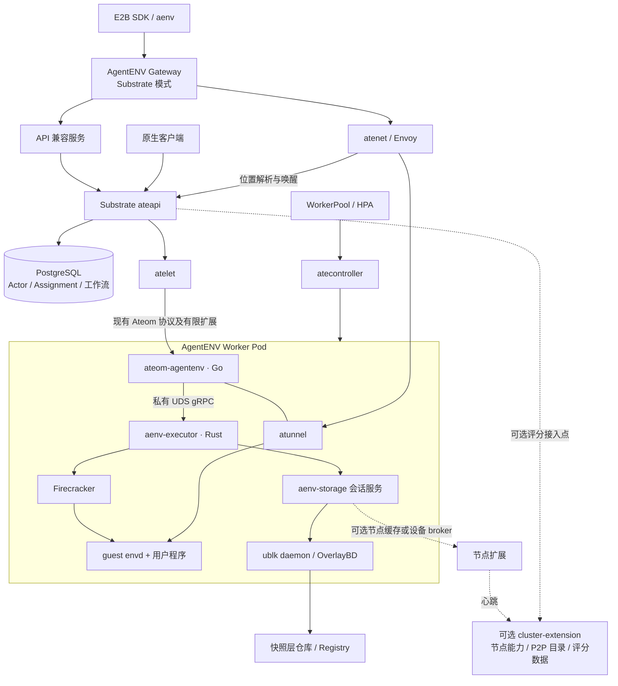
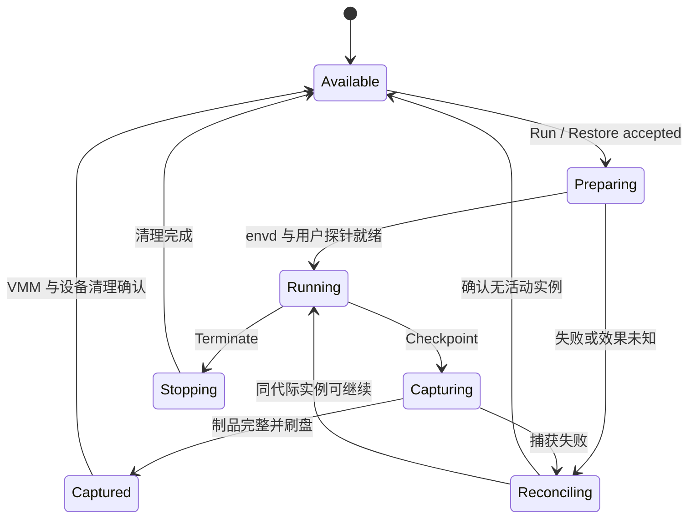
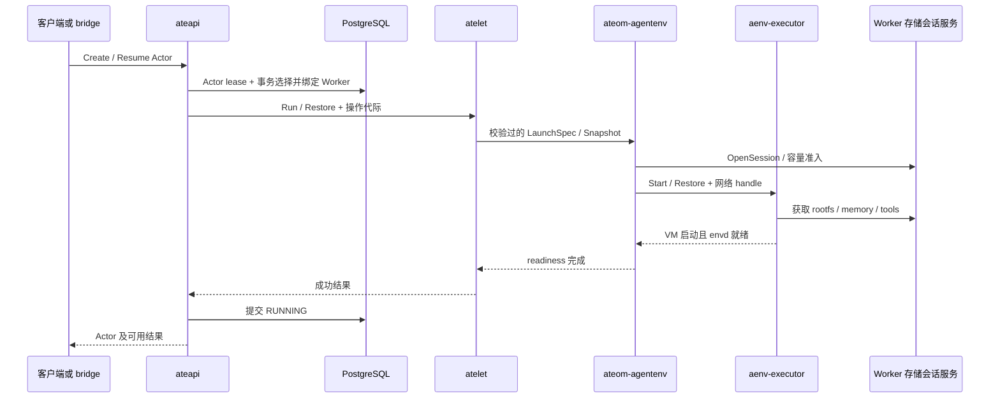
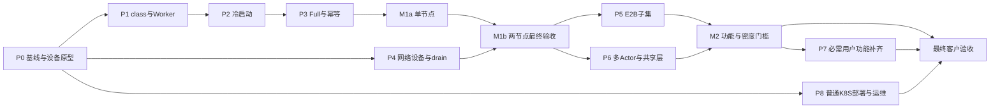

# Substrate 与 AgentENV 软件实现设计

版本：设计草案 v2.3（2026-10-08，记录批准实施决策与首批源码状态）。基线：Substrate **v0.4.0 / `756c2a53741121e728f4cc3066c8a19e575b4919`**，AgentENV **v0.2.3 / `6cccaa7842bd5be2051111d4f74d9e37aa721244`**。两个 checkout 在设计基线核对时均无本地改动；本次实施已产生未提交修改；相对 v1 基线分别新增 227/9 个提交。第一轮 [Claude 评审](claude方案审视.md) 裁决见第 20 节；第二轮 [Claude 复核](claude审视-1.md) 的处理与 v2.1 变更见第 21 节及 [Codex 回复 §8](codex审视.md#8-对-claude-第二轮评审的回复v21)。v2.2 根据用户明确的最终目标补充 §1.3、§14.3、P8 与 §17.4，源码基线不变。本设计用于开发拆分与技术评审，不代表已有可运行集成；所有标注“新增”的组件、配置、字段和接口均需要实现。本文承接[总体接入方案](AgentEnv运行到Substrate可行性分析.md)，以本文件的具体接口与阶段范围作为实现依据。

## 1. 目标与设计决策

目标是在 Substrate 中新增 AgentENV 执行后端，与现有 gVisor、Kata/Cloud Hypervisor 后端并存。Substrate 管理 Actor、WorkerPool、Worker 分配和生命周期；AgentENV 提供 Firecracker、OverlayBD、ublk、envd。Gateway 和 Scheduler 可以保留为独立扩展服务，但不能为同一个 Actor 形成第二套分配权威。

**用户最终目标是在普通 Kubernetes 集群中正常使用集成后的 AgentENV 功能。** 后端接通是必要步骤；最终交付还须包含可重复安装、目标客户端功能、持久恢复、访问控制及日常运维。M1/M2/M3 是开发里程碑，不是替代最终目标的不同产品；M1 原生 API 演示通过、M2 的部分接口通过，均不能直接宣称最终交付完成。

采用“适配层优先、Substrate 最小必要改动”：协议转换、存储数据路径、节点能力采集尽量在新组件中实现；分配事务、生命周期提交和必要的快照所有权变化保留在 Substrate 的控制流程内。

| 决策 | 本设计选择 | 原因 |
|---|---|---|
| 后端标识 | 新增 `agentenv` sandbox class | 当前 `microvm` 已对应另一套 VMM/快照实现，不能混用 |
| 执行单元 | M1 `maxActors=1`；M2 首选有界多 Actor | 原生已有多 Actor；单实例仅降低首期验证复杂度，按 Actor 建锁/状态/网络，从第一版保留扩展边界 |
| 适配语言 | Go Ateom 适配器 + Rust AgentENV 执行服务 | 复用 Substrate 网络/证书代码和 AgentENV 执行存储代码，避免跨语言移植 |
| Worker 进程组织 | Go 主进程监督 Rust 子进程；Rust 启动 Firecracker | 进程都留在 Worker cgroup，退出与资源计费关系明确 |
| 设备服务 | M1 Worker 内 storage session 服务监督 ublk；M2 优先在同 Worker 共享 | 先避免跨 Pod 设备分发；节点缓存与可选节点设备 broker 分离，设备访问仍是门槛 |
| 对外入口 | AgentENV Gateway 增加 Substrate 模式，配套 API 兼容服务 | 保留现有客户接口，数据面优先复用 atenet |
| 调度权威 | Substrate ateapi + PostgreSQL Assignment | 保留事务绑定和资源校验，不双写旧 Scheduler 绑定 |
| Scheduler 接入 | 首期外置节点/P2P 信息，后期有限过滤/评分扩展 | 后端先跑通，避免一开始重写调度 |
| 快照落地 | M1 独立包；M2 内容寻址层与引用目录 | 先验证恢复正确性，再保留增量与共享性能 |
| 存储保留策略 | 写入可多次重试，删除必须证明无有效所有者 | 失败优先产生可回收孤儿，不产生不可恢复快照 |

### 1.1 交付范围

- **M1 后端闭环：** Linux amd64、KVM、单容器映射单 guest、原生 API、maxActors=1、Full 独立快照包、固定平台出站策略。M1a 单节点生命周期与 Worker 重用；M1b 两兼容节点跨 Worker suspend/restore，才算 M1 完成。M1b 不依赖 M2 共享层或节点设备 broker。其他现有后端行为保持不变。
- **M2 存储与客户端：** 有界多 Actor Worker、同 Worker 只读设备共享、共享层仓库与持久引用、按需节点不可变缓存、Gateway/E2B 明确子集、模板发布与超时语义。跨 Pod 共享块设备不是必交项；统计内存超分为独立后续能力，不能隐含在提高 maxActors 中。
- **M3 用户功能补齐与可选优化：** 为最终保留 AgentENV 现有主要用户功能，补齐运行中快照/fork、模板构建、卷及现有 API 策略/扩展契约；这些是最终交付工作。节点压力与缓存评分、P2P 等性能增强单独按需实施。
- **首期拒绝：** 多容器 Actor、DATA scope、未适配的 CSI/DurableDir/SystemInfo/Image 卷、跨架构恢复、PVM、GPU 透传、公开裸 TCP 入口、未适配的 custom extension 和 E2B 网络策略参数等。在分配前返回清晰错误。当前 scope 只有 FULL/DATA，`DataOnGolden` 不是枚举；pause/suspend 共用 `on_commit`，不存在独立 `on_pause`。
- **恢复额外约束：** 原生 Resume 在快照来源模板 UID 与当前模板 UID 不同的情况下会改走 DATA；M1 必须拒绝此模板替换/恢复组合，不能只检查模板配置为 FULL。共享层时代继续验证 class、模板与资产身份。

### 1.2 ADR-001：Worker 粒度与存储服务位置

**状态：采纳 M1 单槽、M2 有界多槽的实现方向；M2 生产默认容量由 P0/性能实验确认。** 不采纳“上游仍单 Actor”或“多 Actor 已自动解决所有共享/超分”的前提。

| 方案 | 收益 | 仍需解决 | 决策 |
|---|---|---|---|
| 单 Actor + Worker 内 daemon | 所有权/退出简单，能独立完成跨节点包恢复 | 每 Pod 固定开销、无跨 Pod 设备 page cache 复用 | M1 主线与后续隔离型池 |
| 有界多 Actor + Worker 内 daemon | 复用现有进程内/daemon 共享表；减少进程与 Pod 开销，无需跨 Pod 分发设备 | per-actor 并发、cgroup、warm pool 归属、设备权限、故障半径、HPA | M2 优先主线；上限逐级实测，禁止直接取原生默认 1000 |
| 单/多 Actor + 节点设备 broker | 同节点跨 Worker 复用只读块设备/page cache | 动态设备 cgroup、跨容器路径/权限、持久引用、多客户端安全与节点故障半径 | 可选优化；有跨 Pod 共享收益且设备原型通过后再开发 |

节点不可变层缓存只共享字节，不等于同一 ublk 设备/page cache；两者指标分开。跨 Worker 恢复只要求快照与固定 assets 可访问，不要求两 Worker 打开同一块设备。

当前 `internal/ateom/register.go` 从 Pod **limits** 上报容量；`scheduling.checkRoom` 和绑定事务按模板 limits 累加检查。因此把多个 VM 装进一个 Worker 不会自动获得 standalone 的内存超分。K8S 按 **requests** 调度 Pod；limits 控制运行上限，两者不能混写为“节点密度等于 limits 之和”。M2 先保持保守容量模型，给固定进程开销和每 Actor 的 VMM 开销留预算。要启用统计超分，需单独设计 guest 最大内存、调度预留、物理预算、balloon/OOM 与 Node 准入，增加独立评审和验收。

无论采用哪种形态，运行 VMM 的 Worker 容器仍需访问 KVM/ublk；把 daemon 放回同 Pod 只缩小设备分发边界，不能移除 device cgroup 校验。多 Actor 也不承诺上传自动聚合/去重，持久层去重仍属于 M2 graph/catalog。

### 1.3 最终交付目标：普通 Kubernetes 集群可用

**用户已确认：可配置专用工作节点和必要设备权限；最终保留 AgentENV 现有主要用户功能及 SDK/API，并逐项验收。** 集群具体版本/CRI/CNI、硬件和控制面 feature gate 可用性尚待采集；允许配置工作节点不等于默认可以修改控制面参数。

“普通 K8S”按标准 Kubernetes API 和可安装扩展构建部署方案，不把 GKE/GCP 作为必需平台，不要求维护自有 Kubernetes/kubelet fork。需要覆盖至少一套用户实际使用的非特定云平台集群；在取得版本/CRI/CNI 信息并实测前，不承诺支持任意发行版与任意默认配置。

| 层次 | 最终交付要求 | 环境/范围边界 |
|---|---|---|
| 集群与安装 | 在已有集群安装 Substrate、AgentENV 后端及必要入口，参数和依赖可配置、可检查 | 标准 CRD/RBAC/Deployment/DaemonSet/Service 等可用；安装包不得隐式要求创建 GKE 集群 |
| 执行节点 | 在用户允许配置的专用 Linux 工作节点提供 KVM、ublk/io_uring 及必要网络/cgroup/设备能力，准入检查失败时不给该节点分配 Actor | 普通业务节点无需同样设备权限；只向已验证的执行节点调度 Worker。最终权限清单须基于实测，不能将实验 privileged 配置直接标为最小权限 |
| 用户功能 | 保留当前 tag 原版已实现的主要功能与 SDK/API；验收清单见 §17.4 | 创建/执行/文件/网络/暂停恢复之外，fork、模板构建、卷和现有策略接口同样进入最终交付；原版 schema 中未实现的接口不凭声明推定可用。必需项不能以 UNSUPPORTED 视作完成 |
| 持久性与运维 | 数据与快照可持久保存；跨兼容节点恢复；重启/故障有明确恢复上限；具备日志、指标、备份和受控升级/缩容流程 | 不承诺故障前未持久状态无损；最终权限配置需明确，实验特权 PoC 不自动成为正式部署模板 |
| Worker 模型 | 功能接口不绑定固定 Actor 槽数；单 Actor 池可保留，目标共享池采用经验证的有界多 Actor | 多 Actor 是资源共享和密度方案，不能代替功能验收；单纯增加 maxActors 也不是普通 K8S 兼容性方案 |

功能清单逐项记录“原版行为、集成行为、支持阶段、测试与限制”；当前 M2 的 E2B 子集只代表阶段范围。网络参数、fork、卷、模板构建及已实现的扩展接口明确转为最终功能补齐工作；不能继续笼统归为 M3 可选。P0 从当前 tag 的 API/CLI/SDK 测试补齐具体请求、错误码、默认值和版本，不要求用户重新逐个列举已经说明要保留的主要能力。未经过对照验收前，不能承诺“所有功能等价”或沿用旧阶段工期作为完整交付总工期。

当前普通集群适配还有一个独立门槛：[create-kind-cluster.sh](substrate/hack/create-kind-cluster.sh) 显式启用 `PodCertificateRequest`、`ClusterTrustBundle`、`ClusterTrustBundleProjection` 及证书 API；[ateapi](substrate/manifests/ate-install/ate-api-server.yaml)、[atelet](substrate/manifests/ate-install/atelet.yaml) 和 [controller](substrate/manifests/ate-install/ate-controller.yaml) 使用相应投影。不能把开发集群脚本成功当成默认配置集群可装。P0 必须探测目标 API/投影能力；若不具备且不能开启，需要为当前身份/信任接口新增标准证书分发、轮换和加载适配，保持 mTLS/SPIFFE 校验，不能关闭认证绕过。替代方案已确定为标准 Pod-bound ServiceAccount token + TokenReview 的通用签发服务，以及 init container + 普通 sidecar 轮换；实现状态见 §22。默认安装尚未完成替换，不能宣称普通集群已经可装。

## 2. 源码事实与主要差异

| 已核对事实 | 对实现的影响 |
|---|---|
| WorkerPool 有 `workerImage`；class 当前仅有 gvisor/microvm | 可增加自定义 Worker，但必须更新类型与验证，不能只改 YAML |
| Ateom RPC 已有 Run/Checkpoint/Restore/Terminate/Stats | 生命周期框架可复用；需要补齐 AgentENV 特有输入和错误契约 |
| atelet Run 会准备 OCI bundles；Ateom `WorkloadSpec` 主要描述容器名、探针和挂载 | 不能假设 Go 适配器直接从当前请求拿到完整镜像引用、环境和启动命令 |
| Substrate Resume 有分布式 Actor lease、分步恢复和事务绑定 | 复用其权威状态与重试，新增本地日志仅记录执行效果 |
| Checkpoint 返回相对文件清单；atelet 写自己的 `manifest.json` | AgentENV 另用独立描述文件，不能覆盖 Substrate manifest |
| AgentENV `SandboxSnapshotManifest` 部分路径为运行时字段且 `serde(skip)` | 直接序列化该对象不足以搬运快照，必须设计可移植导出描述 |
| AgentENV 客户端共享表在进程内；daemon 的 pool 已有 `active_shared` 引用表，key 为配置路径 | 同 executor 可复用；跨进程仍需统一 canonical/digest 路径、会话归属和回收协议，不是从零重建共享，也不是现成多租户 broker |
| UblkDaemonClient 创建即 spawn；daemon 用 pidfd 监听父进程死亡，提供 shutdown | Worker 内服务可复用父子监督；节点模式需独立监督/受限客户端，不能假设父退出后 daemon 或设备仍存活 |
| 原生 gvisor/microvm 已有 hosted Actor 表、per-actor 网络/cgroup 与多样本 Stats，max-actors 默认 1000 | 复用这些模式；部分 proto 单实例注释过时，不作为实现事实 |
| Worker/Assignment 已有 Worker epoch；执行 RPC 未携带该 epoch、operation ID 或 assignment generation | 复用重启对账，但仍须补执行链 fencing，不能说系统除 Actor UID 外完全没有 incarnation 防护 |
| OpenFGA 门控默认关闭，未登记 RPC 直接放行到 handler | 当前 CRUD 覆盖不能外推到生命周期/Tag/数据面完整授权 |
| HardwareIdentity 当前只上报 architecture，Matches 无生产调用，快照/调度链未完整接通 | 优先沿该模型扩展，但 M1 仍需可信池约束和执行端硬检查 |
| AgentENV 两种基础调度策略忽略传入的镜像 hint | 缓存感知评分是新增实现，不能作为已有能力承诺 |

## 3. 架构与部署



### 3.1 组件和所有权

| 组件 | 部署与实现 | 权威职责 |
|---|---|---|
| ateapi | 现有 Deployment，少量补丁 | Actor 状态、Worker 分配、生命周期进度 |
| atecontroller | 现有 Deployment，新增 class Pod 形态 | WorkerPool 到 Pod 的配置生成 |
| atelet | 现有 DaemonSet，增加后端准备/结果契约 | 调用 Worker、搬运 M1 快照、协调资源和状态观测 |
| ateom-agentenv | 新 Go 命令，Worker 主进程 | Ateom RPC、网络/atunnel、执行进程监督、Worker ready |
| aenv-executor | 新 Rust 命令，同 Worker 子进程 | 按 Actor 会话执行 VM 生命周期/统计，M1 准入上限 1；无集群调度 |
| aenv-storage session 服务 | M1/M2 先作为 executor 内模块；节点 broker 为可选独立形态 | 设备分配、共享引用、路径管理、资源准入、操作日志；节点缓存另行部署 |
| uvm-ublk-daemon | Worker 内存储服务或可选节点 broker 监督的子进程 | 实际块设备、OverlayBD I/O 和 restack |
| aenv-api-bridge | 新服务，可与 Gateway 同 Pod，也可独立部署 | 外部 ID、E2B HTTP 语义、持久幂等映射；不决定 VM 位置 |
| cluster-extension | 从 Scheduler 拆分/改造，可选 | 节点事实、兼容计算、P2P 目录；不提交 Assignment |
| layer-catalog | M2 新服务，可与 bridge 部署但独立模块 | 不可变层、快照引用所有者与回收事务；不保存 Actor 运行位置 |

M1 Worker 内存储状态按 Pod UID 隔离；checkpoint 输出必须写到 atelet 下发的 ActorDirs，不能仅在 Pod 临时盘上保留。可选节点 broker 与 Worker 挂载受控宿主目录，接口只接受相对资源标识；路径示意 `/var/lib/aenv-substrate/{node-uid}/`，含 layers、sessions、journal。不得与 standalone 目录混用。节点模式经受限 UDS 访问，不把全节点工作目录无差别暴露给每个 Worker。

### 3.2 Go internal 包约束

Substrate 的 `internal/proto/ateompb`、`internal/atunnel`、`internal/ateomnet` 不能由任意外部 Go module 直接导入。M1 将新增 Go 命令放在 Substrate 的 `cmd/ateom-agentenv/` 下，业务隔离在该命令自己的 internal 目录；这是新增代码，不等于大规模修改现有核心。

若将来要求独立仓库发布，再提取稳定协议及最小公共库，或固定版本复制生成协议代码并维护来源。不要通过改 module path 等方式绕过 Go internal 边界，也不为“零新增目录”重写整套证书和隧道。

## 4. Substrate 具体改动

### 4.1 最小补丁集合

| 补丁 | 文件/模块 | 软件修改内容 | 阶段 |
|---|---|---|---|
| S1 后端登记 | `pkg/api/v1alpha1/*`、公共/内部 proto、验证策略、generated 清单 | 添加 agentenv class，同步 proto `maximum=2` 等上限、CEL、admission、converter、metrics、prewarm、ate-setup/镜像清单；重新生成 | M1 必需 |
| S2 Worker Pod 形态 | `cmd/atecontroller/internal/controllers/workerpool_apply.go` | 指定 adapter/executor 镜像与参数；KVM/ublk、Worker 内存储进程、工作目录、容量开销扣除及探针；节点 broker socket 可选 | M1 必需 |
| S3 冷启动规格传递 | `cmd/atelet/main.go`、新 backend prepare helper、`ateompb` | AgentENV 路径跳过不需要的 bundle 解包，生成版本化 BackendLaunchSpec；不改变旧后端路径 | M1 必需 |
| S4 网络/资产适配 | `cmd/atelet/sandbox_assets.go`、新命令 | 复用摘要校验资产下载；传递 Firecracker、kernel、tools，网络交给 adapter | M1 必需 |
| S5 操作身份与清理 | `controlapi/workflow_*`、assignment 存储、`ateletpb`、`ateompb` | 复用 Worker epoch/lease；补绑定时 epoch/对账水位校验、旧 claim 防复活、执行实例握手、持久 operation/assignment 身份、端到端 fencing、atelet 幂等及失败重选；具体规则见 §12.5 | M1 正确性门槛 |
| S6 按需捕获模式 | Checkpoint/Restore 协议及调用点 | LOCAL/EXTERNAL 只在 ateletpb，若后端确须区分则新增 ateompb 字段；M1 同格式独立包不必下传。在线 capture disposition 属 S9 | M2 按需 |
| S7 外部层保留契约 | 快照复制、tag、删除和持久提交工作流 | 调用 Retain/Release/Clone 等后端资源钩子；与 outbox/重试结合 | M2 必需 |
| S8 调度扩展 | `internal/scheduling`、分配前验证 | 可选节点约束/评分；Worker 绑定仍在原事务内 | M3 可选 |
| S9 原生运行中捕获/fork | controlapi workflow/proto | 新增 CaptureActorSnapshot 工作流，在 Actor lease 下捕获并继续运行；子 Actor 由控制面独立分配和恢复 | M3 必需 |
| S10 硬件兼容链 | HardwareIdentity、快照元数据、scheduling/绑定复核 | 扩 CPU domain/资产兼容要求并贯穿采集、持久化、过滤；完成前 M1 用可信固定池+executor 校验 | M1 保守防线；自动匹配后续 |
| S11 授权与安全 drain | bridge/Gateway、authz 注册表、生命周期调用点 | 入口补完整动作授权和私有端口保护；原生 authz 补齐覆盖另行提交；drain 通过控制面 Suspend 并确认完成 | 对外开放/安全运维前必需 |

S1 必须搜索所有 class switch、字符串验证、资产规则、指标映射和恢复兼容检查，不只修改 WorkerPool 枚举。所有未知值都拒绝，agentenv 快照绝不回退到 microvm。

### 4.2 BackendLaunchSpec 新增设计

由 atelet 从 ActorTemplate、已解析镜像配置和资源信息生成，放入 Run 请求的新增可选 typed 字段。原 `WorkloadSpec` 保持供既有后端使用。尽量用小而稳定的公共字段，避免任意 JSON 隐式契约。

| 字段 | 含义与规则 |
|---|---|
| `schema_version` | M1 为 1，未知主版本拒绝 |
| `image_digest_ref` | 固定 digest 的用户 OCI 镜像；禁止 restore 时重新解析 latest |
| `image_config` | 合并后的 argv、env、cwd、user/group；规则与 OCI/E2B 输入各自明确 |
| `resources` | CPU 毫核、内存字节、根盘虚拟大小；不得在不同层使用不同单位 |
| `network_ref` | adapter 管理的网络配置标识；guest IP/MAC/TAP 在 Worker 端注入 |
| `runtime_assets` | 现有 RuntimeAssetPaths 提供实际宿主路径；另含版本与 digest |
| `mounts` | 类型、目标、只读标记；M1 非支持类型在 API 层拒绝 |
| `readiness` | envd ready + 用户配置探针；两者均就绪才返回启动成功 |
| `secret_refs` | 短期镜像拉取授权引用；不可写入镜像、快照或日志 |

AgentENV Firecracker 用整数 vCPU。M1 要求 CPU 为整核，或在模板准入明确向上取整并按同样数量预留 Worker；不得预留 500m 却偷偷启动一个无约束 vCPU。内存固定 MiB 对齐并在准入阶段验证。Full restore 以快照中的机器规格为准，冲突时拒绝，不修改快照伪装为另一规格。

冷启动不复用当前 atelet 的 `prepareOCIBundles` 完整解包路径，否则会与 AgentENV ImageResolver 重复拉取/解包并失去懒加载。新增按后端分派的准备函数，AgentENV 仅解析配置与身份，实际层转换/打开交 executor/broker。Registry 凭据由可信宿主获取，guest 不接触。

### 4.3 Worker 注册和调度

- adapter 启动、executor 健康、存储服务就绪（节点模式另做 broker 握手）和设备检查通过后才注册容量；仍使用现有 `RegisterWorker` 容量+硬件注册流程（当前已非 SetWorkerCapacity）。
- M1 `capacity.actors=1`；M2 使用经验证的上限。Pod limits 覆盖 guest+VMM+adapter/executor+本 Pod daemon；上报可分配容量扣除固定及保守 per-actor 开销，避免模板 limits 填满 Pod 后宿主进程 OOM。控制面同时预留槽位和 CPU/内存；清理未完成仍占本地槽位。
- 硬约束：class、arch、virtualization、CPU compatibility ID、runtime asset generation、Worker 容量、本地快照的 RequiredNodes。
- M1 CPU 兼容域通过平台管理的 WorkerPool/模板选择器固定，并在执行端核对 snapshot domain、CPU config digest 和 assets；租户不得移除硬约束。S10 优先扩展原生 HardwareIdentity，但当前只有 architecture，Matches 没接入 scheduler，快照要求也未贯通，不能直接替代标签。CPU vendor/model 相同也不足以证明 CPUID/MSR/内核/Firecracker 兼容。
- M3 外部服务可返回候选评分，ateapi 再验证候选和事务容量；它不得直接指定最终 Assignment。硬约束数据未知时拒绝，缓存热度未知时允许退回原生 power-of-two-choices。
- 存储会话服务做设备/磁盘准入。当前 `handleAteletError` 会将多数非传输错误标 CRASHED，因此“后端拒绝后有界重选”须由 S5 按 NO_EFFECT/EFFECT_UNKNOWN 明确实现，不是抛出 RESOURCE_EXHAUSTED 即自动获得。节点共享资源若需强预留，另建 reserve/commit/release 契约，不能用心跳冒充强一致。

## 5. AgentENV 具体改动

### 5.1 新增执行模式

新增 `src/bin/aenv-executor.rs` 和 `src/embedded/`。其初始化复用 ImageResolver、SnapshotManager 必要功能及 FirecrackerSandboxFactory，不启动原 HTTP server、集群 reporter、独立 Scheduler 或节点级自动创建/驱逐循环。

| 原模块 | 处理方式 |
|---|---|
| `src/sandbox/backend.rs` | 复用执行 trait，外层增加受控操作包装，不直接暴露给网络用户 |
| `src/sandbox/firecracker/` | 支持注入网络与存储上下文，取消必须自行领取全局网络槽的假设 |
| `src/sandbox/ublk/device.rs` | 封装 WorkerLocal/External 模式，先复用同 executor 共享表，跨 Pod 服务为可选 |
| `storage/ublk-daemon/src/client.rs` | WorkerLocal 复用 spawn/pidfd；节点模式才新增 connect-existing、会话认证与能力协商，外部客户端无 shutdown 权限 |
| `src/sandbox/network/` | 保留 standalone NetworkManager；embedded 模式消费 adapter 提供的 TAP/netns，不重复配置旧地址池/iptables |
| `src/snapshot/` | 增加 portable export/import 及 M2 reference manifest；复用分层读取/捕获，不直接序列化运行路径 |
| `src/orchestrator/` | standalone 保留；启动只加载 paused 元数据、访问时惰性恢复，停机 pause-all；embedded 不运行这些自主流程，改由 Substrate 驱动 |
| FirecrackerPool + NetworkManager 暖 slot 池 | embedded 初始同时关闭，且不启动旧网络池后台填充。M2 若启用，必须由 adapter 管理网络所有权，在 spawn 前给定正确 netns，或将预分配的完整网络会话正式交给 Actor；领取时落实 Actor cgroup 与策略重置，不能仅替换已启动 VMM 的 TAP 路径 |
| startup-pack 录制 | embedded 初始关闭自动录制；读取已发布 pack 可在格式/校验通过后复用。录制会启动额外 VM，不能因复用 SnapshotManager 而绕过 Substrate 的实例准入，后续按受控内部任务接入 |
| tools/镜像缓存 | immutable key 后在节点共享；每个启动实例的可写 upper 独立 |
| 原 fork | 拆为 capture source 与 launch children；子 Actor 的 Worker 由 Substrate 分配 |

这些改动以新模式和依赖注入实现，避免破坏 AgentENV 独立部署。standalone 仍使用原 manager、daemon spawn 和原编排。

两层暖池是不同对象：FirecrackerPool 持有 `{slot, fc_instance, work_dir}`，仅被 restore 消费；NetworkManager 在 release 时还可缓存完整 slot。现有 fresh/restore 均在运行 guest 前调用 `set_egress_policy`，后者跟踪 `user_egress_rules_present` 并清空重建用户 filter/NAT 链，不能仅从“归还时未销毁 netns”推断已发生跨租户规则泄露。适配后仍须验证 A→B 策略重置、代理状态/连接残留、失败回收及网络所有者变更；依据见 [slot.rs](AgentENV/src/sandbox/network/slot.rs)、[policy.rs](AgentENV/src/sandbox/network/policy.rs)。

### 5.2 Rust 依赖注入边界

新增 `ExecutionContext`：Actor UID、Worker Pod UID、Worker epoch、worker instance ID、assignment generation、工作目录、存储客户端、网络 handle、固定 runtime assets、不可变 CPU config/domain 和 token provider。配置由启动时传入，不在请求过程中修改进程级全局变量。

`NetworkHandle` 只含可验证的 netns/TAP 引用、guest 网络参数和 adapter 所有权 ID。`StorageSession` 只含存储服务签发的 session/device handle。两者析构只能释放本会话资源，不能调用全局 shutdown。WorkerLocal daemon 的关闭由 Worker 监督者在所有会话退出后统一执行。

现有 OnceCell singleton 可封装为 Worker 级服务，但 Actor 会话/代际所有权必须显式。CPU 求交在 standalone 经 `HeartbeatResponse.cpu_config_json` 写到 server 组装的共享 `Arc<RwLock<Option<String>>>`，再注入 factory；这不是必须保留的全局单例。embedded 不启动 reporter，改用固定 domain 的配置注入，禁止心跳变化静默更改旧快照兼容要求。

CPU config 注入仅用于 fresh/build 的首次启动；restore 使用 `vm_state.bin` 中的 CPU 状态，验证目标兼容域，不能再次调用 `/cpu-config` 改写快照 CPU。当前 [config.rs](AgentENV/src/sandbox/firecracker/config.rs) 已明确区分这两条路径。

### 5.3 envd 与 guest 初始化

复用 AgentENV tools/guest 中的 envd，exec、文件和终端协议由它执行，adapter 不重新实现 guest 内命令服务。镜像入口参数和 envd 的启动顺序由 executor 的启动流程统一生成；先确认 envd 健康，再执行用户 readiness，最终才向 Substrate 返回成功。

复用已实现的身份初始化链：`from_snapshot_config_with_override`/launch config 覆盖身份和 token → 恢复暂停态下 `set_mmds` → resume → `FirecrackerSandbox::wait_for_ready` 先探测 health 再调用 `EnvdInstance::init`。token 字段 `serde(skip)`，但不代表 VM 内存没有旧 token；在 init/探针全部完成前阻断入站与用户出站，避免后台任务抢先使用源身份。

区分“同一沙箱恢复”与“克隆”：当前 token 是 HMAC(seed, SandboxId)，同 ID 同 seed 的恢复 token 不变，**不是每次 Restore 自动轮换**。M2 为既有 E2B 客户端保留同 sandbox 的 token；fork/golden 派生/同名新 Actor 必须有新 sandbox ID/token，父 token 不得访问孩子。assignment generation 用于执行 fencing，不强行改变客户端 token。要做安全事件后的 token 撤销/轮换，需另有版本记录和客户端重取协议。

TokenProvider 在受信控制域保存 seed/生成策略，只向 executor 下发当前 Actor 的凭据；也可在受控实验部署使用统一 Secret，不能依赖各节点随机生成的默认 seed。跨节点稳定性、新子身份隔离、MMDS 更新与 init 回复丢失均需实测，无需预设从零建设 guest 初始化通道。

[access.rs:61](AgentENV/src/sandbox/access.rs) 已对集群使用 node-local seed 发出警告；这是已知配置风险，启动校验应拒绝不满足统一 TokenProvider/受控共享 seed 的部署。验证要同时覆盖 envd 和 traffic token，不能只验证管理 API 能恢复 Actor。

[startup_pack.rs:95](AgentENV/src/sandbox/firecracker/startup_pack.rs) 调用 `from_snapshot_config`，后者复制宿主 `snapshot.common.envd_access_token`；录制流程是 `start_nowait` → 轮询 daemon recording 状态 → stop，未调用完整 `wait_for_ready/init`。这不能证明 Claude 所称“故意利用残留 token 让录制 VM 连上恢复出的 envd”，也不能将录制成功当作身份重绑定已通过。§5.1 禁止 embedded 自动启动这种临时 VM；后续启用须有独立任务身份、预算、cgroup/网络/设备 owner 和清理记录，且默认阻断用户流量与外部副作用。普通用户 Restore 始终执行完整身份初始化与 ready 门控。

AgentENV custom extension hook 不随执行 trait 自动接入。后续支持时，bridge 持久化完整 extension params，executor 按新的 `sandboxInstanceId` 配对 start/stop，保留 start/patch 失败与 stop 尽力而为的原语义；M1 明确拒绝未支持的非空参数。

## 6. 新增适配层和组件内部设计

### 6.1 ateom-agentenv

建议新增目录（均为拟新增）：

```text
substrate/cmd/ateom-agentenv/
  main.go                  参数、服务注册、优雅退出
  internal/service/        Ateom RPC、参数校验、错误转换
  internal/worker/         Actor 会话表、逐 Actor 锁、容量准入、恢复对账
  internal/executor/       私有 RPC 客户端、Rust 子进程监督
  internal/network/        ateomnet/atunnel 整合、Firecracker TAP
  internal/checkpoint/     相对文件清单、portable/reference 格式
  internal/metrics/        Actor 归属、host/guest 指标区分
```

每个 Actor UID/generation 的生命周期锁保证 Run/Restore/Checkpoint/Terminate 不交叉；Worker 另有短临界区容量锁，不能全 Worker 一把长锁。Stats 不等待长操作锁，读取快照视图，符合现有 Ateom 统计约定。Actor 身份在接受操作时即绑定，未 ready 时返回“当前无有效采样”，不能把旧 Actor 指标归给新 Actor。

Go 进程拉起 executor，并设置父进程死亡处理/进程组监督。executor 或 broker 异常时先关闭数据面和 Worker readiness，再向 atelet 报告可重试或效果未知状态。不能因为本地 RPC 超时直接删除所有设备；先查询实际操作结果。

adapter 或 executor 任一重启都要重新建立 §12.5 的执行实例身份；仅 Rust 子进程重启不会增加 K8S 容器 RestartCount，不能沿用旧身份继续接单。新进程先对账旧 VMM/设备和未决操作，经控制面确认后重新开放准入。

### 6.2 Ateom 与 AgentENV 操作映射

| Ateom RPC | adapter 行为 | AgentENV 调用/新增包装 |
|---|---|---|
| RunWorkload | 校验空闲槽、创建网络和存储会话、启动并等待 readiness | Factory build → start；注入外部 network/storage |
| RestoreWorkload | 校验 class/资产/快照与新 Actor 身份，解析 paths，恢复 | build_from_snapshot/paused_state → start |
| CheckpointWorkload | 关闭新请求、捕获 Full、输出完整结果，再清理执行槽 | capture_to_dir 或 pause + stop，按失败契约分类 |
| TerminateWorkload | 校验 Actor/generation，停止 VMM，再释放设备和网络 | stop；重复调用同一目标成功，旧代际不得终止新实例 |
| GetWorkloadStats | 验证 Actor UID，返回当前采样 | guest metrics + VMM host metrics 分别记录 |
| GetActiveWorkloadStats | 返回当前身份及采样，不携带旧绑定假设 | 读取无锁/短锁采样视图 |

Checkpoint 清理目标 Actor 并释放其执行槽，不能清空多 Actor Worker 的其他会话。VM 停止发生在 atelet 外部上传之前，ateapi 提交前不算 durable。当前 EXTERNAL 上传普通错误通常使 Actor CRASHED；`Unavailable/Canceled/DeadlineExceeded` 或工作流上下文结束按原分类保留待对账状态，不能笼统宣称所有上传失败立即 CRASHED。源码 TODO #362 明确没有可依赖的外部失败快照缓存；即便磁盘残留文件也不构成可恢复重试契约。M1 按此暴露失败；持久 staging/retry 作为 §12.3 的后续增强，不能由 executor 单方面承诺。

### 6.3 私有 Executor RPC

新增接口使用 UDS 上 gRPC，proto 单独版本化，在 AgentENV 生成 Rust，在 Substrate 生成 Go。下面是逻辑契约，非现有可调用接口。

| RPC | 关键输入 | 输出与幂等规则 |
|---|---|---|
| Capabilities | 协议范围、assets digest、本次 executor boot nonce | 支持 class/arch/scopes/network/device 模式；供 adapter 启动握手使用，本调用本身不授予执行权限 |
| Start | OperationEnvelope、LaunchSpec、NetworkHandle、StorageSession | 实例与 ready 结果；相同 op + payload 返回同结果 |
| Restore | Envelope、SnapshotDescriptor、identity config | instance ID、ready；同 Actor 保持 token 契约；派生 Actor 注入新身份，不能复用源令牌 |
| Capture | Envelope、scope=FULL、format=portable-v1、output root | CapturedResult、所有文件大小/hash；M1 不区分外部去向，CaptureAndStop 包装保证清理；M2 按需扩 destination |
| Stop | Envelope、expected instance | 停止效果；目标不匹配拒绝 |
| Inspect | Actor/Worker/generation 或 operation ID | 当前本地事实及效果，不修改集群状态 |
| Stats | instance identity | 带身份和时间的 host/guest 数据 |
| Reconcile | 控制面认可的当前归属 | 只处理同 Worker 的残留，不能跨节点自行接管 Actor |

`OperationEnvelope = {protocol_version, actor_uid, worker_pod_uid, worker_epoch, worker_instance_id, assignment_generation, operation_id, payload_digest, deadline}`。`worker_instance_id` 由控制面在 adapter/executor 启动握手后确认并持久化，绑定两者本次 boot 身份，通过 atelet 传递；各层校验它与当前归属相符。generation 由控制面分配并传到所有层，不由 adapter 自增后自称权威。相同 operation ID 但 payload 不同返回 ALREADY_EXISTS/冲突；超时不等于撤销已发生的写入。该字段及握手均为 S5 新增协议，不能仅在私有 RPC 中添加而遗漏 Worker/Assignment 与 atelet/ateom 链路。

请求不接受 shell 字符串执行任意宿主命令。文件路径必须是指定工作根下的相对路径；拒绝 `..`、符号链接逃逸及指向 socket/device 的导出文件。

### 6.4 本地操作日志

executor/broker 使用已有 RocksDB 包装或同等级嵌入式日志实现：

```text
operation_id → actor_uid, worker_uid, worker_epoch, worker_instance_id, generation, payload_digest,
               phase, resource_handles, result_digest, error_class
phase: ACCEPTED → PREPARED → EFFECT_APPLIED → COMPLETED
```

关键资源创建/捕获点在返回前刷盘；恢复时先核对 PID start time、cgroup、设备所有者，不仅凭 PID 判断。日志不是 Actor 状态数据库，控制面缺席时禁止接收新分配，只允许已授权实例继续运行和安全本地清理。

## 7. 存储与设备设计

### 7.1 统一存储会话服务与可选节点 broker

M1/M2 先将以下能力做成 executor 内可注入模块，以 Worker 为作用域监督 ublk daemon；仅需跨 Pod 共享时再以 `aenv-storage-broker` 独立部署。接口/所有权模型尽量共用，但 WorkerLocal 不强制增加一跳 UDS。接口建议：

| 接口 | 含义 |
|---|---|
| OpenSession | 绑定 Node UID、Pod UID、Actor UID、generation，验证调用者 |
| PrepareImage | 按 OCI digest 转换/解析 layer graph，返回不可变 image handle |
| AcquireRootfs | 共享只读 layers + 当前会话独立 upper，返回 device handle |
| AcquireMemory | 按 memory graph digest/size/format 共享只读内存设备 |
| AcquireTools | 按 tools digest 共享只读设备 |
| SealAndRestack | 对指定会话可写设备封存，返回不可变层描述和操作结果 |
| Release/CloseSession | 幂等释放引用；最后一个有效引用消失且无在途操作才删除设备 |
| Inspect/Reconcile | 查询残留及归属；节点服务重启时恢复账本 |

同 executor 先复用现有共享表。daemon pool 的 `active_shared` 已能跨连接引用共享设备，但 key 是 `(image_config_path, global_config_path)`，无 Pod/Actor 持久租户账本。节点模式需以 digest、格式、大小和访问域生成受控 canonical path，并补 session/generation、认证、原子落盘与重启对账；不能原样向各 Worker 暴露低层 daemon socket。写盘永不跨 Actor 共享；内存映射只读并由 guest 写时 COW。

节点模式 Worker 只能拿到自己的设备 handle，broker 校验 UID/会话凭据。UDS 对端的 root UID 在容器间不能唯一代表 Pod，需额外验证 Pod 绑定凭据和节点映射。高权限 Worker 在宿主共享挂载上的攻击面必须纳入部署模型，不能把 UDS 路径本身当多租户强隔离。

### 7.2 生命周期与设备回收

停止顺序：拒绝新操作 → 停止/确认 VMM 不再访问设备 → 等在途 I/O/捕获结果 → 释放 writable 和 shared 引用 → 清理网络/工作目录。仅依据 TTL 不得拔掉仍在使用的设备。

broker 账本至少记录 `device_id + daemon_instance + device_generation + owner/session + image_key`。内核 device ID 会复用，禁止晚到 Release 按数字 ID 删除新设备。daemon crash 后不宣称设备可原地恢复：标记受影响实例、关闭准入，由后端检查 I/O/VMM 故障；必要时从最后持久快照恢复。

内存设备共享是本项目价值点：M1 独立设备用于正确性，不代表共享密度；M2 必须证明同 Worker 多 Actor 对同一只读内存 graph 的设备复用。跨 Worker 复用只在节点 broker 模式单独验收。现有 daemon 的 pidfd 会在监督父退出时触发退出：WorkerLocal 以 Worker 故障处理；NodeBroker 以节点设备服务故障处理。若要求 broker 重启而 daemon 不退出，必须显式改变独立监督模型，不能只添加 connect-existing。

### 7.3 K8S 设备访问

Firecracker 在 Worker 内需要 KVM 与 ublk 块设备；仅挂目录不保证 device cgroup 允许打开。WorkerLocal 创建动态设备同样需要设备规则与 io_uring/能力验证；NodeBroker 额外增加跨 Pod 分发、挂载与授权，是生产阻断项。

- M1 隔离实验节点可用明确标记的特权 Worker 配置验证功能，不作为默认生产模式。
- 正式模式验证固定设备池+device plugin/CDI、适用版本的 DRA 或明确管理的设备开放方案。记录内核、CRI、Kubernetes/插件版本、major/minor、OCI 设备规则与 Actor 隔离结果；CDI/DRA 是集成机制，不自动证明 Pod 启动后新 minor 可用。不能假定 kubelet 动态追加放行；不将有限候选方案宣称为所有环境下“唯一正路”。
- 预分配固定设备池需分别处理 rootfs、附加盘、共享内存和 tools 的数量/尺寸要求。若运行时不能在既定安全配置下访问所需设备，先保留受控特权部署并明确其边界，不伪称已完成最小权限。
- Worker 内 daemon 纳入 Pod 预算，节点 broker 则单独计费和限额。page cache 的 cgroup 归属可能受首次读取者影响，不能简单按 Actor 私有内存求和得到节点真实用量。

## 8. 快照协议与持久引用

### 8.1 M1 独立快照包

保留 Substrate `manifest.json`；AgentENV 输出 `agentenv-manifest.v1.json` 和全部恢复依赖文件。描述文件使用逻辑键、相对路径与 digest，恢复时重写本机 OverlayBD config 和 VMM 设备路径。

```json
{
  "schemaVersion": 1,
  "backend": "agentenv",
  "vmm": "firecracker",
  "format": "portable-v1",
  "architecture": "amd64",
  "virtualization": "kvm",
  "cpuCompatibilityId": "<verified-domain>",
  "runtimeAssetsDigest": "sha256:<digest>",
  "machine": {"vcpu": 2, "memoryMiB": 2048},
  "vmState": {"path": "vm/state.bin", "sha256": "<digest>"},
  "memory": {"virtualSize": 2147483648, "layers": ["<layer-id>"]},
  "rootfs": {"virtualSize": 68719476736, "layers": ["<layer-id>"]},
  "layers": [{"id": "<layer-id>", "path": "layers/<digest>.commit", "size": 0, "sha256": "<digest>"}],
  "toolsDigest": "sha256:<digest>",
  "attachedDrives": []
}
```

这是格式示意，所有 digest/size 必须由实际导出计算，示例不是可直接恢复的数据。tools/kernel 可由摘要固定的资产仓库提供，但要保证版本生命周期；依赖不在外部可靠资产仓库时也必须入包。不能仅复制最新 upper，丢掉继承层。`runtimeAssetsDigest` 要涵盖 VMM、kernel、tools、overlaybd/ublk ABI 与相关捕获配置，CPU domain 另存 config digest；单写“Firecracker 版本相同”不足以验证格式兼容。

Ateom 返回文件清单；atelet 上传或移动到 node-local checkpoint，保留既有 sandbox class/asset manifest。跨节点恢复先校验可预读的 class、arch、CPU/domain、assets 元数据，再下载大文件/解析；在文件路径和引用全部校验后才创建 VMM。

### 8.2 M2 共享层快照

M2 将大层提交到内容寻址仓库，Substrate 仅搬运外层 descriptor 与必要小文件。descriptor 包含 `graph_id、catalog_namespace、format_version、runtime compatibility`，不能携带只有源节点能理解的绝对路径。

层仓库按 `digest → immutable bytes` 存储；元数据目录维护有向图（父层/子层）、graph 所有者与临时操作保留。首次层写入必须验证 hash，已存在同 digest 可复用；使用临时对象再完成提交，未完成对象不能出现在 COMMITTED graph 中。

### 8.3 所有权和目录接口

新增 layer-catalog 持久表/等价 KV：

| 数据 | 唯一键 | 内容 |
|---|---|---|
| layers | namespace + digest | 大小、位置、校验、提交状态 |
| graphs | graph_id | 根盘/内存/附加盘层列表、父依赖、兼容信息 |
| graph_owners | namespace + owner_kind + owner_uid + version | graph_id、ACTIVE/RELEASING 状态；含独立 LOCAL snapshot owner |
| pending_ops | operation_id | staged graph、结果、最后成功阶段 |
| active_pins | node/session/generation | 当前恢复或运行引用；不能替代已暂停快照的持久 owner |

接口：`CommitGraph(op, graph)`、`Retain(owner, graph)`、`CloneOwner(srcOwner,dstOwner)`、`Release(owner)`、`Resolve(graph)`、`ListPending`。全部幂等，重复请求不得增加额外引用。持久所有者包括 Actor external snapshot generation、LOCAL snapshot（Node UID + Actor UID + snapshot name）、Template golden、Tag UID 和 Build cache；活动恢复/运行再使用 session pin。不能只用 Actor 名称或随 pause 释放的会话作为所有者。

**不能仅把 graph_id 放入快照文件就认为引用安全。** Substrate 复制 tag 快照、删除旧 snapshot、删除模板时都必须联动所有者；这正是需要小范围核心钩子的地方。若这些钩子尚未完成，M2 必须关闭 GC 并承认存储泄漏，不能用不可靠 TTL 回收。

### 8.4 提交和删除协议

跨 PostgreSQL 与对象存储不存在单个本地事务，采用持久步骤和幂等补偿：

1. capture 后 CommitGraph，目录为 operation 建立临时保护；写入 descriptor。
2. Substrate 上传 descriptor 成功，记录操作待提交；为新持久 snapshot owner Retain。
3. 控制面事务更新 Actor snapshot 指针并记录后续清理任务；成功后清理旧 owner 和临时 owner。
4. 若步骤 2 成功但步骤 3 失败，只产生多保留，重试读操作状态后继续或释放孤儿。禁止先删除旧 owner 再提交新指针。
5. Tag 创建先 CloneOwner 成功再公开 tag；删除 tag 需遵守既有借用语义：仍被 Actor 使用的 graph 必须有自己的有效 owner，或明确阻止操作。M2 采用每个 Actor 显式 retain，不依赖 tag 文件存在充当引用。
6. GC 只删除无 committed owner、无 pending protection、无 active pin 的对象；标记候选后再次确认引用版本，经过安全窗口再扫。目录不可用时停止回收。

控制面 outbox 记录 Retain/Release 的重试，handler 不在数据库锁内等对象上传。Node-local pause 必须由 atelet 持久 local snapshot 身份 pin 保留，**不能只绑定已释放的 Worker session**；活动 session pin 与本地快照 owner 分开。节点丢失则按本地快照丢失处理，不能宣称跨节点可恢复。

## 9. 网络与身份

### 9.1 唯一网络管理者

Worker adapter 复用 Substrate `ateomnet`/`atunnel` 管理 Actor 网络；AgentENV embedded 模式不得同时创建旧 Node 级地址池和默认 iptables。网络 handle 由 adapter 注入 Rust，Firecracker 只接入已准备的 TAP。

```text
入站：客户端 → Gateway 格式适配 → atenet → Worker atunnel
      → Actor 内部网络/TAP → Firecracker guest → envd 或用户 HTTP 服务
出站：guest → TAP/内部 veth → Substrate 出站机制
      → 配置的 egress enforcement point → 目标服务
```

沿用当前后端实现的内部地址规划与网络策略语义，Firecracker 与 Cloud Hypervisor 的接口参数分别生成；不能直接复制 AgentENV 固定地址后期待 Substrate 隧道自动可达。可复用 microvm 后端 TAP/veth 思路，但不复用 CH 专用 restore FDs 调用。

恢复需保持 guest 所见网络参数兼容，并重建本 Worker TAP、路由、MAC 与 MTU。与旧宿主绑定的 TCP 连接不保证恢复，平台流式连接需重连。短期数据面优先 IPv4，与当前 Actor 网络一致。

### 9.2 身份与认证

区分三类身份：

- 平台调用身份：Gateway API key、Substrate JWT/mTLS。bridge 将外部 credential 映射成受限 atespace/操作，凭据不转发给 guest。
- Actor 实例身份：Actor UID + assignment generation。每次激活重新取得隧道证书；当前 Actor name 相同不代表 UID 相同。
- envd/应用端口访问身份：envd token 与 traffic token 分开；同 sandbox 恢复保持既有 token，派生 Actor 使用新 token。源 VM 内存的身份在恢复 ready 前按 §5.3 重绑定；证书代际不等于客户端 token 代际。

v0.4.0 的 ateapi gRPC 入口先执行 `apiauthn`：验证 mTLS/SPIFFE 或 Bearer JWT，无有效身份拒绝；unary 的 OpenFGA authz 检查在其后，stream 也有 authn（[main.go:313](substrate/cmd/ateapi/main.go)、[apiauthn.go](substrate/cmd/ateapi/internal/apiauthn/apiauthn.go)）。**认证通过不等于获准操作某个 Actor**，这里的授权缺口主要涉及已认证主体越权，不是匿名可调用 Control RPC。

OpenFGA 的 `--experimental-enable-authz` 默认 false。`registry.go` 覆盖 Atespace、AccessPolicy、Actor/ActorTemplate 的登记 CRUD；`interceptor.go` 对未登记 RPC 继续调用 handler，Resume/Pause/Suspend/Revert/Tag/egress 等不能因此视为已完成对象级授权。AccessPolicy 标记 `alwaysEnforce`，不随实验开关关闭；内部身份还有明确的 bypass 路径，须单独审计。未登记也不等于 handler 没有任何检查：例如 [RegisterWorker](substrate/cmd/ateapi/internal/workerservice/register.go) 另验 atelet SPIFFE 身份及所属 Node。旧 `docs/authentication.md` 的“没有授权”不能作为当前事实，注册表也不能代替逐 RPC 调用链核对。

M1 仅可信管理域；M2 bridge 必须校验全部对外操作、模板使用、租户/atespace 与目标 Actor UID。优先对齐 OpenFGA principal/关系，补生命周期权限覆盖后再复用决策；不经“共享超级账号+用户自报租户”产生 confused deputy。未完成用户身份委派时，bridge 是明确的授权边界，隔离 ateapi/atenet 直连；数据面另校验 sandbox token/公开端口策略。K8S RBAC 不替代 Actor API 授权。

Pod UID/session token 绑定 broker 权限；证书和拉取凭据只从可信宿主渠道获得，日志禁止记录 token。Snapshot descriptor 不持久化当前平台 credential；即使内存镜像包含源 guest 凭据，也必须在派生实例 ready 前替换；同实例的 token 延续按 §5.3，显式撤销才要求轮换。

### 9.3 代理兼容细节

Gateway 的 path/header/host 解析仍按现有规则，bridge 得到外部 sandbox ID 后查 Actor UID 映射，再生成可信的 Substrate 目标。外部传入的 `ate-target-actor` 等内部字段先清除或强制校验，不能直接透传造成跨域访问。

HTTP 默认端口复用路由；其他端口由可信入口终止外部 HTTP/流协议后建立 Substrate mTLS CONNECT 隧道，再在隧道内转发原始 HTTP/HTTP2 流，客户端无需改成 CONNECT。CONNECT 可承载 TCP 字节，但外部仍是受限 HTTP(S) 入口，不等于公开裸 TCP 监听。envd Connect-RPC、SSE、WebSocket、文件双向流与取消传播必须逐项测试。保留 URL 转义、不误解码 `%2F`，避免文件路径代理语义变化。

路由连接失败允许重新解析尚未发送请求的目标；命令或文件写入可能已执行时，不自动重放。长连接迁移会断开，返回可识别的连接/实例变化错误，不虚构端到端 exactly-once。

### 9.4 E2B 路由与入站授权契约

| 输入/行为 | 必须保留或明确限定的规则 |
|---|---|
| header 目标 | `x-agentenv-sandbox-id` 优先于 `e2b-sandbox-id`；`x-agentenv-target-port` 优先于 `e2b-sandbox-port`；按现有 parser 测试保存规则 |
| 泛域名 | `{port}-{sandboxID}.{proxy_domain}`；有效 host route 优先于冲突 header，端口需校验；泛域名 DNS/TLS 证书覆盖该单级标签，内部目标只由可信映射生成 |
| 路径 | `/proxy` 路径与免此前缀的 Connect-RPC 都支持；保留 RawPath/转义、query、trailers 与流取消，不能二次解码 `%2F` |
| envd | 迁移旧 `src/api/impls/auth.rs` 的 `secure` + `x-access-token` 校验；不让管理 API key 或 traffic token 绕过 secure envd 校验 |
| 用户端口 | `allowPublicTraffic=true` 才允许公开流量；否则验证 `e2b-traffic-access-token`。在自动 Resume 前校验，防止未授权唤醒 |
| 内部沙箱 | `template_builder` 对外管理查询/代理入口保持 404 隐藏；后续 recorder/build 任务同样不进入外部 sandbox 映射，内部调用走专用权限 |
| header 清理 | 拒绝重复认证 header；去除不属于目标端口的 envd/traffic/API-key 和伪造内部路由字段，保留应用自身 Authorization；不将 secret 转发到用户 HTTP 服务 |

原 Gateway 故意跳过数据面 API-key 认证，是因为旧 runtime 节点承担以上检查。embedded 删除旧 HTTP server 后这些检查不会随 envd 自动迁移；必须在 Gateway/bridge 的可信入口实现，且禁止绕过入口直接访问 atenet。外部 ID 的无凭据路由查找仅用于公开策略或 token 校验，不等于授予管理权限。`x-agentenv-node-id` 若继续暴露，只作路由诊断；其值/含义在兼容表固定，不成为绑定来源。

### 9.5 E2B 出站策略与 Substrate 的差异

AgentENV `network/policy.rs` 中 `allowOut` 接受 IP/CIDR/域名；`denyOut` 只接受 IP/CIDR。平台绝对禁区优先，其后显式 allow 可覆盖用户 deny；域名代理主要拦截 TCP 80/443，其他流量还受 netns 规则约束。不能将其简化成通用“deny 优先域名黑白名单”。未提供 `allowInternetAccess` 时为 Default，用户规则为空时默认放行平台禁区之外的流量；Substrate 空 allow policy 默认拒绝用户出站，两者不能静默替换。

当前 [API 校验](AgentENV/src/api/impls/sandbox.rs) 要求：只要 `allowOut` 含域名，`denyOut` 就必须**包含** `0.0.0.0/0`，即使 `allowInternetAccess=false` 也不能省略。该 CIDR 在纯域名策略中是 deny-all 基线，可规范化为 Substrate 的默认拒绝，不属于必须拒绝的“CIDR 例外”。M2 首批候选输入收窄为**精确域名**：AgentENV 的 `*.example.com` 可匹配 `a.b.example.com`，Substrate 的同名模式只匹配一层子域；禁止直接照抄或静默缩窄。

Substrate 当前规则按 hostname、协议、端口允许 HTTP/HTTPS/TLS passthrough，不等价于任意 CIDR/TCP/UDP 策略；`https` 会 MITM，`tls_passthrough` 才保持端到端 TLS。以实际 policy parser/数据面测试为准，不把 GA 文档中的目标表当所有当前实现的精确说明。

| E2B 输入 | 本期处理 |
|---|---|
| M1 任意用户网络选项 | 不接受；使用管理员固定的平台规则与测试镜像，声明出站能力 |
| M2 `allowOut=["api.example.com"]`、`denyOut=["0.0.0.0/0"]`，无其他 CIDR/通配符 | 候选等价子集：以 deny-all 为底，对每个精确域名添加 http:80 与 tls_passthrough:443；通过 DNS、原始目的 IP、平台禁区与 IPv6 测试后才开放，不因 deny-all 哨兵是 CIDR 而直接拒绝 |
| M2 显式 deny-all、无 allow 例外 | 可映射为空用户 allow policy；管理通信/DNS 例外另列并验证 |
| 域名 allow 缺少必需 deny-all | 按原 API 判为参数无效，不能自动补全；与“语法有效但尚不支持”区分 |
| `*.example.com`、`*`、CIDR allow 或额外 CIDR deny、混合优先级、非 HTTP/非 TLS TCP、UDP | 首批 UNSUPPORTED；通配符语义没有对齐前不开放。额外 CIDR 即便可能冗余，首批也不承诺通用化简器 |
| 省略网络参数的 Default、显式 allow 任意出站 | 当前无等价映射，返回 UNSUPPORTED；只有客户端明确选择已声明的平台受限网络模式时才用固定平台规则，不悄悄把 Default 改成 deny-all；不能用 hostname `*` 代替全部网络 |
| HTTPS MITM/凭据注入 | 单独声明的新能力；须完成 Firecracker guest 的 CA/信任包注入，不默认用尚不支持的 SystemInfo 卷 |

平台禁止访问的节点/元数据/其他 Actor 地址在新网段下重新实施，不照搬旧 AgentENV 地址池。DNS、无 SNI、IP literal、通配符 apex、重定向、DNS 重绑定、IPv6 与策略更新在恢复前后的行为纳入契约测试。不能等到 M3 才发现 M2 对外入口已经静默忽略网络策略。

该子集是待实现/待验收的兼容契约，不宣称已有 translator。省略参数的常见 SDK 创建路径也会受 Default 差异影响，必须在 capability/客户端示例中说明。兼容覆盖率只能由实际策略样本和 SDK 契约测试计算；没有样本时不采用“绝大多数存量输入会被拒绝”的比例判断。

**v2.2 最终目标约束：** 上述拒绝范围限于 M1/M2 阶段。要保留现有主要 SDK/API，最终必须补齐原版已支持的 Default、IP/CIDR、通配符及运行中策略更新等语义；通过扩展统一出站执行路径或增加受控的后端策略实现完成，继续遵守 §9.1 唯一网络管理者，不原样启动第二套旧 NetworkManager。最终验收不能要求普通 SDK 创建调用为适应缺功能而改成平台受限模式。该工作须新增设计、估算和原版对照测试；未完成时只可标为阶段性兼容子集。

## 10. Gateway 与外部 API 适配

### 10.1 Gateway 改造边界

在 AgentENV `services/gateway` 新增配置模式 `backend_mode=standalone|substrate`（拟新增）。默认 standalone 保留原逻辑。Substrate 模式注入 `ControlBackend` 和 `RouteResolver`，不再直接依赖旧 Schedule/RecordAssignment。

```text
ControlBackend:
  CreateSandbox(request, idempotencyKey) → sandbox view
  Get/List/UpdateTimeout/Pause/Resume/Delete → compatibility result
  Template/Snapshot/Volume operations → explicit supported subset

RouteResolver:
  ResolveExternalID(principal, sandboxID, targetPort) → actor identity
  不返回可由 Gateway 自行选择的第二套 Node assignment
```

管理请求发往 bridge；数据请求经格式转换交 atenet。Gateway 可以继续维持独立 Deployment，也可以与 bridge 同 Pod，但不把 gRPC 控制逻辑复制进每个 Envoy filter。

### 10.2 API 映射

| AgentENV 外部动作 | Substrate/适配实现 | 返回语义 |
|---|---|---|
| 创建沙箱 | CreateActor → ResumeActor → await ready | 可用后返回成功；仅创建 SUSPENDED 记录不算启动成功 |
| 获取/列表 | Get/ListActors + bridge metadata | 生命周期来自控制面；实时指标带采样时间 |
| 暂停 | 明确选择 PauseActor 本地或 SuspendActor 持久 | E2B 默认策略在部署配置中固定并记录，不按负载偷偷切换语义 |
| 恢复 | ResumeActor | 使用现有分配工作流；本地 pause 不满足节点约束则报不可恢复/等待 |
| 删除 | DeleteActor，必要时 any_state 对应路径 | 等执行和资源清理完成后返回终态；长操作允许查询 |
| wall-clock timeout | bridge 持久 expires_at + 有界任务调用原生生命周期 | policy_version 防止更新/删除竞态；不直接 kill VM |
| idle suspend | adapter 新增空闲观测，接入 `ateomsuspend.Requester`→`RequestActorSuspend` 让控制面决策 | 当前库没有 ateom 二进制调用方，接线与触发策略均是新增工作；与 wall-clock timeout 分离，不能只看 HTTP 空闲忽略后台任务，不在持有生命周期锁时回调 |
| CRASHED 恢复 | 核对持久快照与 fencing 后 RevertActor→ResumeActor | 明确回退的快照/数据损失边界；无快照不可冒充成功恢复 |
| exec/files/PTY | atenet/atunnel → envd | 保留协议，单独统计连接与命令错误 |
| 模板 | bridge 保存名称/别名映射，原生 ActorTemplate/golden 为启动源 | 固定镜像/工具版本；OCI 导入经 AgentENV resolver |
| fork/运行中 snapshot | M3 捕获工作流 + 子 Actor 创建 | 不伪装成普通复制 API；返回每个子 Actor 的独立结果 |
| persistent volume | M3 单独定义 volume type 映射 | 不把 CSI 外部数据自动当作 Full 快照内容 |

atenet request parking 仅覆盖经过 router 的入站自动 Resume；bridge 的直接 Create→Resume→await-ready 需自身持久操作记录、有界退避与结果查询。默认 5s 是 router 重试预算，不是所有启动的完成 SLA，在途 Resume 可能超过预算；客户端断连也不代表操作撤销。

M1 原生 API 验证不要求上述全部接口。bridge 公布 capability 列表；未支持 API 明确返回，不用 HTTP 200 的空对象掩盖缺失功能。

### 10.3 兼容元数据

新增 bridge 自有 schema（可同 PostgreSQL 实例，但与 Substrate schema 隔离，独立 migration）：

| 表 | 关键约束 |
|---|---|
| external_sandboxes | `(tenant_id, external_id)` 唯一；关联 Actor UID/atespace/name；无 authoritative node_ip |
| compatibility_requests | `(principal, request_id)` 唯一；payload_hash、actor_uid、result、status、expires |
| template_aliases | tenant/name → ActorTemplate UID/digest，别名修改不改旧快照 |
| deadline_jobs | Actor UID、policy_version、expires_at、action、执行结果 |

先记录请求再使用确定性 Actor 名称/幂等身份创建；遇 AlreadyExists 必须核对原请求 fingerprint，不接管同名别人的 Actor。响应丢失重试读取原结果。删除和 TTL 使用 Actor UID 防止名字重用误删。

bridge 增加定期对账：按 Actor UID 查询并修正外部映射/未决请求/超时任务；不通过名字接管同名重建对象。身份、secure、allowPublicTraffic、策略版本与 token key-version 属兼容元数据，敏感 seed 只在受信 Secret/TokenProvider 中。

这些是兼容元数据，不复制一份 Actor 生命周期作为权威。短期缓存必须标识 generation/失效时间；路由位置由 Substrate 返回。

## 11. Scheduler 扩展软件实现

### 11.1 首期直接复用

Substrate `scheduling` 已按 class、标签、RequiredNodes、Worker actor/resource capacity 过滤，再随机抽两个候选比较槽位/计算资源主导利用率；`BindActorToWorker` 在事务内重查容量和唯一 Actor assignment。M1 直接复用。

AgentENV Scheduler 不再为融合 Actor 处理权威 `Schedule`/`RecordAssignment`。如保留原查询接口，LookupNode 必须从 Substrate Assignment 投影，不能通过心跳名单重新分配 Actor。

### 11.2 cluster-extension

从 AgentENV `services/scheduler` 中抽取以下包：

```text
cluster-extension/
  nodes/       节点 heartbeat、service generation、freshness
  compat/      CPU 配置求交、runtime capability domain
  artifacts/   P2P peer 和 artifact 位置索引
  placement/   可选纯函数评分，不写 Assignment
  api/         gRPC、认证、版本协商
```

复用过滤阈值与 CPU 求交逻辑，但 node ID 改为稳定 Node UID/集群 ID，并与 Worker Pod UID 解耦。CPU domain 创建后固定版本，加入新节点不能让旧快照要求悄悄改变。P2P 索引可重建，peer 失效退回对象仓库；publish 只能声明本服务允许访问的制品 namespace，不能泄露跨租户数据。

### 11.3 可选调度接口

新增 `PlacementAdvisor` 接入点为提议接口：

```text
Evaluate(request_uid, actor_requirements,
         candidate_workers[{worker_uid,node_uid,resource_version}],
         snapshot_compatibility, cache_keys)
→ observations_version,
  results[{worker_uid,eligible,reason,score,expires_at}]
```

接口只能过滤已有候选或建议评分，不能添加任意 Worker、放宽原始硬约束、写绑定。ateapi 拒绝过期/不在候选集内的结果，事务提交前重校验；RPC 超时对可选评分回退，对无法证明的兼容条件拒绝。

首版评分接法保持原有负载保护：先硬过滤，再原生双候选择；仅在负载接近的候选间以缓存分数择优，阈值配置化并压测。若未来先做 cache top-K 再双候选择，作为单独策略实验，验证热点与饥饿；不以热度压过 RequiredNodes/兼容域/容量。

缓存数据只作性能建议；准入需控制面预留或存储服务 admission。若引入 Node reservation，必须定义 reserve/commit/release 的唯一 token、代际、崩溃恢复和容量账本，单独上线，不能夹在评分接口中。

## 12. 生命周期和失败语义

### 12.1 本地状态与权威状态



这是每个 Actor session 的执行事实状态，不是整个 Worker 状态，不替代 Substrate 的 RUNNING/PAUSED/SUSPENDED。Captured/Available 也不等于控制面已完成持久提交。

### 12.2 创建和恢复时序



执行前需重复检查 operation/generation；控制面尚未确认时不能发布给外部数据面。恢复失败保持源 snapshot owner；新的临时设备失败可清理，但不能删除源快照。

### 12.3 暂停与持久 suspend

1. 控制面持有 Actor lease，进入转换态，阻止并发 fork/delete/resume 互相覆盖。
2. adapter 停止接受新数据请求，按配置排空；活动命令可能中断，不能只凭 HTTP 流量静默判断 guest 没有后台任务。
3. executor 暂停 VM，捕获当前阶段支持的内容（M1 为 Full、无附加用户卷），输出完整文件并刷盘；adapter 确认 VMM 停止、会话清理后返回 CheckpointWorkload。多 Actor 时仅清理目标会话。
4. atelet 收到结果后再处理去向：LOCAL 移到节点 checkpoint 目录；EXTERNAL 上传，外层 manifest 最后提交。此时 VM 已停止，不能承诺上传失败仍有活源实例。
5. 控制面按工作流释放 Assignment 并提交 PAUSED/SUSPENDED：PAUSED 保留 AssignedNode 和 LocalSnapshot，Resume 转为 RequiredNodes；SUSPENDED 解除本地约束。VM 本地槽位释放、DB Assignment 释放和持久 snapshot 提交是不同时间点。
6. PAUSED→SUSPENDED 使用现有 `UploadPausedCheckpoint`，不再调用 ateom 捕获；LOCAL snapshot/pin 在成功提升前保留。新持久 snapshot 提交后才释放旧引用。普通 EXTERNAL 上传失败按当前 crash 分类处理；传输超时先对账，不重复捕获已停止 VM。

**可选增强（不属于 M1 已有保证）：** 给 atelet 增加以 Actor UID/assignment/op 标识的持久 capture receipt、staged 文件保留、Inspect/retry-upload、过期清理与控制面恢复步骤；与 M2 graph 的 pending owner 关联。这是独立的上传恢复补丁，不能只靠 S7 层 GC 钩子实现。普通磁盘残留不算 receipt；节点丢失仍可能丢失尚未提交的状态。

### 12.4 错误分类

| 分类 | 例子 | 动作 |
|---|---|---|
| INVALID_ARGUMENT / UNSUPPORTED | 不支持的卷、scope、多容器、版本 | 分配前拒绝；不重试 |
| INCOMPATIBLE | CPU/runtime/class 与快照不匹配 | 换符合约束的 Worker；不修改快照 |
| RESOURCE_EXHAUSTED / NO_EFFECT | 设备/磁盘准入拒绝且未启动 | S5 明确回滚绑定和有界重选；当前错误直接透传可能 CRASHED，不能假设 router parking 自动修复 |
| RETRYABLE_NO_EFFECT | 下载尚未产生执行效果、短暂服务不可用 | 同 operation ID 重试 |
| EFFECT_UNKNOWN | restack 已可能完成但响应丢失、Start 超时 | 先 Inspect，对账后决定；禁止按“未发生”重做 |
| TERMINAL_CAPTURE | 捕获已改变运行态且不能恢复 | 关闭路由、标记实例失败，保留可诊断制品 |
| STALE_ASSIGNMENT | 旧代际 Stop/Restore | 拒绝，无副作用 |
| DATA_LOSS | 缺层、校验不符、本地快照节点丢失 | 不回退空白环境冒充恢复成功 |
| EXTERNAL_COMMIT_FAILED | VM 已停、外部上传普通失败 | 当前通常 CRASHED；保留原持久快照指针，明确新状态未提交，Revert 后按最后有效快照恢复 |
| WORKER_LOST | Pod 删除、ateom 重启导致 Worker epoch 变化 | 当前控制面将受影响 Actor CRASHED；确认旧执行 fencing 后再恢复，无自动 suspend/迁移保证 |

AgentENV 已区分 Recoverable/Terminal capture error；adapter 必须保留含义。当前 Substrate checkpoint 的错误分类存在待完善之处，M1 应补必要映射，不能把所有错误都统一可重试。

### 12.5 Fencing 和网络分区

当前确有 Actor lease（默认 TTL 30s 与续约）、Worker/Assignment 的 `worker_epoch` 和重启对账；但 atelet/ateom 生命周期请求没有这些 fencing 字段，Stats 的 epoch_unix_nano 仅是采样 epoch。S5 必须把 Worker Pod UID、Worker epoch、持久 assignment generation/token 与 operation ID 贯穿控制面→atelet→adapter→executor/存储服务。可复用现有 Assignment UID 作为唯一 token，但需定义失效比较与当前归属检查；若使用单调 generation，计数不得随 Assignment 删除而归零。

**不能只加一个 `observed_epoch` 比较就宣称关闭重启竞态。** 当前绑定已经在 Worker 行锁内读取 epoch 并给 Assignment 盖章，并非无锁写旧值；`status.observed_epoch` 是旧 Assignment 清理完成的水位，不是“调度器选中时看到的 epoch”，也不是执行进程的同步存活证明（[绑定事务](substrate/cmd/ateapi/internal/store/atepg/worker_assignment.go)、[对账流程](substrate/cmd/ateapi/internal/controlapi/workflow_reconcile_assignments.go)）。新增规则为：

1. **绑定前及事务内：** 校验 Worker UID/Pod UID、就绪状态和本次候选 epoch；候选 epoch 与锁内当前值不符则重新读取/选择。在 agentenv 池要求 `epoch > 0 && observed_epoch == epoch`，对账未完成时不接新分配，首次注册也须完成初始化。该门槛不替代容量重查；失败时结束本次尝试并释放 Actor lease，不能持 lease 等待一个也需取得该 lease 的 reconciler 追平水位。
2. **旧 claim 和恢复续跑：** `workerHoldingStaleClaim`、同 Worker 重绑和 `validateAssignedWorker` 均核对持久 Assignment 的 epoch/实例归属。旧 epoch 的 claim 不能仅重新盖新 epoch 而复活；交给旧执行确认停止、释放与 Actor 恢复流程，不绕过 crash/fencing。仅新操作尚无副作用时允许按 §12.4 有界重选。
3. **事务提交后至 RPC 执行：** 重启仍可发生，K8S RestartCount→DB epoch 同步也有延迟。新 adapter/executor 在完成本次启动注册握手前不得服务；控制面签发的执行身份须绑定本次 boot/session，旧 RPC 在入口及产生副作用前均被拒绝。不能把启动时读到的滞后 DB epoch 当成新进程身份。S5 的握手/令牌须穿过 atelet，而不只是增加请求字段。

这里的 boot/session 为拟新增执行实例标识，与 Worker 的 K8S 重启计数协同；用于区分相同 Pod UID 内先后启动的进程。Actor/Assignment 提交、回执恢复和旧实例清理共同构成正确性要求，不以“校验成本极低”代替协议设计与竞态测试。

新代际/操作身份须在发 RPC 前持久化，同请求重试复用原值。节点日志按 Actor UID/Worker incarnation 隔离；Checkpoint、Terminate、清理/Release 都检查，不只检查 Start。生命周期状态 CRASHED 或 Pod API 对象删除本身不证明网络分区中的进程已停。

代际只能阻止旧请求覆盖新实例，**不能单独阻止网络隔离节点上的旧 VM 继续运行**。只有在确认源停止、隔离其外部副作用，或有效租约机制确保源失效后，才允许目标节点接管。同一 Actor 没有完成 fencing 时保持等待/失败，不提供自动双活。`RevertActor` 是丢弃当前执行并返回 SUSPENDED 的原语，不保证一定存在恢复点：bridge 恢复前检查 ExternalSnapshot/受支持 golden；无有效快照只提供明确的重建动作。

## 13. 模板、fork、卷与其他扩展

### 13.1 模板

ActorTemplate 是 Substrate 原生启动定义；bridge 中的 AgentENV 名称/别名仅指向其 UID。创建模板时固定镜像、tools、kernel、CPU domain 和执行后端，golden snapshot 由同一 AgentENV Worker 捕获。模板删除需检查 Actor/构建引用并释放相应 graph owner。

M3 Dockerfile 构建使用内部 builder Worker，调用 AgentENV 现有 BuildKit 导入/缓存逻辑；构建任务有独立 ID、deadline、缓存 owner。构建 worker 不以用户 Actor 绑定冒名占用；需要在池容量与指标中显式计费。

### 13.2 fork

原 AgentENV fork 会创建多个子 backend，不能直接调用后让 Substrate 补登记。M3 分为：

1. 在源 Actor lease 下捕获一致的可继续运行快照，恢复源运行；源继续运行的 capture 需要明确原生 workflow 支持。
2. 为源捕获的 graph 建立临时 operation owner，逐个创建子 Actor 持久 owner。
3. 子 Actor 各自走 Substrate Worker 分配和 Restore；注入新的 envd/token/Actor 身份。
4. 返回每个子请求的成功/失败结果；失败孩子清理自己的 owner，不影响源与已成功孩子。

若只用现有 suspend/tag/create/resume 编排，可以先实现“暂停源后复制再恢复”的兼容版本，但必须向调用者披露停顿，不能承诺 AgentENV 原 fork 延迟。原生在线 capture/fork 是独立补丁，不是 M1 前置条件。

### 13.3 卷

| 类型 | 接入原则 |
|---|---|
| rootfs / tools | AgentENV 原分层块设备，M1 支持 |
| AgentENV 附加 OverlayBD 卷 | M2/M3 显式传 descriptor/drive slot/挂载目标，定义写者租约 |
| Substrate DurableDir | 宿主目录与 Firecracker guest 的连接方式需另做文件共享或导入导出，不直接当块设备 |
| CSI filesystem volume | 需要文件共享 transport；仅有宿主挂载目录不足以直接给 Firecracker 使用 |
| CSI raw block volume | 必须确认 Substrate/CSI 驱动暴露该模式，再适配 Firecracker drive，M1 不假设已有 |

Full 快照对外部卷的数据一致性必须显式说明。CSI 数据是否快照、读写者排他、克隆与恢复时点分别定义；不能恢复旧 VM 内存却悄悄接入不一致的新卷数据。

## 14. 配置和版本管理

### 14.1 新 class 配置示意

以下 YAML 表示完成 S1/S2 后的预期用法，不是当前仓库可直接 apply 的文件；镜像和摘要均为占位。

```yaml
apiVersion: ate.dev/v1alpha1
kind: WorkerPool
metadata:
  name: agentenv-small
  namespace: agent-workloads
spec:
  replicas: 4
  sandboxClass: agentenv
  workerImage: registry.example/ateom-agentenv@sha256:<digest>
```

SandboxConfig 继续按架构配置摘要固定的 Firecracker、kernel、tools 资产。配置字段优先复用现有 schema；只有 broker/device/network 参数无法表达时增加经过验证的 class 专属配置。避免用任意可执行脚本作为 Pod 模板扩展。

S2 还须给新 adapter 配置 Actor 上限（M1 默认 1）、Pod requests/limits、存储模式与工作目录。以上精简 YAML 不含完整设备/资源字段，也不能从现有原生 Worker 的 `--max-actors=1000` 推导新后端容量。未知或缺失的资源维度拒绝准入，不允许靠省略模板 limits 绕过容量模型。

资源校验分三层，agentenv 池必须同时实施：

- **ActorTemplate：** CPU/内存 limits 均显式为正，并在分配时重查模板版本。当前 `admittedResources` 对无 limits 的模板返回 nil，只计 Actor 槽位；这不是受支持的超分方案，也不能据此断言系统仅存在这一种超分途径。
- **WorkerPool/生成的 Pod：** `ateom` 执行容器显式声明正数 CPU/内存 requests 与 limits，requests 不大于 limits；控制器生成和最终 Pod 准入都校验，不能只查 CRD 或依赖集群默认值。容量扣除固定/VMM/daemon 开销，未知维度拒绝。M1 不启用 Pod 原地垂直调容，变更资源后受控替换 Worker。
- **运行时上报：** 投影文件缺失、不可解析或非正数时不注册可用容量、不接 Actor；将上报与显式声明及实际 cgroup 预算交叉核对。仅看到文件有正数不足以证明 Pod 配置正确。

原因需准确区分：[register.go](substrate/internal/ateom/register.go) 的零值兜底针对文件读取；[Worker Pod](substrate/cmd/atecontroller/internal/controllers/workerpool_apply.go) 投影的是 `limits.cpu/limits.memory`。**容器未设置这些 limits 时，Kubernetes Downward API 会回退到 Node allocatable，不保证输出 0**（[Kubernetes 官方说明](https://kubernetes.io/docs/concepts/workloads/pods/downward-api/#fallback-information-for-resource-limits)）。因此缺 limits 还可能让多个 Worker 把节点容量各自当成独立可用预算；必须显式校验配置，不能依赖“容量为零所以安全”的推论。目标集群若有 LimitRange/准入默认化，核对最终 Pod，仍保留本设计的显式配置要求。

bridge 配置示意：

```yaml
mode: substrate
controlEndpoint: <ateapi service>
routerEndpoint: <atenet service>
actorBackend: agentenv
pausePolicy: durable-suspend
capabilities: [create, list, exec, files, pause, resume, delete]
idMappingStore: <secret reference>
```

### 14.2 兼容版本

发布物包含 Substrate 全套控制面/atelet/adapter、executor、可选 broker、runtime assets、private proto 和 snapshot format 的兼容矩阵。启动握手逐项检查；不只比较软件语义版本大小。

Substrate v0.4.0 的 AGENTS 明确 pre-1.0 不维护旧协议兼容，**不能默认按“新旧控制面兼容滚动”发布**。默认锁定整套版本，用独立安装灰度或协调停止新操作、持久 suspend 后成套升级；同一 Actor 只保留一个控制权威。同套协议内新 WorkerPool 可金丝雀，旧池完成受控 drain 后回收；保留旧快照 assets/读取能力至最后引用释放。自有 executor/snapshot 格式可做版本化，但不能据此外推上游 proto 兼容。

回退条件是旧版本可读当前快照/协议，且新端实例已停止。不可读时只能保持新读取服务或从兼容检查点恢复，不能仅回滚 Deployment 后继续宣称可恢复。

### 14.3 普通 K8S 部署交付物

基于现有 `ate-setup`/manifests 增加可复现安装配置及 AgentENV 后端清单，不在本阶段预设必须另做一个 Operator。交付至少包括：

- **环境预检与支持矩阵：** Kubernetes、Linux 内核、CRI、CNI、cgroup、架构/CPU 兼容域、KVM/ublk 动态设备权限、证书 API/投影；清楚区分不支持与缺少可安装依赖。
- **节点与权限配置：** 使用标签/污点将 Worker 和所需节点服务部署到合格节点；记录设备分发、宿主挂载和 capability。节点准备自动化，不要求每次启动 VM 手工改宿主。
- **通用依赖配置：** PostgreSQL、镜像仓库、对象存储、证书/身份、DNS/TLS 与对外 Service/Ingress 的可配置入口。Substrate 已有 [S3 实现](substrate/pkg/objectstorage/s3.go)，GCS 不是唯一存储实现；仍需贯通 AgentENV/atelet 的 endpoint、凭据、路径与快照契约实测，不因有 S3 客户端就宣布任意兼容服务可用。
- **无云平台隐式依赖：** 核对镜像拉取凭据、云身份、Secret provider、存储、对外路由和观测配置；GCP 专用 provider/overlay 按选配处理。基线配置在目标非 GKE 环境中安装验证。
- **安装与运维手册：** 成套镜像/资产摘要、安装/检查/升级/回退/卸载步骤，Secret 配置和轮换、PG/快照备份恢复、受控 drain、故障诊断；卸载默认保留业务数据，数据清理单独显式执行。

证书替代链、设备路径或最终功能清单未通过时，安装器给出具体缺项；不能“全部 Pod Running”就判定部署成功。最终验证按 §17.4 运行客户侧流程。

## 15. 资源、可观测性与运维

- Worker requests/limits 覆盖 guest + VMM + adapter/executor + Worker 内 daemon；节点 broker/cache 才作为 Node 开销另计。VMM 进入 Actor cgroup leaf，CPU quota、内存计费/限额策略分别验证。上游 leaf 代码目前主要设置 cpu.max，不能据此宣称已有完备 per-actor memory.max/OOM 隔离。
- WorkerPool/HPA 复用采集链路，但多 Actor 不能直接照抄 `at_capacity Worker 数` 示例：大量半满 Worker 时可能低估需求。初期固定容量并手动受控扩缩；后续用已分配/可用槽位、CPU/内存主导利用率、parking 拒绝/等待和设备压力设计指标并压测。Pod requests 影响 K8S 密度，Actor limits 影响 Substrate 准入，两者同时测量。
- 指标包括启动/恢复/捕获分阶段延迟、设备等待、broker 准入拒绝、graph 提交/回收、缺页读取、P2P 命中、孤儿资源、过期请求拒绝、Worker/Node 实际占用。
- Actor UID 作为日志/trace 关联字段，遵循 Substrate 指标注册表限制，不作为高基数指标标签。
- health 区分进程存活、可接受新 Actor、当前 Actor 可服务、存储可用。broker 不可用时 Worker 不接受新实例；既有 VM 是否存活需独立探测。
- 安全 drain 是新增运维流程：使池/Worker 不再被分配→逐 Actor 调控制面 Suspend→确认持久提交/释放→退出 Pod；不得持 Actor 锁调用会回调 Checkpoint 的 RequestActorSuspend。原生 microvm SIGTERM 是 guest 终止而非自动 snapshot-all；AgentENV 本地 pause-all 不替代 Substrate 提交。普通 Deployment/HPA 删除 Pod 不能保证按此顺序挑空闲 Worker，自动缩容在 drain 选择/确认机制未通过前关闭；grace 按整个池并发上传 p99 实测。
- 原生 [CheckpointWorkload](substrate/cmd/ateom-microvm/checkpoint.go) 在 draining 时放行，可供协作停机使用；但 [gracefulShutdown](substrate/cmd/ateom-microvm/shutdown.go) 在 `WaitIdle` 返回后就会开始终止 guest，晚到 checkpoint 没有“提交前不得终止”的屏障。计划缩容必须在发起 Pod 删除前 drain 完成；若要支持 SIGTERM 后补救，新增显式协调状态/完成确认，未确认前不主动停 guest，并说明强杀或 grace 到期仅按最后已提交快照恢复。3600s 不是快照完成保证。
- 巡检工具只读列出 Actor Assignment、Worker 本地执行、broker session 和 snapshot owner 的不一致，包括 [Revert TODO #641](substrate/cmd/ateapi/internal/controlapi/workflow_revert.go) 遗留的 local checkpoint。清 DB 的 LocalSnapshot 字段不等于节点文件/设备已删；保留 Node UID、Actor UID、快照名与操作身份用于对账。自动修复只处理可证明无主且无活动 session/pending op 的资源；失联节点、回执未知或目录不可用时保留并告警，不靠 TTL 或“DB 已无指针”直接删。

### 15.1 风险登记与信任边界

以下是实施风险及退出条件，不是静态分析已经证明会发生的故障。

| 风险 | 应对与责任边界 | 放行条件 |
|---|---|---|
| fork 依赖长期维护 | 当前 KVM 链依赖 kvcache-ai Firecracker `1.15.1-patch-v1`、overlaybd `v1.0.18-aenv.1`、guest kernel `6.1.175`；执行/存储负责人跟踪补丁、构建来源与安全更新 | assets 摘要锁定，兼容矩阵含旧快照回归；明确升级后的不可读格式处理 |
| 特权/设备与共享宿主路径 | 平台负责人分别验证 WorkerLocal 与 NodeBroker；遵循 Substrate 对 trusted Worker / untrusted guest 的边界 | 目标 CRI 的设备权限、逃逸路径校验、租户设备互访测试通过，实验特权不标成生产最小权限 |
| 入站授权被搬迁遗漏 | 入口负责人对齐 [Substrate 威胁模型](substrate/docs/threat-model.md)，复用旧 runtime auth 语义 | 管理动作、私有端口、envd、非法唤醒、token 泄露与直连绕过测试通过 |
| 已认证控制面主体越权 | apiauthn 与对象级 authz 分开验收，逐 RPC 核查 registry、handler 检查、内部 bypass 和 bridge 委派 | 匿名被拒、有效身份跨租户操作被拒、合法 atelet 也不能注册其他 Node 的 Worker |
| 隐式启动录制 VM | 执行/存储负责人禁用 embedded 自动 startup-pack 录制；以后由受控任务获得预算与独立资源 owner | 复用 SnapshotManager 不额外启动 VM；新录制实现经过准入、外部副作用隔离和失败清理验收 |
| 多 Actor 故障放大及虚假超分 | 平台/执行负责人限定每 Worker 容量，分开资源计费与 guest 规格 | PSS/cgroup/Node 总量、共享率、OOM 半径和密度预算达标；不以 README 数字替代 |
| 快照引用/GC 与本地 pause | 存储负责人覆盖 Actor、Tag、Template golden、pending op、LOCAL snapshot 和活动 session | 引用状态机故障注入通过后开 GC，目录不可用即停删 |
| pre-1.0 协议/硬件兼容漂移 | 控制面负责人固定源码 SHA 与发布套件，检查所有 proto/class 分支与新 CPU domain | 成套升级及快照回退演练通过；未经验证的硬件/格式拒绝恢复 |

威胁建模至少覆盖：外部 E2B 凭据→bridge principal、入口→atenet、Go→Rust UDS、Worker→节点缓存/broker、快照 descriptor→宿主路径、跨租户共享缓存和 GC owner。以源码和攻击面为准，威胁模型文档不是平台已完成安全加固的证明。GPU 透传不在本期能力范围，后续需求单独评估，不推定所有未来硬件形态都不能支持。

## 16. 实施任务和源码落点

| 任务包 | Substrate | AgentENV / 新适配组件 | 完成条件 |
|---|---|---|---|
| P0 协议与验证环境 | 固定当前 tag、采集目标 K8S/Linux/CRI/CNI/KVM、设备及证书 API/投影能力，选择通用证书接入路径 | 原版 assets、SDK/API 行为基线、两节点快照、单/多 Actor 对比原型 | 基线可复现，设备与证书路径明确，功能契约和 ADR 输入齐全；kind 可测控制面但不能替代用户目标集群与真实设备环境 |
| P1 后端登记 | S1/S2、生成代码、镜像构建清单 | 新 Go 命令 skeleton、新 Rust executor | Worker 注册并准确报告容量，未知 class 被拒绝 |
| P2 冷启动 | S3 LaunchSpec、backend prepare 分派 | ImageResolver、外部网络/存储上下文 | 单 Actor 用户命令/文件/探针正常 |
| P3 Full 生命周期 | S5、Full/模板替换准入、结果分类与对账 | portable exporter/importer、存储会话日志 | pause/suspend/restore/delete、失败重试正确 |
| P4 网络与设备加固 | 最小 Pod/device 形态、S10 保守防线、安全 drain | atunnel、TAP、设备隔离与身份验证 | 派生 token 不串用、同 Actor token 稳定、跨 Worker 恢复；最小权限和多 Actor 准入单独验收 |
| P5 Gateway | S11 鉴权边界，按需 authz 补齐 | Gateway substrate 模式、bridge DB/TTL/访问策略 | SDK+aenv CLI、header/host、公开/私有端口、出站子集与流式契约通过 |
| P6 分层快照与多 Actor | S7 资源钩子、Worker 容量/指标 | catalog、owners、同 Worker 设备共享、会话并发；节点缓存可选 | 引用不误删、仅上传缺失层、实际共享率和密度达标；P2P 留 P7 |
| P7 功能补齐与可选调度 | S9 及现有 API 网络/卷/身份所需补丁；S8 按需 | 必需：fork/在线快照、构建、卷、现有策略及扩展接口；可选：cluster-extension/P2P/评分 | 必需能力按 §17.4 对照原版验收；可选优化单列，调度无双权威 |
| P8 普通 K8S 交付 | 安装参数/环境预检、证书兼容路径、通用依赖和成套升级 | AgentENV/bridge/设备服务部署、功能兼容矩阵、操作手册与验收脚本 | 用户目标集群从安装到客户功能、恢复和运维全链路通过 §17.4；从 P0 开始并行推进，不等 M3 后才排查平台限制 |

建议新增 AgentENV 代码目录：

```text
src/bin/aenv-executor.rs
src/embedded/{mod.rs,service.rs,session.rs,network.rs,operations.rs}
src/snapshot/portable/{export.rs,import.rs,manifest.rs}
src/embedded/storage/{mod.rs,session.rs,journal.rs}
storage/broker/{src/main.rs,src/service.rs} # 仅可选 NodeBroker 形态
services/gateway/internal/substrate_backend.go
services/aenv-bridge/{cmd,internal/api,internal/mapping,internal/jobs}
services/cluster-extension/{cmd,internal/nodes,internal/compat,internal/artifacts}
protocols/aenv-executor/v1/executor.proto
```

以上均为建议路径，开发时补 Cargo workspace、Go 模块和镜像构建配置。Substrate 新增命令遵循其 internal 包规则；共享 proto 由一个来源生成双方代码，禁止手改生成文件。

### 16.1 依赖、工作量与人员假设

以下为**静态审查后的粗估**，单位是工程人周（开发、评审和对应验证），不是现有人力/预算或交付承诺。假设已有两台真实 KVM Linux 节点、对象仓库/PG、能修改 Go/Rust 两仓库的团队。P0 后重新估算；设备驱动/CRI 深改、完整生产认证和所有 E2B API 兼容不含在区间内。

v2.2 新明确的最终目标需要单列 P8，以及 P7/现阶段拒绝项转入交付的用户功能补齐；用户已确认主要功能和 SDK/API 保留。原 M1/M2 及下表 P7 区间不能直接作为普通 K8S 完整交付总报价。P0 采集目标集群条件、具体 SDK 版本和原版契约后，评估完整出站策略、证书兼容、设备与安装等新增工作量并重新汇总。

| 包 | 估算人周 | 关键依赖与交付边界 |
|---|---:|---|
| P0 | 3–5 | 环境、两套基线、设备/恢复原型、密度预算；失败先收窄设备形态 |
| P1 | 3–4 | P0；class/构建/注册骨架 |
| P2 | 5–8 | P1；CPU/身份/网络注入、冷启动 |
| P3 | 8–14 | P2；跨 RPC 幂等/fencing、portable 包、本地与外部生命周期 |
| P4 | 6–10 | 设备原型从 P0 开始；与 P2/P3 协作，M1b 前完成恢复/网络防线，生产权限与 drain 单独记录 |
| P5 | 6–10 | P3 的生命周期稳定契约；Gateway/bridge、SDK/CLI 子集、token/策略授权 |
| P6 | 10–18 | P3/P4 与 ADR 试验；多 Actor、持久 graph 引用/GC/密度验收 |
| P7 | 12–24（原 v2 范围估算） | 原扩展包估算保留作历史参照；v2.2 将必需功能与可选 P2P/评分拆分，并补全网络/API 契约后重估，不能视为全量兼容预算 |
| P8 | 待 P0 估算 | 集群能力、证书兼容路径、通用安装、端到端功能与运维验收；不计入此前 M1/M2 小计 |

M1 的 P0–P4 合计约 25–41 人周，M2 的 P5/P6 再约 16–28 人周。建议最小投入为 1 名 Go/控制面工程师、1 名 Rust/虚拟化存储工程师、1 名平台/集成测试工程师，并安排安全评审支持。按该三人投入、依赖串行和约 30% 不确定性缓冲，M1 可用 **12–20 个日历周**作资源规划区间，M2 追加约 **10–16 周**；环境或设备门槛未过则暂停使用此预测。M3 不和 M1 绑定承诺。



NodeBroker 跨 Pod 设备共享、统计超分、外部上传持久 staging 重试属于选配包，原型结果出来后单独估算，不塞进“多 Actor 已支持”的工时。M1 原生 API 闭环可独立交付价值，避免同时引入所有可选服务。

### 16.2 上游与版本维护

- 固定两个 tag 的完整 SHA、Go/Rust 生成工具、Linux/CRI 与 assets digest，开发分支不跟随浮动 main；每周评估上游差异、每个里程碑刷新证据和兼容矩阵，而非自动升级部署。
- 候选上游补丁拆成可审阅的窄修改：class/Pod shape 泛化、Worker 硬件兼容链、RPC 幂等/fencing、授权覆盖、快照资源生命周期钩子。AgentENV 侧优先提交 embedded 依赖注入/网络上下文与受控 daemon 客户端；portable/reference 格式与 E2B bridge 可先独立演化。
- `workerpool_apply.go` 确有 Pod shape 泛化 TODO，roadmap 有 runtime modularity；它们说明方向可讨论，**不构成上游会接收具体实现或日期的承诺**。先取得接口共识再扩大通用框架，保留自有补丁栈与回归成本。
- 每个补丁记录必要性、源码基线、接口变更、生成文件、测试与回退条件；不复制旧控制面/schema形成长期双权威。协议修改遵守该 tag 的 pre-1.0 规则，同步更新所有调用方，不预设兼容别名和双版本握手。
- 本文只提出协作策略，未向上游发送 issue/PR，也未安排自动同步任务。

## 17. 测试与验收

### 17.1 分层测试

| 层次 | 必测内容 |
|---|---|
| 契约单测 | LaunchSpec 单位/默认值、class 拒绝、相对路径校验、错误映射、幂等 fingerprint |
| 适配集成 | Go→Rust UDS、Rust 子进程崩溃、actor/generation 校验、Stats 不阻塞生命周期 |
| 存储集成 | 同快照内存设备共享、可写 upper 隔离、ID 复用晚到 Release、restack 回复丢失 |
| 控制面集成 | 并发 Resume、Worker 容量竞争、绑定后响应丢失、操作取消、lease 到期 |
| 快照集成 | 包含继承层、metadata/path 重写、校验失败、runtime/CPU 不兼容、tag/模板/Actor 删除组合 |
| K8S E2E | class 对应 Pod、实际 cgroup 计费、设备权限、Pod 重建/节点 drain/跨 Worker 恢复 |
| 客户兼容 | Python/TS E2B SDK+aenv CLI，header/host 优先级、免 /proxy、exec/files/流、%2F、secure/私有端口、token 稳定/隔离、超时/取消/出站规则 |
| 原功能回归 | Substrate gVisor/microvm 原用例，AgentENV standalone 启动/快照/卷用例 |

至少执行以下故障注入场景：

1. VM 已启动、Run RPC 回复丢失，重试只能发现同一个实例。
2. restack 成功、返回丢失，Inspect 能获取原结果，不再次 seal 错误 upper。
3. graph 已保留、控制面提交失败，不误删源快照；补偿后无永久泄漏。
4. 新 Assignment 后旧 Stop 到达，不停止新实例。
5. 源节点失联且无法 fencing，不启动第二份有外部写能力的 Actor。
6. broker 重启、daemon 重启分别验证；不假定两者故障结果相同。
7. 子 fork 部分启动失败，源和成功孩子仍正确，失败孩子无遗留占用。
8. 删除 tag 与 Actor resume 并发，使用中的 graph 仍被 owner/pin 保留。
9. Worker SIGKILL 后残留设备和操作结果被发现，未确认 VMM 消失前不拔设备。
10. 不支持的 scope/mount、模板 UID 替换引起的隐式 DATA 恢复在执行前拒绝。
11. WorkerPod OOMKill/容器重启/Deployment 滚动更新/节点 drain，核对 epoch→CRASHED、无自动快照假设及 Revert 的数据损失边界。
12. EXTERNAL 上传普通错误、传输超时、上传成功但回复丢失分别注入；不把遗留文件误认为已提交新快照。
13. 同 sandbox 跨节点恢复保持有效 token；同 golden 派生两个 Actor 的父/子 token 交叉拒绝；非法 token 不触发自动 Resume，应用端口不收到 envd token。
14. authz 开关开/关、未登记 RPC、bridge 服务凭据、同名 Actor 重建和跨租户模板使用；不依赖 CRUD 测试推导生命周期安全。
15. 多 Actor Worker 内 A 捕获/退出时 B 的网络/统计/块设备不受影响；关闭预热池与启用受控池分别验证 cgroup 归属。
16. 多 Actor 池至少 100 个 Actor 并发生命周期与持续浸泡，观测 PG 冲突、资源泄漏、设备耗尽、共享缓存计费及 OOM 半径；测试时长/节点规模写入报告。
17. 在选 Worker 后、绑定行锁前、提交后及 RPC 到达前分别重启 ateom；另测仅 Rust executor 重启、容器 RestartCount 不变。延迟 controller epoch 同步、保留旧 claim、令 observed_epoch 落后；验证拒绝旧实例/旧 Stop、不会重盖 epoch 复活旧 claim，且完成对账后可重新接单。
18. Actor 缺 CPU/内存 limits；Worker 容器缺 limits、最终 Pod 被默认化、容量文件缺失/格式错误、开销扣除后不足，分别验证拒绝点。明确区分 Downward API 的 Node allocatable 回退与文件读取兜底。
19. 匿名 Control RPC、有效用户跨租户生命周期操作、内部身份 bypass、atelet 跨 Node RegisterWorker 分开测试；authn 通过不能使 authz 用例自动通过。
20. `WaitIdle` 已返回后才到达 checkpoint、drain 上传失败/超时、未确认就删除 Pod 分别注入；计划缩容未获持久提交确认不得删除，强杀不承诺保存新状态。
21. Revert 后 DB local pointer 消失但节点文件保留；同时进行 Resume/上传/GC 或 Node 失联，不误删仍有 owner/pin/未决操作的数据，恢复通信后可对账回收。
22. 同 slot 先 A 再 B，含有策略→空策略、域名代理→无代理、策略更新失败；验证两层暖池的规则/连接清理和资源归属，不能只测 FirecrackerPool。
23. 出站矩阵含精确域名+deny-all、域名缺必需 deny-all、`*.example.com` 对 `a.b.example.com`、默认参数、混合 CIDR、DNS/IP/SNI/IPv6。支持项结果等价，拒绝项在创建 VM 前报错，不能以静默收紧通过测试。
24. embedded 发布快照不启动录制 VM；内部 builder/recorder 不出现在外部 sandbox 路由；seed 不一致被启动校验或恢复校验发现，同 sandbox 的 envd/traffic token 跨节点均稳定。

### 17.2 性能验证

同节点硬件、同 OCI/快照、同资源规格比较：AgentENV standalone、Substrate 原 microvm、Substrate agentenv。区分冷缓存/热缓存、单实例/并发、空闲/大量脏盘。

另比较单 Actor Worker、有界多 Actor Worker、可选 NodeBroker；固定物理节点预算、SLO 与故障模式，不能用改变资源保障偷换密度。

记录端到端和分阶段 p50/p95/p99：创建、恢复、捕获、持久上传、worker 释放、首命令；同时记录上传字节、共享设备数、宿主总 RSS/page cache、I/O、节点 CPU 和数据库事务冲突。M1 独立包用于正确性，不作为增量快照性能结论；M2 应证明无需每次上传所有父层。

不预设 README 的超分比例/延迟为 SLA。P0 产出经项目冻结的延迟与密度门槛，M2 动工前填值，不留到上线验收临时调整。至少记录：

- `D = 满足同一延迟/OOM预算的并发活动 Actor 数 / 节点物理 GiB`，同时报告逻辑总 VM 内存/物理内存比、分配预留与节点实际使用，区分同时运行和暂停复用。
- `reuse = 使用同一只读内存设备的 Actor 数 / 该 graph 的恢复 Actor 数`（按 Worker/NodeBroker 作用域），同 Worker、同 graph、并存两个 Actor 必须观测到一个共享设备；可写 upper 必须各自独立。
- standalone vs 集成多 Actor 的 D、page cache/PSS/cgroup memory、CPU/吞吐与尾延迟；Pod requests 与上报 capacity、daemon 开销、内存峰值一并公开。默认保守准入不够接近 standalone 时，结论为尚未保留其超分优势，不虚称达标。
- Go↔Rust UDS 的端到端/序列化成本、隧道成本以及 M2 缺失层上传比例；不预估“亚毫秒”代替测量。

### 17.3 阶段退出门槛

- M1a：单节点/单槽闭环，仅中间验收。M1b（M1 最终）：原生 API 在两个兼容节点完成 Full suspend/restore，文件与应用内存状态一致，删除源 Pod 后仍可恢复；指定故障注入不产生双实例/设备串用。实验特权 PoC 与生产最小权限验收分开标记。
- M2：E2B 子集含入站授权/网络策略限制全部通过；graph retain/release 与 LOCAL owner 可恢复，GC 不删活数据；同 Worker 多 Actor 实际共享只读内存设备，达到冻结的密度/开销门槛。若缺少预算或数据，只能算功能完成，不能宣布性能目标完成。
- M3：fork/在线快照、卷、构建、现有网络/API 策略及扩展接口的必需功能补齐；调度/P2P 优化按需验收。旧 Gateway/Scheduler 无独立分配权，不要求停止其服务进程。
- 所有阶段：新增 class 不改变旧后端 schema 默认行为，升级与回退有版本矩阵。

### 17.4 最终交付验收：用户目标 K8S 集群

以下门槛同时通过才可声明用户最终目标完成；M1/M2/M3 是进入这些验收的开发步骤。当前为“设计/待实现”，用户已确认主要功能保留，P0 负责将下面的功能组落实为具体接口与测试用例。

功能基线为 AgentENV v0.2.3 本地源码实际实现：[OpenAPI](AgentENV/src/api/openapi.yml)、[sandbox API](AgentENV/src/api/impls/sandbox.rs)、[template API](AgentENV/src/api/impls/template.rs)、[snapshot API](AgentENV/src/api/impls/snapshots.rs)、[volume API](AgentENV/src/api/impls/volumes.rs)、envd 与 Gateway/CLI 调用链。仅文档声称或 schema 占位的未实现能力不视作基线；不能以 E2B 云平台的全部接口替代 AgentENV 自身支持范围。

| 编号 | 最终保留的功能组 | 逐项验收内容 | 主要实施阶段 |
|---|---|---|---|
| F01 | 沙箱生命周期与元数据 | 镜像冷启动/模板创建、获取/列表、连接/恢复、删除、状态和 ID 稳定性；v1/v2 已实现路径 | M1 内核闭环，M2 API |
| F02 | 命令与终端 | exec、退出码、环境变量、工作目录、用户、流式输入输出、PTY、取消/断连行为 | M2 |
| F03 | 文件操作 | SDK/CLI 已支持的读写/上传下载、路径转义、权限、错误与大文件传输；恢复后内容正确 | M2 |
| F04 | 端口访问与安全 | header/host 路由、HTTP/流式代理、secure envd、公开/私有流量、凭据清理、内部 builder 隐藏 | M2 |
| F05 | 网络策略 | 原版支持的 Default、allowInternetAccess、allowOut/denyOut、域名通配符/IP/CIDR 与运行中更新；平台禁区不被绕过 | M2 子集，最终补齐为必需 |
| F06 | 暂停、快照与恢复 | pause/resume/connect、快照创建/查询、已实现 refresh 行为、内存/文件一致、自动唤醒、快照持久性和异常处理；明确 LOCAL 与 durable 差异 | M1/M2，在线捕获相关在 M3 补齐 |
| F07 | fork | 从运行实例派生独立子实例，源/子文件与内存语义、子身份和 token 隔离、部分失败清理 | M3 必需 |
| F08 | 模板与构建 | OCI pull/import、名称/别名、模板列表/查询/删除、构建提交/状态/日志及原版已支持 builder 操作 | M2 模板使用，M3 构建补齐 |
| F09 | 卷与附加驱动器 | 原版卷创建/查询/列表/删除、沙箱附加/挂载、读写及生命周期契约；无需支持原版不存在的所有 CSI 类型 | M3 必需 |
| F10 | 超时、指标及既有扩展 | timeout 更新/到期动作、沙箱指标、已实现 custom extension 参数读写与 start/stop 行为；旧节点拓扑接口有明确映射 | M2 基础，M3 扩展补齐 |
| F11 | 客户端兼容 | 固定可运行的 E2B Python/TypeScript SDK 与 aenv CLI 版本，以上主要用例对照原版运行；仅通过地址/凭据等部署配置切换，无需更改原有主要业务调用 | 贯穿 M2/M3，P8 汇总 |

所有行初始均为待实现/待验收。P0 记录原版结果，再在目标集群重复执行；逐项比较成功响应、错误、默认值和外部可见副作用。原版不安全行为不盲目复制，需明确修复及兼容影响；任何必需行为的削减须显式说明并由用户接受，不能仅修改 capability 列表后宣称完成。

1. **从已有集群安装：** 在确认的 Kubernetes/CRI/CNI 配置上按交付手册部署；预检识别节点设备、证书和依赖缺项，无未记录的人工宿主修补，不依赖特定云安装脚本。
2. **真实客户端功能：** 从集群外使用约定的 SDK/API 完成创建、exec/终端、文件读写、端口访问、模板使用、超时、暂停/恢复和删除；所有冻结的必需功能通过，不能仅通过原生 Actor demo 或返回“不支持”。
3. **持久恢复与清理：** 成功持久 Suspend 后删除源 Worker，在另一兼容节点恢复文件与应用内存；控制面/Worker 重启和失败上传遵守明确的数据恢复边界，删除后无永久网络/设备/快照引用泄漏。
4. **安全与资源：** 认证、跨租户授权、私有端口、出站策略、CPU/内存/设备准入及多 Actor 隔离符合声明；最终权限配置已验收。单 Actor 功能通过与多 Actor 密度通过分别出具结果。
5. **日常运维：** 能查看日志/指标，备份恢复配置与持久数据，执行受控扩缩和成套升级/回退；节点故障不会因旧 VM 尚未 fencing 而启动第二份有外部副作用的实例。

性能预算单独验收，不以功能正常推导达到 standalone 密度；反之，性能优化也不能代替未实现的用户必需功能。

## 18. 实施前必须关闭的技术问题

| 问题 | 验证方式 | 不满足时的处理 |
|---|---|---|
| 普通集群的证书 API/投影与身份链 | P0 探测目标 API、轮换/加载与 SPIFFE 校验，核查所有使用证书的控制面/节点/数据面组件 | 无法使用当前路径时新增通用分发/轮换适配并估算；不关闭认证，不标为已支持该集群 |
| 现有主要 SDK/API 与出站语义保持 | 按 §17.4 原版对照测试，含默认创建、CIDR/域名规则、fork/构建/卷 | 阶段版本可明确拒绝，但最终交付继续补齐必需项；调整预算，不静默缩窄范围 |
| 动态 ublk 设备在 Worker cgroup 可访问且隔离 | 在目标发行版/CRI 上验证 device plugin/CDI/设备池 | 保持明确的实验特权模式，不宣称可生产多租户 |
| Firecracker 恢复时路径、网络和机器兼容 | 两节点不同工作路径、同兼容域实测 | 调整 portable 重写与 Worker 约束，禁止盲目恢复 |
| envd 既有身份链在新网络下工作 | 同 sandbox 跨节点+同 golden 双 Actor，测 MMDS、init、token 稳定/隔离、流量门控 | 先修复/复用现有通道，不默认重造；未 ready 禁止流量 |
| Worker epoch/Assignment 身份贯穿执行链 | S5 协议与数据库提交、晚到 RPC/lease 到期故障注入 | 字段当前缺失，须补齐；不声称 lease 自动阻止分区双活 |
| tag/模板复制删除钩子覆盖全部 owner 变化 | 建立状态转移清单和引用模型测试 | M2 GC 不开启，先补契约 |
| 成套版本升级与旧快照读取 | 同版本套件发布；快照格式/资产回退演练 | 上游 proto 不默认混跑；不可读则保留旧读取服务/隔离安装 |
| CSI/DurableDir 与 Firecracker 的 transport | 原型验证块/文件挂载语义 | M1 明确不支持；不靠路径映射假装完成 |

## 19. 关键源码索引

现有实现引用（新增路径见第 16 节）：

- Substrate：[WorkerPool](substrate/pkg/api/v1alpha1/workerpool_types.go)、[SandboxConfig](substrate/pkg/api/v1alpha1/sandboxconfig_types.go)、[Pod 生成](substrate/cmd/atecontroller/internal/controllers/workerpool_apply.go)。
- 协议：[Ateom](substrate/internal/proto/ateompb/ateom.proto)、[atelet](substrate/internal/proto/ateletpb/atelet.proto)、[执行准备与快照搬运](substrate/cmd/atelet/main.go)、[资产与 manifest](substrate/cmd/atelet/sandbox_assets.go)。
- 控制面：[Resume workflow](substrate/cmd/ateapi/internal/controlapi/workflow_resume.go)、[Tag workflow](substrate/cmd/ateapi/internal/controlapi/workflow_tag.go)、[调度](substrate/cmd/ateapi/internal/scheduling/scheduling.go)、[事务绑定](substrate/cmd/ateapi/internal/store/atepg/worker_assignment.go)。
- 网络与安全：[ateomnet](substrate/internal/ateomnet/net.go)、[atunnel](substrate/internal/atunnel)、[API 认证边界](substrate/docs/authentication.md)、[CSI 卷语义](substrate/docs/csi-volumes.md)。
- AgentENV：[SandboxBackend](AgentENV/src/sandbox/backend.rs)、[Firecracker factory](AgentENV/src/sandbox/firecracker/factory.rs)、[快照 manifest](AgentENV/src/sandbox/manifest.rs)、[设备共享 manager](AgentENV/src/sandbox/ublk/device.rs)、[daemon client](AgentENV/storage/ublk-daemon/src/client.rs)。
- 集群能力：[Gateway](AgentENV/services/gateway/internal/server.go)、[Scheduler 协议](AgentENV/services/api/proto/scheduler.proto)、[策略](AgentENV/services/scheduler/internal/strategy.go)、[CPU 求交](AgentENV/services/scheduler/internal/cpu_template.go)。

## 20. 对 Claude 评审的独立裁决与源码证据

以下行号对应本文锁定的本地 tag，用于复核定位；以对应函数的实现为准。原 [Claude 评审](claude方案审视.md) 保留不改，便于比较。本节区分已证实事实、需要收窄的推论和本次新增发现，不能将“静态看起来可行”当作集成已通过。

| 事项 | 独立判断 | 关键证据与修订 |
|---|---|---|
| 基线漂移、多 Actor 已落地 | **采纳**；原单实例前提失效，但新后端仍需适配 | [microvm main.go:75](substrate/cmd/ateom-microvm/main.go)、[hosted.go:46](substrate/cmd/ateom-microvm/hosted.go)、[gvisor hosted.go](substrate/cmd/ateom-gvisor/hosted.go)；§1.2 改为单槽起步、有界多槽方向 |
| 多 Actor 使跨 Pod broker 必然不需要/设备问题只剩 broker | **不直接采纳**；取决于设备服务位置，VMM 自身仍打开块设备 | [AgentENV sandbox.rs:2157](AgentENV/src/sandbox/firecracker/sandbox.rs)、[Worker security context](substrate/cmd/atecontroller/internal/controllers/workerpool_apply.go)；WorkerLocal 优先，NodeBroker 可选，§7 仍保留设备门槛 |
| 多 Actor 自然保全 standalone 超分，单 Actor 密度等于 Pod limits 总和 | **纠正**；缺少资源准入模型论证，K8S requests 与 limits 混淆 | [register.go:62](substrate/internal/ateom/register.go)、[scheduling.go:252](substrate/cmd/ateapi/internal/scheduling/scheduling.go)、[事务绑定:72](substrate/cmd/ateapi/internal/store/atepg/worker_assignment.go)；按 limits 预留仍限制多 Actor，超分独立立项 |
| 新调度是双候选择 | **采纳**；比较槽位与计算主导利用率，不只是 Actor 数 | [scheduling.go:104](substrate/cmd/ateapi/internal/scheduling/scheduling.go)；§11 规定与缓存评分组合和回退 |
| OpenFGA 可复用 | **有条件采纳**；CRUD 覆盖不能推广为全操作授权 | [main.go:83](substrate/cmd/ateapi/main.go)、[registry.go:140](substrate/cmd/ateapi/internal/authz/registry.go)、[interceptor.go:34](substrate/cmd/ateapi/internal/authz/interceptor.go)；未登记 RPC 不做该层检查，§9/§10 补完整入口边界 |
| HardwareIdentity 替代池标签 | **分阶段采纳**；目前只是原生扩展点，还不能直接替换 | [hardware.go:33/51](substrate/internal/hardware/hardware.go)、[快照 record](substrate/cmd/atelet/sandbox_assets.go)、[schedulingConstraints](substrate/cmd/ateapi/internal/controlapi/workflow_resume.go)；只上报 arch，Matches 无生产调用，S10 补闭环，M1 保留保守隔离 |
| EXTERNAL 上传失败必为 CRASHED | **普通失败成立，需收窄“全部”**；传输错误/lease 失效有不同处理 | [atelet main.go:747](substrate/cmd/atelet/main.go)、[crash.go:62/86](substrate/cmd/ateapi/internal/controlapi/crash.go)；不承诺 staged 重试，也不把超时等同已失败，§12.3 分情况 |
| 只有 Actor UID 防护、没有 epoch | **RPC 缺口采纳，系统级断言纠正** | [Assignment 存储](substrate/cmd/ateapi/internal/store/atepg/worker_assignment.go)、[Worker epoch 对账](substrate/cmd/ateapi/internal/controlapi/workflow_reconcile_assignments.go)、[ateom proto](substrate/internal/proto/ateompb/ateom.proto)、[atelet proto](substrate/internal/proto/ateletpb/atelet.proto)；已有 DB epoch，但执行链未携带，S5 仍必要 |
| Worker 崩溃与 Revert 恢复 | **采纳并补无快照边界**；不会自动迁移 | [worker_delete.go:198](substrate/cmd/ateapi/internal/controlapi/workflow_worker_delete.go)、[revert.go:40](substrate/cmd/ateapi/internal/controlapi/workflow_revert.go)、[resume.go:616](substrate/cmd/ateapi/internal/controlapi/workflow_resume.go)；无有效恢复点可走冷启动，bridge 不得冒充无损恢复 |
| request parking 可直接用于 bridge 创建等待 | **仅数据面成立**；直接 API 不经过 router | [request-parking.md](substrate/docs/request-parking.md)、[router resumer 实现](substrate/cmd/atenet/internal/router/ingress/resumer.go)；5s 是重试预算而非完成 SLA，§10 单独设计创建幂等/超时 |
| LOCAL/EXTERNAL、scope 与本地释放 | **采纳**；两个维度分层处理 | [atelet proto](substrate/internal/proto/ateletpb/atelet.proto)、[ateom proto](substrate/internal/proto/ateompb/ateom.proto)、[SnapshotConfig:1059](substrate/pkg/proto/ateapipb/ateapi.proto)、[pause workflow](substrate/cmd/ateapi/internal/controlapi/workflow_pause.go)；移除 DataOnGolden，S6 改为按需新增而非 M1 必改 |
| PAUSED 上传、idle 回收原语 | **采纳**；不混同 timeout 与 idle | [suspend workflow](substrate/cmd/ateapi/internal/controlapi/workflow_suspend.go)、[ateomsuspend](substrate/internal/ateomsuspend/ateomsuspend.go)；复用 UploadPausedCheckpoint/RequestActorSuspend，避免持锁回调 |
| daemon 已有共享原语、pidfd 生命周期 | **采纳但限定条件**；不是现成节点租户服务 | [client.rs:153](AgentENV/storage/ublk-daemon/src/client.rs)、[main.rs:347](AgentENV/storage/ublk-daemon/src/main.rs)、[server.rs:1547](AgentENV/storage/ublk-daemon/src/server.rs)；pool 模式 path key/refcount 可复用，需补会话/归属，父退出行为不能忽略 |
| 动态设备只能用列举的三种方案 | **不采纳绝对化表述**；应以目标内核/CRI 原型判断 | [AgentENV DaemonSet](AgentENV/deploy/k8s/base/agentenv-daemonset.yaml)、[Substrate Pod 生成](substrate/cmd/atecontroller/internal/controllers/workerpool_apply.go)；两套权限差异成立，CDI/DRA 并不自动提供动态 hot-add |
| Orchestrator 启动会自动恢复全部沙箱 | **原设计错误，采纳纠正** | [service.rs:210](AgentENV/src/orchestrator/service.rs)、[proxy 惰性恢复](AgentENV/src/api/proxy.rs)；启动加载 paused 元数据，按访问恢复 |
| standalone 停机 pause-all 与 Substrate SIGTERM checkpoint 天然对齐 | **纠正**；两侧停止与持久提交不同 | [service.rs:2784](AgentENV/src/orchestrator/service.rs)、[microvm shutdown.go:68](substrate/cmd/ateom-microvm/shutdown.go)；后者等待在途 checkpoint 并终止 guest，不自动 capture-all，§15 增安全 drain |
| envd 已有恢复重绑定 | **采纳；补稳定 token 契约** | [sandbox.rs:724/894](AgentENV/src/sandbox/firecracker/sandbox.rs)、[envd.rs:161](AgentENV/src/sandbox/envd.rs)、[access.rs:71](AgentENV/src/sandbox/access.rs)；同 ID/seed token 不变，fork/new UID 才换身份，§5.3 明确 |
| CPU 配置消费是全局单例 | **收窄**；server 组装共享 RwLock 并注入 factory，不是必须保留的全局静态 | [server.rs:112](AgentENV/src/bin/server.rs)、[factory](AgentENV/src/sandbox/firecracker/factory.rs)、[CPU 求交](AgentENV/services/scheduler/internal/cpu_template.go)；embedded 固定 domain 注入 |
| Gateway header/域名与 E2B 出站映射 | **采纳并补入站授权缺口** | [Gateway:580/985](AgentENV/services/gateway/internal/server.go)、[runtime auth.rs:43](AgentENV/src/api/impls/auth.rs)、[AgentENV policy.rs:155/189](AgentENV/src/sandbox/network/policy.rs)、[Substrate egresspolicy](substrate/internal/egresspolicy/egresspolicy.go)；旧节点 auth 必须迁移，CIDR/域名优先级不得偷换 |
| 现有 Full 快照都可 Full 恢复 | **本次新增限制**；模板换 UID 触发 DATA | [resume.go:684](substrate/cmd/ateapi/internal/controlapi/workflow_resume.go)；M1 必须拒绝此组合，补准入与故障测试 |
| 本地 pause 可只用运行 session pin 保留 | **本次新增纠正**；pause 会释放执行会话 | [pause workflow](substrate/cmd/ateapi/internal/controlapi/workflow_pause.go)、[UploadPausedCheckpoint](substrate/internal/proto/ateletpb/atelet.proto)；M2 LOCAL snapshot 独立 owner，避免正常 pause 后误 GC |
| M1 跨节点推迟为 M1.5 | **采纳拆中间门槛，不降低最终验收** | M1a 单节点、M1b 两节点；独立包恢复不依赖跨 Pod 设备共享。两节点仍为 M1 最终退出条件 |
| sizing、维护策略、依赖风险、密度测试缺失 | **采纳**，但估算非事实测量 | §15.1、§16.1/16.2、§17 已补；[deps_manifest.toml](AgentENV/config/deps_manifest.toml)、[Substrate AGENTS](substrate/AGENTS.md) 支撑版本风险；上游接收与工期均不作保证 |

### 20.1 本次验证范围

实际执行的是：本地 git tag/SHA/工作区核对、原基线到 tag 的提交计数、上述关键控制流/协议/部署/测试源码阅读、两份文档的一致性与本地链接检查。引用本地 tag，不声称核查了此后的上游 main。没有修改两个项目源码，没有编译/运行 Linux KVM/ublk、集成或性能测试；设备权限、跨节点恢复、真实共享密度和安全 drain 仍须按 §17/§18 实测。

## 21. v2.1：对 Claude 第二轮评审的处理

本轮依据 [claude审视-1.md](claude审视-1.md) 回查相同 tag。**保留 v2 总体架构；接纳有效补充，纠正部分事实与推论，不接受“剩余问题全都只能实测”。** 完整逐项回复及源码链见 [codex审视.md §8](codex审视.md#8-对-claude-第二轮评审的回复v21)。

| 评审建议/新发现 | v2.1 处理 | 正文位置 |
|---|---|---|
| idle suspend 无二进制调用方 | 接纳；空闲判定和触发接线是新增工作 | §10.2 |
| authn 在 authz 前 | 接纳；区分匿名拒绝、已认证越权、handler 检查/内部 bypass | §9.2、§15.1 |
| observed_epoch 关闭绑定竞态 | 部分接纳；已有行锁盖章，另需旧 claim 校验、启动握手和事务后 RPC fencing，避免持 lease 等对账；仅 executor 重启也更换执行实例身份 | §4 S5、§6、§12.5 |
| Revert local checkpoint 孤儿 | 接纳；以 owner/session/pending op 证明无主后回收 | §15 |
| 域名强制 deny-all 因而应拒绝 | 拒绝该推论；支持精确域名+deny-all 的候选归一化，拒绝通配符语义冲突及默认 allow 的静默缩窄 | §9.5 |
| 两层暖池 | 接纳；同时禁用/改造；正常路径已有旧规则重置，泄露风险不能仅靠保温推断 | §5.1 |
| Worker 缺 limits→容量 0 | 纠正；文件读失败与 Downward API 的 Node allocatable 回退不同，三层显式准入 | §14.1 |
| seed 与 startup-pack token | 接纳 seed 风险；录制路径不证明 envd init；新增禁止自动启动未准入 recorder VM | §5.1、§5.3、§15.1 |
| v2 契约进一步补齐 | 显式列出 template_builder 隐藏；CPU config 只在 fresh/build 设置，restore 校验快照 CPU 状态 | §5.2、§9.4 |
| drain 放行 checkpoint 的推论 | 保留其协作价值，补晚到请求无屏障的边界；计划删除前完成持久提交 | §15 |

§17.1 新增场景 17–24，针对本轮约束设置验收。设备/性能实验与这些协议实现均未执行；本轮是文档和静态证据更新。v2.1 不改变阶段目标，也不将工期估算或评审共识视为软件完成证明。

本次保留的核心结论是：新增 AgentENV 执行后端的方向可行，状态/分配权威应归 Substrate；需要修改的是基线事实、执行/存储粒度决策和若干正确性契约。是否达到 AgentENV standalone 的关键性能价值，仍由明确的基线和实测决定。


## 22. v2.3 批准实施决策与源码状态（2026-10-08）

用户已批准完整实施计划。最终范围仍是普通 K8S 专用节点上的 F01–F11；M1/M2/M3 是开发阶段，不能降低交付范围。当前已写入首批代码，但整个融合实现尚未完成。逐组件的“已写入、已构建、测试通过、未实现/待环境验证”见 [实施状态与验收账本](integration/README.md)。本节覆盖此前相冲突的可选措辞。

### 22.1 固定决策

1. 最终为一个 Worker 承载有界多个 Actor，初始 maxActors=1。CPU 为整数 vCPU，内存为 MiB；恢复保持原机器规格。必须扣除进程与设备开销，不能把当前简单计数准入当成最终多 Actor 隔离。
2. Go `ateom-agentenv` 与 Rust `aenv-executor` 使用私有 UDS gRPC；Substrate 唯一控制分配和生命周期。Rust embedded 不运行旧 Orchestrator、NetworkManager 全局资源管理、预热池或自主录制 VM。
3. 私有 proto 的唯一源为 `AgentENV/protocols/aenv-executor/v1/executor.proto`，Go 在 Substrate 用固定生成器生成，Rust 由 build.rs 生成。fence/operation ID/digest 必须来自权威控制链；仅在本地协议增加字段不能视为完成控制面 fencing。
4. 原生 CaptureActorSnapshot 和 fork 为必需。源 Actor 在 lease 下捕获并继续运行；子 Actor 由控制面独立分配、恢复和重新注入身份，部分失败只回收失败项。当前只有 Rust 捕获代码，尚无公共工作流。
5. 入站复用 Substrate，Go 统一管理 namespace/TAP/路由；出站由 AgentENV 后端策略组件执行。必须扩展既有 EgressPolicy CRUD 的类型、授权、持久化和确认分发，禁止 bridge 单独保留一份未确认的策略。
6. Gateway/bridge 的兼容元数据和 layer catalog 使用 PostgreSQL 独立 schema；位置和运行状态来自 Substrate。M1 FULL 包、M2 共享只读层/独立可写层；引用预留、提交、outbox 释放、延迟 GC 和目录不可用停止删除均为必需。
7. 模板构建使用独立计费、对用户列表隐藏的 builder Worker。卷复用 OverlayBD 附加驱动器，明确 descriptor/drive slot/挂载点与持久卷版本及写者排他。
8. 普通证书模式不依赖 PCR/CTB 实验功能：TokenReview 指定 audience，查询当前 Pod/SA/Node 确认身份，忽略 CSR 自声明身份；init 获取初始证书，普通 sidecar 轮换并原子替换文件。保留 mTLS/SPIFFE，根轮换需要重叠窗口。

### 22.2 当前接口与实现限制

私有协议已有 Capabilities、Execute、Inspect、Stats、Reconcile。Execute 的 oneof 覆盖 Start/Restore/Capture/Stop/UpdatePolicy/UpdateExtensions；结果明确 NO_EFFECT/COMPLETED/EFFECT_UNKNOWN。生命周期请求持久 ID 和 Command SHA-256 用于重试识别；Rust 进程实例 ID 每次启动变化。UpdateExtensions 的 JSON 是传给原版 extension patch hook 的补丁，成功后记录 hook 批准的完整参数。Stats 为 guest 指标，不冒充 cgroup 总资源。

`WorkerPool.spec.podIdentityIssuer` 为通用签发 endpoint、agentImage、trustConfigMap；atelet 增加 `--egress-trust-bundle-file`，controller 增加 `--configmap-trust-provider`。信任 ConfigMap 所需键、签发权限和 Worker 节点/设备权限见实施账本。默认安装没有自动启用尚未接通的 AgentENV 后端。

已加入 native Go adapter、私有 typed launch 接线、控制面持久 assignment generation/实例注册、Gateway Substrate 转发模式及 catalog 引用管理。公共完整启动描述、bridge HTTP/SDK 映射、catalog 与生命周期提交接线、原生 capture/fork、builder、卷 owner/version 和普通 K8S 完整安装仍未完成。Rust argv 已接原版进程接口，但执行代码未编译；完整设备账本和权威重启对账仍缺失。当前发现旧 live 日志时要求隔离/替换 Worker，是保守失败行为，不等于最终故障恢复实现。

### 22.3 验证结论

官方 Go 生成器已运行，部分 Go 组件/race/控制器纯函数测试通过。完整 envtest 和 make verify 未通过环境检查；Rust/Linux VM、SDK 对照与真实 K8S 尚未执行。不能以 proto/CRD 接入或客户端测试通过声明 M1 闭环，更不能声明 F01–F11 或最终目标完成。后续严格按原计划继续软件实现，并在有环境后执行真实验收。


### 22.4 继续实施中的接口落地

`RegisterWorker` 增加只读 probe、expected_epoch、executor_instance_id；AgentENV bootstrap 先注册身份，执行端握手后才报告可调度容量。同一 epoch 内更换执行进程必须被拒绝。`WorkerStatus.registered_epoch/executor_instance_id` 与持久 assignment_generation 一同构成执行边界；Run/Restore/Checkpoint/Terminate 经 atelet 原样传递私有 LifecycleOperation。

WorkerPool 的 `spec.agentenv.maxActors` 默认为 1，明确配置多 Actor；CPU/内存预算从 Pod 限额扣除运行时预留后报告，不再把整个 Pod 限额全交给 guest。网络分配和操作日志独立持久化，未知执行结果不释放资源。原型仍缺逐 Actor cgroup 和完整设备账本，不能声称已完成资源隔离验收。

Gateway 的 Substrate 模式不连接原 Scheduler。catalog 引用在对象上传和控制面提交前保留，owner 转移在确认提交后完成；owner 释放使用 outbox，运行 pin 只能在确认停止或节点隔离后移除。GC 与 retain 使用相同层锁且二次检查全部引用。当前 catalog 是已写入的数据库组件，尚未接通 bridge HTTP 和快照工作流；数据库并发测试也尚未实测。最新证据以 [实施账本](integration/README.md) 为准。


### 2026-10-09 实施核对补充

本次代码核对确认，Worker 记录消失和 epoch 更新只能证明控制面身份失效，不能证明原 Firecracker/ublk 已终止。AgentENV 的自动 crash/reconcile/delete 分配释放现已改为保守拒绝，直至明确停止或取得节点隔离证明。节点隔离证明的持久化与恢复工作流尚未完成，不能据此宣称故障恢复已经交付。

bridge 元数据模块已实现 PostgreSQL 外部 ID 映射、请求幂等结果和超时 revision；共享 catalog 与元数据模块可独立构建，本地纯逻辑测试通过，数据库合约测试未执行。HTTP bridge、SDK 全功能路由、模板/卷工作流以及真实集群验收仍未完成。停止重试、宿主开销预算和执行端清理错误传播的最新实现与验证明细见 `integration/README.md`。开发继续按 F01–F11 完整范围推进。


### 2026-10-09 继续实现同步：兼容服务与运行凭据

兼容层已新增可启动服务、删除/续期路由、持久超时删除意图与回收循环；仍不代表创建、connect、构建、fork、卷等 SDK 路由已全部实现。超时 claim 与续期锁定相同元数据行，删除 RPC 结果未知时保留 claim，禁止续期复活。成功删除后原子记录 tombstone；PostgreSQL 合约尚未实测。

新增 Substrate `ConnectActor(actor, uid)` → atelet `ReadAgentENVConnection`，在 Actor lease 和完整 Worker fence 核对后读取节点私有 envd 凭据。要求 Actor 更新权限，凭据只用于当前分配，不写入 bridge 请求回执或快照。生命周期与 EgressPolicy CRUD 同步补齐父 Actor 授权规则；安装必须启用现有授权 enforcement。

FULL 工具盘依赖已在 Rust 源码补为包内只读 tools 镜像与摘要校验，仍待 Linux Rust 构建及设备测试。SDK 版本已锁定且本地安装通过，基础 Python/TypeScript 对照入口已写入，尚无真实后端执行结果。完整实现及 F01–F11 验收均未完成；详细状态以 `integration/README.md` 为准。

后续验证更新：已在临时 PostgreSQL 18.0 上运行并通过 bridge 全包 race 测试（含 catalog、元数据与超时并发合约），Substrate 授权权限矩阵也已在实际 PostgreSQL/OpenFGA 数据层通过。新增内部在线 Capture 通路，保留源运行资源并隔离每次导出，Go 通路测试通过；公共捕获提交、fork 和导出回收仍未完成。Rust 编译、真实设备和 K8S 验收仍待进行。这些结果不改变“整体尚未完成”的结论。

控制面真实 PostgreSQL 回归后续通过：曾发现 epoch 严格门控误影响原 gVisor 的 4 个场景，已将额外门控限定于 AgentENV，并用真实数据库验证旧 AgentENV claim 仍不可重新绑定或覆写。恢复源码还修正了未显式覆盖时应保留快照网络策略、扩展参数及环境变量的语义；该 Rust 改动待编译执行。


### 2026-10-09：生命周期 UID 与普通 K8S 证书部署补充

- SuspendActor/ResumeActor 增加可选 UID 前置条件；bridge 必须传入已持久化的 Actor UID。控制面在租约内再次校验，Resume 的只读 RUNNING 快路径也校验，避免先 Get 再按名称变更造成同名新实例误操作。旧后端未设置 UID 时保持原有按名称语义。新增真实 PostgreSQL 用例验证旧 UID 拒绝、当前 UID 幂等和租约获取前后实例变更。
- 新增 `substrate/cmd/ate-generic-manifests`，转换 API/controller/atelet/router/egress 的实验性证书投影为标准 token + init + 普通 sidecar；启用授权与 ConfigMap/file 信任根 provider。新增 `ate-identity-bootstrap` 生成分离的 issuer TLS/Pod CA、私有 Secret 和公共根 ConfigMap，0600 文件独占创建，不覆盖已有密钥。部署 RBAC/issuer 清单及具体步骤见 `substrate/manifests/ate-install/generic/README.md`。
- 轮换 agent 增加仅允许 0600/0640 的文件模式，通用控制面使用专用共享组读取原子替换后的证书；默认 Worker 仍为 0600。五类原清单转换、证书模式、bootstrap 信任链与拒绝覆盖的 Go race 测试通过。尚未在真实 Kubernetes 验证。
- 这不是完整安装器：PostgreSQL/OIDC 权限、对象存储、节点镜像凭据配置、运行资产和 Gateway/bridge 接线仍需整合；尚存的 SDK、公共 capture/fork、构建和卷功能缺口未因本次工作消除。


### 2026-10-09：网络策略私有执行确认链路

- canonical executor proto 新增 `ApplyNetworkPolicyRequest/Response`，atelet/ateom 共用这份类型。atelet 对照本地 preparation 验证完整分配 fence，再原样转交 operation ID 和 policy；Worker 通过已有持久 journal 调用 Rust `UpdatePolicy`。
- 成功必须匹配请求 revision；执行结果未知、缺少 ACK 或 ACK revision 不匹配均返回错误。策略更新不重建 netns/TAP，不撤销 ingress，不修改启动重试的不可变 preparation。
- 新增 envelope 限制及真实 UDS 转发测试；旧 epoch/assignment 拒绝、payload 保持、未知结果和 revision ACK 的 Go race 测试通过。Rust 实际策略执行仍待 Linux 编译和节点测试。公共 EgressPolicy 类型、持久化 delivery intent、后台重试与启动/恢复注入尚未接通，不能把本项作为 F05 通过。


### 2026-10-09：公共 AgentENV EgressPolicy 交付流程

在现有 EgressPolicy CRUD 中加入 `agentenv` 类型，保留原网关 rules；两者互斥，策略后端必须匹配 Actor，更新不能转换后端。公共校验沿用原 AgentENV 的 Default/Allow/Deny、IP/CIDR、allowOut 域名及前缀通配符，denyOut 仅接受 IP/CIDR。

ActorStatus 中保存 server-owned delivery projection：单调 revision、期望策略、资源 UID/version、最后确认的 assignment/revision 和删除意图。CRUD 持有 Actor lease；先持久化期望状态，再调用 atelet/Worker，只有匹配 ACK 才确认运行中策略。暂停实例只提交期望状态，不伪造运行时确认；Run/Restore 在 VM 启动前注入策略，并将策略绑定到不可变 preparation digest。恢复缺少显式 override 时仍保留快照策略。

删除先持久化 Default 交付意图，确认后才删除 EgressPolicy 行；后台按页对账，修复 API 重启、策略行已写但 intent 未写、ACK 丢失、策略行已删但删除意图未完成等窗口。旧 revision 不因策略资源删除重建而复用。对账不会通过新建 VM 处理失败，不释放不确定的分配。公共读取不会将旧资源版本的 ACK 附着到新版本。

已通过私有 UDS/ACK、真实 PG CRUD、失败重试和生产 ServiceImpl 校验路径的定向测试。Rust/Linux 真正策略生效、SDK bridge 的 allowInternetAccess/network 映射及 F05 对照验收仍未完成，整体实现与最终目标仍未完成。


### 2026-10-09 实施补充：策略更新执行确认

公共 AgentENV EgressPolicy 已增加持久 revision、执行确认及恢复对账；SDK `PUT /sandboxes/{sandboxID}/network` 已接入。Actor UID 与 RUNNING 前置条件在控制面生命周期 lease 内检查，暂停状态或旧 Actor 身份不能先写入策略。相同策略重试复用 revision；bridge 收到匹配 policy UID/version 的执行 ACK 后才返回成功。原版 API 的 IPv4 限制、域名 allowOut 需要显式 denyOut `0.0.0.0/0` 的约束已保留。

Go 定向测试（含真实 PostgreSQL）通过，不代表 F05 最终验收。并发历史 pending 请求已通过持久化预期 revision 与控制面乐观检查防止覆盖新策略（含删除后重建）；相关真实 PG 回归通过。Rust/Linux 实际网络、完整 SDK 对照和普通 K8S 验证未完成；总体软件实现也仍有公共 capture/fork、构建、卷及其余 SDK 路由等缺口。详见 integration/README.md 的当前状态表。


2026-10-09 指标接口补充：新增 `GetActorGuestMetrics`，使用 Actor 读取权限、Actor UID 和完整 Worker 分配身份读取当前 envd guest 样本。CPU 百分比、guest 内存与宿主机 cgroup 计量保持语义区分。SDK 历史指标 GET 路由与后台采样随后已接入：15 秒采样、1 小时保留、PostgreSQL 去重及租户/分配身份隔离，相关数据库与 HTTP 测试通过。历史可跨 bridge 重启保留，与原版节点本地历史有差异，需纳入对照报告。逐 Actor cgroup 限制、真实 envd/VM 指标验收仍待补齐，不作为 F10 完成依据。验证状态见 integration/README.md。


2026-10-09 暂停实施补充：SDK pause 已映射持久 Suspend，新增可选 assignment generation 前置条件防止旧暂停请求影响恢复后的新分配。兼容数据库 v2 持久暂停意图同时阻止超时回收，后台重试保留分配身份；只有确认 SUSPENDED 及快照 URI 才回复成功。相关真实数据库并发、Go race、静态检查和构建通过。恢复后定时器提交、SDK autoResume 与原生路由恢复策略仍需补齐；不宣称 F01/F06 已验收。


### 2026-10-09：持久恢复、SDK 连接和运行时连接信息补充

已接通 bridge 的 v1/v2 connect 与 legacy resume 路由。恢复意图在 PostgreSQL metadata v3 中持久化，绑定 Actor UID 和源快照 URI；控制面在读取快路径及生命周期租约内检查源快照，拒绝旧快照请求影响后续暂停产生的新快照。持久恢复没有快照时返回错误，不创建空白实例替代。未知执行结果保留 timer hold 并由后台重试，只有确认 RUNNING 才原子移除暂停/恢复 hold、提交 TTL 和完成回执。重复完成回执不会再次延长 TTL；运行中 connect 只延长、不缩短现有到期时间。

SDK 连接响应的 envdVersion 从当前 executor 的实际启动配置读取，envdAccessToken 从当前分配的私有 preparation 读取；读取链路校验 Worker Pod UID、epoch、executor 实例、assignment generation 和运行状态。连接 token 不写入兼容 metadata。v1 timeout 范围按原源码修正为 0..4294967295 秒，0 表示立即到期；v2 connect 默认 300 秒、最小 1 秒，legacy resume 默认 15 秒。bridge 必须配置 sandboxDomain。

验证状态：真实 PostgreSQL 的 schema 升级、恢复意图/到期互斥、重复完成和 TTL 提交测试通过；bridge 全包 race、vet 和 Linux amd64 构建通过；Substrate controlapi、apivalidation、authz、atelet、adapter、executor 相关全包 race、vet 和 Linux 构建通过。Rust 的运行时版本读取只执行 rustfmt，尚未 cargo check/test。SDK 命令/文件/端口的数据入口仍未接通；到期 autoPause、访问触发 autoResume 的完整策略仍待实现。连接 JSON 返回成功不能作为 F01–F11 或真实 SDK 验收通过。


### 2026-10-09：入站 Actor 身份约束

Substrate 路由解析后向 Worker 写入控制面返回的 `ate-target-actor-uid`，覆盖外部输入；Worker 在取得当前 activation 的同一把锁内核对 UID，拒绝已删除并同名重建实例的旧请求，返回 421/stale assignment。该内部头在转发 guest 前移除。Gateway 的 Substrate 模式同时移除客户端提供的 Actor、UID 和目标端口路由头，后续由可信 bridge 重新生成。原有未携带 UID 的内部调用保留既有行为。

Gateway 转发隔离、Worker 当前/旧/重复/空 UID、UID 不泄漏到 guest，以及路由覆盖伪造 UID 的 race 回归通过。此保护限定为 Actor incarnation；完整 assignment generation 路由约束、SDK 数据代理和 autoResume 控制仍需继续实现，不能据此声明完整入站验收通过。


### 2026-10-09：SDK 数据代理、自动生命周期与基础创建

- bridge 已接入沙箱 host 与 `/proxy` 数据路由，分开验证 secure envd 与应用端口的 public/traffic token；先认证再自动恢复。SDK 得到稳定、绑定 tenant/external ID/Actor UID 的 HMAC 凭据；代理在每次分配读取后注入新的 guest token，凭据不写入 metadata。原生 runtime token 不再作为融合数据入口的客户端凭据。bridge 副本必须共享同一 32 字节 key Secret。
- bridge 固定连接内部 Substrate HTTPS ingress；携带 Actor UID、assignment generation 和端口。带 generation 的路由只 GetActor，不隐式 Resume；Worker 在 activation 锁内核对 UID/generation。Gateway 移除外部路由头，所有代理移除平台凭据后转发 guest。内部 ingress 必须以 NetworkPolicy 限制来源，不能对外暴露原生无认证路由。
- HTTP 请求体与响应可同时流式传输，WebSocket 101 升级和双向字节透传已有实现及真实本地 HTTP/TLS 测试；这尚不是 envd/SDK/K8S 验收。
- metadata v4/v5 增加不可变访问/生命周期选项；到期 autoPause 将已提交 expiry claim 原子转为冻结 generation 的 suspend hold，未知结果后台重试，不改为删除。autoPause=false 执行删除。自动恢复只发生在已认证且 autoResume=true 的暂停实例上。
- metadata v6 保存创建 job、固定启动描述和兼容 profile。创建基于明确配置的 native template/profile，冻结私有模板传递 envVars 与初始扩展参数；跨 bridge 创建/删除串行化，已绑定 UID 不通过 Create 重建。创建期间持有到期与数据入口 hold；确认 RUNNING 后提交 profile、runtime envdVersion 并开始 TTL。SDK v1/v2 create、list/info 路由已接入，列表支持状态、metadata、时间、模板、排序和游标过滤，状态仍从 Substrate 读取。
- 初始 extension params 已加入公共 Container、私有 WorkloadSpec 和 LaunchSpec，限定 AgentENV 后端、JSON object、大小上限并标记 debug_redact；已通过官方生成脚本和初始参数校验/传递测试。

验证：数据认证/隔离、流式/WebSocket、自动暂停、创建重试、列表/详情等 Go race 测试已通过；metadata 的创建 hold、确认、迁移与自动暂停在真实 PostgreSQL 定向回归通过。后续合并检查仍在进行。真实 Linux/Rust、envd SDK、S3 和 K8S 未执行。公共 capture/fork、动态模板构建/导入与 GC、卷、运行中 extension update、共享层、设备/cgroup 完整管理及成套集群交付仍有实际代码缺口，整体尚未完成。


### 2026-10-09：原生在线捕获及快照子实例恢复路径

新增公共 `CaptureActorSnapshot(actor, uid, assignment_generation, tag_name) -> Tag`，授权要求源 Actor 的 can_update。Actor lease 与 Tag lease 贯穿在线捕获；Tag 保存源 UID、完整 assignment 和冻结的执行请求，以 Tag UID 的独立 FULL 对象前缀作为目标。未知执行结果保留 pending Tag，同名同源重试使用原始请求；确认上传完成后才提交 Snapshot，不改变源 Actor 状态。已完成请求不重新执行。执行载荷只保存在控制面，公共 Tag 响应清除该载荷。

创建任意 Tag 来源的 Actor 时持有 Tag lease 直到引用入库；删除 Tag 前遍历所有 atespace 的 Actor 引用，仍被借用时拒绝删除，查询失败也拒绝回收。在线捕获未确认时禁止删除目标，避免晚到上传与 GC 竞争。后续仍需实现物理隔离后的失败捕获清理与 catalog 对账，不以直接删除 pending Tag 代替。

bridge 增加租户/分配约束的 Capture 调用及 CreateFromSnapshot，创建 job 支持共享捕获模板而非重新克隆模板，保留模板 UID 校验、每个子项独立绑定 Actor UID、策略注入、恢复与 RUNNING 后 TTL 提交。批量 fork API、父操作持久 saga 和失败子项回收尚未接入，不能将此子实例路径记为 F07 完成。

验证：新增在线捕获重试、冻结请求、公共响应载荷清除、pending 删除拒绝和借用引用保护已在真实本机 PostgreSQL + bufconn 上通过 race；bridge Capture 身份检查及快照子实例独立确认测试通过 race，公共请求/授权校验通过，相关 vet 通过。完整控制面回归正在执行。真实 VM 在线捕获、S3 上传、跨 Worker 恢复与 SDK fork 未执行。整体功能编码仍未完成，环境限制与实际代码缺口分别记录。

追加约束：显式快照子实例使用不可变 `Actor.source_tag_uid`，控制面在同一 Tag lease 下校验源 Tag UID，bridge 在创建重试时同时核对模板、Tag 名和 UID，拒绝同名 Tag 删除重建导致的来源替换。最新完整控制面 PostgreSQL race 回归通过（controlapi 102.790s，authz、apivalidation 通过）；新增 UID 定向回归与 Linux 构建另行记录结果。

验证补充：Tag UID 约束及 capture/借用保护定向 PostgreSQL race 回归通过（5.079s）；bridge control/creation race 通过；ateapi 与 aenv-api-bridge Linux amd64 构建均 exit 0。运行中扩展、批量 fork saga、构建/卷/共享层及集群交付等剩余代码工作未因此标记完成。


### 2026-10-09：批量 fork 持久编排与扩展执行链

**已编码的 fork 路径：** bridge 接入 `POST /sandboxes/{sandboxID}/fork`，支持 count 1–100（默认 1）、可选 u32 timeout（缺省继承父实例）和 Idempotency-Key。metadata v7 新增 fork_jobs / fork_children；冻结源 UID/generation、捕获目标、模板、网络策略、访问选项、profile 和确定性 UUID 子项 ID。未确认捕获时保持到期与 SDK 持久暂停互斥；捕获确认后持久保存完整 Tag 描述，再独立恢复子实例，父 Actor 不必继续存在。后台循环在 bridge 重启或 HTTP 超时后继续未完成任务。

每个子项使用独立 creation job，由 Substrate 分配新 UID 和 Worker；模板与 Tag UID 均受约束，TTL 从该子项确认 RUNNING 后开始。成功结果和已清理的失败结果逐项提交，父操作提交失败不会重做已完成子项。永久启动失败仅在冻结创建 job、停止后续创建重试并确认 UID-bound 删除后进入失败结果；超时/断连及无法确认 UID 的清理保持 pending。已确认后立即到期/删除的子项仍能从创建 receipt 判断完成，不会被重新创建。网络策略尚未执行确认时拒绝开启新的 fork。结果 receipt 不保存 bearer credential，HTTP 返回时重新读取兼容信息。

**扩展参数补充：** 私有协议新增批准参数与当前参数返回，Go adapter / atelet 接入 ApplyExtensionParams；延续同一持久 operation ID、分配 fence 和 executor journal。确定 NO_EFFECT 以类型化响应传回，未知执行结果不当作批准。Rust 在开始副作用前检查运行状态、hook 配置和 JSON object；执行后返回 hook 批准的完整参数，Inspect 读取 runtime 的当前参数。恢复时清除 initial-template extension override，使用快照保存的已批准参数，避免 pause/restore/fork 回退到初始值。此处仅完成私有执行链；公共控制面意图、批准参数持久化和 SDK GET/PATCH 路由尚待接入，不能记为完整 F10 已完成。

**验证：** bridge 全包 race 测试通过，强制执行真实本机 PostgreSQL（包括 v1→v7 迁移、捕获确认、到期/暂停互斥、逐子项结果不可变、失败清理及已完成子项删除后的确认）。fork 定向测试覆盖源 generation 改变、未知捕获/启动结果、部分失败、父 receipt 提交失败、重复 key 和已到期子项不复活；HTTP 兼容响应与输入校验通过。private executor / adapter / atelet 的扩展参数校验、批准 ACK、NO_EFFECT、旧分配拒绝和恢复状态保护 race 回归通过。Go vet 与 Linux amd64 构建通过；Rust 仅 rustfmt，未 cargo check/test。真实 VM/S3、带卷 fork、SDK/CLI 和 K8S 验收未执行。

**仍需编码/接入：** fork Tag 的 catalog operation pin 与最终回收、模板构建/导入/刷新和 builder 管理、公开卷生命周期/写者排他/版本、公共运行中扩展更新、共享只读层及完整设备/cgroup 管理、成套普通 K8S 安装与运维脚本。当前 fork Tag 保持独立持久所有权，不启用未接通的自动 GC；它仍被 Actor 借用时控制面禁止删除。整体功能开发和最终验收均未宣布完成。


### 2026-10-09：扩展参数公共控制面与持久确认

新增 Substrate `GetActorExtensionParams` / `UpdateActorExtensionParams` RPC，沿用 Actor 的读取/更新授权；更新必须提供 Actor UID、assignment generation、operation ID、expected revision 和不超过 64 KiB 的 JSON object。控制面在 Actor 生命周期 lease 下先保存完整更新请求及原 WorkerAssignment，再调用既有私有扩展执行链。只持久化 hook 批准的完整参数；传输错误或未知结果保留 pending，后台扫描按冻结分配重试，不重新定向到新进程/新 assignment。明确 `NO_EFFECT` 保存拒绝回执，不推进参数 revision。相同 operation ID 的请求内容必须一致。

初次读取从 fenced runtime Inspect 获取实际参数，包含 snapshot/fork 继承状态；已经观察到的参数可在持久 suspend 后读取。尚未观察过、已处于 suspend 的历史 Actor 需要先恢复完成首次观察，不能用模板默认值冒充快照中的参数。pending 更新阻止 pause、suspend 和在线 capture。显式 revert 完成终止及分配释放后清除运行参数缓存，恢复后重新观察快照中的状态。

本次增加 atelet 的 fenced `ReadRuntimeInfo` 转发、协议生成、参数脱敏及未知结果/幂等/拒绝/旧分配测试。SDK `/custom-extension-params` GET/PATCH 路由及 bridge 请求后台重放仍待实现，不能将公共控制面完成记作 F10 全链验收完成。模板构建、附加卷、共享层/catalog 引用闭环及完整普通 K8S 安装仍有功能编码工作；真实 Rust/Linux VM/K8S 验证继续单列。

验证记录：扩展专项 `go test -race` 使用真实临时 PostgreSQL 通过（含旧 allocation 不重定向）；官方协议生成、相关 `go vet`、`ateapi` 和 `atelet` Linux amd64 构建通过。相关整包回归运行结果见后续记录；Rust Cargo/VM/SDK/K8S 未执行，不能计为通过。


### 2026-10-09：SDK 扩展参数路由与 bridge 持久重放

本次补齐 SDK `GET/PATCH /sandboxes/{sandboxID}/custom-extension-params`，响应为 hook 批准的完整 JSON object。PATCH 不做参数合并，转发对象补丁，保留 JSON 数值精度。沿用租户鉴权、已确认创建检查和 Actor UID 映射。Idempotency-Key 按 tenant/sandbox 隔离，同一 key 的不同参数拒绝；重复完成请求返回持久 receipt，不重复执行 hook。

metadata v8 新增 extension_jobs，冻结公共控制面请求中的 UID、generation、operation ID、expected revision 和 patch。请求与到期 hold 原子提交；后台循环在 bridge 重启、HTTP 超时或结果提交失败后重放同一请求，不采用新的分配或参数 revision。只确认控制面返回的完整批准结果，或与完整冻结请求匹配的持久 NO_EFFECT 回执；未知结果继续 pending。NO_EFFECT 兼容原版 HTTP 400。pending 扩展与到期回收、持久暂停、未完成 fork capture 双向互斥，明确批准/拒绝后释放 hold；显式删除仍通过 Substrate 执行。

创建和快照子项创建在确认成功、开始 SDK TTL 前查询实际 runtime 扩展状态并持久化，因此新实例第一次 suspend 后也可 GET 已批准参数。历史 suspended Actor 未曾观察过 runtime 参数时仍需先恢复完成观察，不能用模板值冒充快照中的状态。本条更新取代前文“SDK 扩展路由及 bridge 重放未实现”的当前状态判断，保留前文作为历史进展记录。

验证：上一轮 Substrate controlapi/apivalidation/authz/atelet 整包 race（真实临时 PostgreSQL）全部通过；本轮 bridge 全包 race（mandatory PostgreSQL）通过，最后增补创建观察、HTTP HEAD 及 v7→v8 迁移的相关回归也通过。Go vet 和 bridge Linux amd64 构建通过；Rust Cargo、实际 hook/VM、SDK 原版对照、S3、K8S 未执行。模板构建/导入、卷、共享层/catalog 生命周期接线、设备/cgroup 和完整普通 K8S 交付仍有功能编码工作，整体尚未完成。


### 2026-10-09：逐 Actor cgroup 限制、账本及宿主机指标

Worker 新增 mandatory cgroup v2 执行链。启动时从 `/proc/self/cgroup` 定位当前容器 scope，验证它包含当前 Worker PID 且 CPU/内存有有限上限；特权容器继承宿主 cgroup namespace 时使用所属容器子路径，不直接在宿主根创建 Actor 组。把 scope 中的 Worker 进程移入 `aenv-supervisor` 子组，再严格启用 cpu/memory/pids；缺少权限、控制器或有限 Worker limits 时启动失败，不降级为无隔离运行。既有特权 Worker/AppArmor 配置需要允许当前容器 mount namespace 内的 cgroup writable remount，不新增 host cgroup 挂载。

Go adapter 在网络及执行 RPC 前持久预留完整 fence、机器规格和 cgroup 路径，配置 cpu.max=(整数 vCPU + 已计入预算的 host CPU reserve)、memory.max=(guest MiB + host memory reserve)、memory.swap.max=0、memory.oom.group=1、pids.max=4096。默认 CPU/memory reserve 沿用 250 milliCPU/128 MiB，Worker 自身及共享 ublk 服务仍在 Worker overhead 范围。配置中断的记录不标 ready；重试不得跳过未完成的限制、重塑运行组或认领没有账本的组。Stop/capture-stop 的 executor ACK 后，必须确认 cgroup.events populated=0 才移除组和 fsync 账本。未知执行/停止结果保留分配；残留进程、不明组或资源状态不清楚时停止回收。

私有 LaunchSpec 携带 adapter 覆盖的 cgroup_path；Rust 检查它与指定 cgroup root、Actor UID 和 assignment generation 完全一致。Firecracker 子进程使用预先打开的 cgroup.procs，在 exec 前通过 child-only syscall 入组，避免把共享 executor/launcher 线程移入某个 Actor。普通 standalone 使用 None 保持原路径。路径在 common config 标记 serde skip，FULL 快照不携带源节点 cgroup 路径，恢复按新分配注入。新 executor 的 fenced Reconcile 确认无 Actor，且其已有 live journal 启动屏障通过后，Go 才清理空闲残留组；这不是“进程重启即证明 VM 已停止”，也不替代节点物理 fencing 或设备对账。

原 gVisor cgroupstats 解析器移至共享 internal/cgroupstats，两后端复用，gVisor 只更新 import。AgentENV 接通 GetWorkloadStats / GetActiveWorkloadStats，返回带归属和 activation epoch 的 VMM cgroup current/peak/working-set bytes、累计 CPU usec，标记 CGROUP/AGENTENV；不冒充 guest envd 样本。统计不占 Actor lifecycle 锁，分配改变时不沿用旧归属，采样失败在 discovery 中返回未测量而不是伪造零值有效样本。

验证：Go adapter/admission/cgroup manager/network/supervisor/executor/shared parser race 回归通过；Worker Linux amd64 构建、cgroup 内核测试 Linux 编译、gVisor 统计测试 Linux 编译及 Go vet 通过；节点预检 3 项 Python 单测通过。内核测试要求 AENV_CGROUP_TEST_ROOT 指定已准备的隔离 delegated child scope；CI 或 AENV_REQUIRE_CGROUP_TESTS=true 缺条件时失败。已实际验证本机 CI 严格分支失败，本机 native cgroup 测试为未执行。verify-source.sh 强制该条件，新增 Rust child-scope 和运行路径不入快照的测试源码并 rustfmt；Rust Cargo、真实 kernel/VM 内存与 CPU 压力、多 Actor OOM 隔离及节点回收没有执行，不能计为通过。

设备账本/故障对账、物理节点 fencing、模板构建/卷/共享层/catalog 完整生命周期及普通 K8S 成套交付仍有编码工作。本次补齐 cgroup 和 host stats 路径，不宣布整体实现或 F01–F11 验收完成。

补充：统计 epoch 与 cgroup 初始预留一起持久化，重试及重启读取同一值，不在启动完成后重置以免错归冷启动 CPU 开销。Worker 在注册前强制检查 executor 的 allocation-cgroup-v2 capability 及进程实例 ID；缺少能力时拒绝启动，防止误用旧二进制而忽略新的 cgroup_path。最终 epoch 回归、Worker Linux 构建及 Linux 静态检查通过。


### 2026-10-09：设备会话持久屏障与可信退出确认

executor 的启动顺序调整为：打开并锁定 RocksDB journal、拒绝旧 `live/` 或 `devices/` 记录、绑定独占 UDS、同步持久化 `devices/session`，最后初始化 ublk daemon。这样没有创建过 Actor 的预热设备也在持久所有权范围内；同一 endpoint 的第二个进程不会先启动设备服务。daemon 初始化失败或进程异常退出保留 session 和 socket，不自动删日志、接管旧设备或将进程重启当作停止证明。

正常关闭先 drain/停止全部 Actor，再停止 daemon。daemon 停止接收连接后等待已有请求结束，停止继续调度 pool refill，并等待已有 refill 结束，再枚举并删除设备，避免并发 create/refill 在清理枚举后发布设备。清理所有设备时累积删除错误，仍尝试清理其他项，最后以错误退出；此前 pooled device 删除失败或 startup rollback 无法确认也使退出失败。client 等待子进程退出并检查成功 exit status，等待超时、异常/未知退出不返回成功。只有上述确认后 executor 才同步删除 session 并移除自己的 socket；失败保留屏障，要求隔离旧 Worker/节点后按恢复流程处理。

新增 Actor-less 异常重启、正常释放、重复 claim/release、endpoint 冲突不抢占和未知 device session 拒绝绑定测试；daemon client 增加失败/未知退出及等待真实子进程清理的测试，修改旧“无响应即成功”测试为拒绝未知清理。Linux verify-source.sh 增加 executor binary 和 daemon shutdown 测试入口。

本次完成的是共享设备会话所有权及关闭屏障，不是完整逐设备 ID/Actor 引用账本、设备数量预算、节点 fencing 证明或自动重建。它也不提供故障时对遗留 kernel device 的自动删除；不确定时保留分配。上述功能，以及模板构建/导入、卷、共享层/catalog 生命周期与完整普通 K8S 安装仍需编码。

验证状态：修改的 Rust 文件 rustfmt/格式检查及 git diff --check 通过；verify-source.sh 的 bash 语法检查通过。本机没有可用 cargo/Linux ublk 环境，因此新增 Rust 测试、daemon 编译、内核删除故障及多 Actor/真实集群验证均未执行，不能计为通过。整体实现尚未完成。


### 2026-10-09：逐 kernel device 持久账本与 Worker 设备预算

新增 daemon `device_ledger`，embedded 模式必须启用。它在 ADD_DEV 之前同步写入预留；通过 ublk builder 的可选 on_allocated hook，在 ADD_DEV 确认 ID 后、udev 等待和 char device 打开之前同步记录 kernel device ID。记录包含 daemon 进程所有者、创建时的 image config 路径和 operation 序号。未知创建、future/handle 被丢弃或持久化失败不自动回滚。账本通过 mutex 限制同一 Worker 的物理设备总数，shared read-only、运行设备及 idle/prewarm pool 都计入；共享设备按实际设备数计一次。目录/文件分别为 0700/0600，排他 flock 防止两个 daemon 使用同一账本，fsync 文件、rename 和目录保证提交顺序。

普通删除、pooled 删除、启动失败回滚和 daemon 关闭全部接入账本；仅 DEL_DEV 成功或回滚明确 ENODEV 后释放相应记录并同步目录。未知 ID、重复 ID、删除/持久化失败保留未确认状态，daemon 不给出成功关闭确认。最后关闭还必须确认内存账本和目录均无剩余记录，包含未知 ID 的 intent 与中断写入的 pending 文件。启动发现旧记录、pending 文件或不明目录项时拒绝接管，不扫描节点全局设备列表、不删除其他 Worker 的设备，也不盲目重试旧 kernel ID。

WorkerPool `spec.agentenv.maxDevices` 默认 64，CRD 范围 4–65536，controller 显式传给 Go Worker，再传给 executor/daemon。executor capabilities 新增 max_devices 和 durable-device-ledger-v1，Worker 注册前强制核对能力与配置。embedded 预热池 high watermark 限制为设备预算的一半，low watermark 相应收紧，为运行/root/tools/recording 留出空间；client 即使带 --config 也发送明确 pool overrides，避免 TOML 悄悄覆盖预算。standalone 不启用新 ledger 时保留原执行路径，原 builder 调用不配置 ownership hook。

当前账本是 Worker/daemon 对实际 kernel device 的持久所有权与预算，image 字段是创建来源，不作为当前 catalog 引用或 Actor 写者身份。Actor 分配仍由已有完整 fence/live journal 管理，共享设备引用仍使用已有 refcount/pool 逻辑。逐 Actor/角色的持久引用、断电/节点隔离证明及自动恢复对账仍需接入；本次不将目录删除或更换 Pod 当作节点 fencing。设备预算不是节点全局 Broker 的容量保证，同节点多个 Worker 的总预算需由部署配置与实际设备能力共同约束。

验证：官方 codegen 通过，生成新私有协议和 CRD；controller Pod 配置专项 race（包括默认/指定 maxDevices）、Go executor/adapter/admission/cgroup/network/supervisor race 回归通过，Worker Linux amd64 构建和 Linux Go vet 通过。新增 Rust ledger 并发预算、未知创建重启、明确删除、重复 kernel ID、排他锁及部分写入测试源码；Rust 文件格式检查通过。cargo/Linux ublk 环境缺失，Rust 编译/新增测试、真实 kernel quota/udev/删除故障、standalone 和多 Worker 节点验证未执行，不能计为通过。模板构建、卷、catalog/共享层完整生命周期及成套 K8S 交付仍有编码工作，整体尚未完成。

补充：任何账本持久化/释放提交结果未知时，将当前 daemon 账本标记 uncertain 并停止新的设备预留；即使后来清空已知记录，也不能在这个进程内返回正常关闭确认。它防止删除已执行但目录 fsync 未确认时，继续创建并复用同一 kernel ID。新增失败预留测试使用仍有剩余容量的预算，明确验证未知状态拒绝继续分配。


### 2026-10-09：持久模板目录与 SDK 模板读取

bridge 新增独立 v1 template registry migration，与 metadata v8/catalog/metrics 的迁移及 checksum 分开管理。已预置的原生 ActorTemplate 在启动时经控制面读取，核对资源、UID 和启动规格，再发布租户内 SDK template ID/alias 映射。目录保存原生 UID、去除服务端 metadata/status 的确定性规格摘要、资源和 envd profile，以及原生创建/更新时间。目录与引用在同一 PostgreSQL 事务内提交，按租户串行处理发布；同 ID 的不同规格拒绝，alias 与 ID 共用引用名字空间，不能抢占其他模板的名称。重复发布保持原记录，迁移校验失败拒绝启动。

SDK Create 改为从持久目录查找 ID/alias；不再以启动时的内存列表作为运行时目录。仍保留内存路径供现有单元 fixture 使用。创建前核对当前控制面原生 UID 和规格摘要，拒绝删除重建同名原生模板或修改已发布规格，不在此情况下启动新实例。CPU/内存 profile 在目录初次发布及创建时都与原生机器资源核对。创建 intent 继续冻结完整原生模板，后续后台执行不重新读取模板目录。

已接通 GET /templates、GET /v2/templates、GET /templates/aliases/{alias} 和 GET /templates/{templateID}。分页按持久创建时间和 ID 降序，游标绑定租户；零 limit 返回空数组，未指定 limit 保留原版全量语义。GET detail 返回已预置 artifact 的一条 imported build，buildID 使用被冻结的原生 ActorTemplate UID，原生时间作为导入 artifact 的时间；templateID 是兼容层 ID。响应 private/public=false，目录查询不会跨租户。当前 buildCount=1、spawnCount=0、lastSpawnedAt=null，与原版记录转换中固定计数的行为对应，未冒充真实运行统计。无论 HTTP 还是后台创建，不接受调用方通过请求自行登记原生 UID/规格。

这是已预置模板的持久发布和读接口，不是动态构建闭环。V3 构建申请、内部 builder Worker、BuildKit/OCI 导入、持久步骤/日志/缓存、构建 cancel、snapshot refresh、删除/outbox/GC、alias 最新版本切换仍需要编码。不能把读接口或一条 imported build 称为已完成 Dockerfile/SDK BuildKit 构建。卷和共享层/catalog 完整生命周期、Actor 设备引用与节点故障恢复以及成套普通 K8S 交付仍有缺口，整体未完成。

验证：真实临时 PostgreSQL race 验证目录重启、幂等发布、ID/alias 冲突事务回滚、租户隔离、相同时间分页和修改 migration checksum 拒绝；bridge 全包 race（mandatory PostgreSQL）通过，新增模板 detail/空游标和零 limit 的最终 HTTP/creation/main 回归通过。bridge Linux amd64 构建及 Go vet 通过。没有执行实际 template artifact 导入、动态构建、原版/融合版 SDK 对照、Rust/VM/S3/K8S 验证，不能计为通过。


### 2026-10-09：模板构建持久状态与发布事务

本次增加 bridge 模板构建任务和日志的独立、带摘要校验的 v1 数据库迁移；启动时自动执行。构建输入在分配前冻结，租户内请求键幂等，改变输入会冲突；数值不经过浮点转换，持久输入读取时复核摘要。任务只从 queued 并发领取一次，以 owner、generation、状态和数据库时间租约校验推进及续租；过期任务转 uncertain 并保留 Actor 身份，不能重新领取或自动重跑。排队任务可直接取消，运行中取消仅记录请求，不能据此假定 VM 已停止。日志按事件键幂等、顺序持久化，限制单条 16 KiB、总计 8 MiB / 32768 条，旧执行者不能写入。

模板目录读取新增 profile 摘要及租户 / ID 一致性校验。产物发布支持对别名原目标进行比较后原子替换，旧模板 ID 保持不变，迟到构建不能覆盖新版本；失败时新目录记录和别名修改一起回滚。

**实现边界：** 以上是构建编排持久化和发布事务的实现；尚未接通 SDK 构建写接口、内部 builder Worker 分配、已分配 Actor 中的步骤执行、快照产物发布、构建取消后的停止确认或 uncertain 任务对账。不能将这些数据库方法计为完整 F08，也没有启动后台任务假装完成构建。卷管理、共享层生命周期引用与 GC 接线、节点故障恢复、完整安装运维交付仍有功能编码缺口，除真实设备 / SDK / 集群验证以外继续保留待实现状态。

验证：bridge 全模块 Go race 测试（实际临时 PostgreSQL，强制数据库测试）通过；覆盖并发领取、重复日志、不可变输入、损坏目录 / 输入、跨租户读取、租约过期、发布回滚与迟到构建冲突。Linux amd64 bridge 构建、Go vet 与 diff 检查通过；完整回归记录为 `/private/tmp/aenv-build-jobs-regression.log`，新增测试记录为 `/private/tmp/aenv-build-jobs-final-tests.log`。Rust、VM 和 K8S 验收仍未执行。


### 2026-10-09 剩余方案实施：cold、保活、批量指标与显式快照

本次补齐 POST /sandboxes/cold、POST /sandboxes/{id}/refreshes、GET /sandboxes/metrics、POST /sandboxes/{id}/snapshots、GET /snapshots 与 GET /snapshots/{id} 的实际入口和服务调用链。

- refresh 是保活：缺省 duration 使用配置默认值 15 秒，显式 0 保留零值；只延长当前运行实例的截止时间，不恢复暂停实例，不缩短已有期限。事务检查到期、暂停和恢复中的持有状态。
- 批量 metrics 校验最多 100 个沙箱 UUID，绑定租户和当前 Actor UID、executor instance、assignment generation；无样本或非运行实例省略，不返回旧分配的数据。
- cold 使用预配置的用户模板执行配置及 Worker selector。独立镜像解析工具将 Linux amd64 OCI 镜像及附加驱动器镜像冻结为摘要；创建意图冻结 CPU、内存、磁盘、启动参数、挂载点与子路径。重复 key 不重新解析可变 tag。Worker 转交 Rust 的镜像驱动器解析及启动链，返回实际根盘容量；OCI 环境、工作目录和用户被保留。该附加镜像驱动器能力不等于持久卷管理已经完成。
- 显式快照使用原生在线 Capture，源 Actor 继续运行。metadata v9 新增捕获任务、快照记录和名称预留，历史迁移未修改。发送前冻结 Actor UID、generation、模板 UID 和目标 Tag 名；未知结果保留并重试同一操作。快照记录和成功回执原子提交，捕获期间保护源实例免受到期、暂停、删除及扩展修改竞态影响。查询与分页绑定租户、过滤条件及不可变快照 ID。

验证：bridge 全包 race 测试（必须连接真实临时 PostgreSQL）通过；新增 HTTP 捕获/分页/跨租户测试、冷启动请求冻结与重试测试、快照未知结果重试和 v8→v9 数据迁移测试通过。Go vet 与 bridge Linux amd64 构建通过；Substrate 镜像解析、AgentENV 校验与 atelet 冷启动转换定向 race 测试通过。协议使用官方脚本重新生成。Rust 只完成格式检查，未执行 Cargo 编译；真实 OCI/Firecracker、S3、SDK 对照及 K8S 未执行。

剩余编码边界：快照恢复创建的兼容 ID 解析、控制面 catalog reserve/owner/pin 接线、共享只读层和 GC、实际模板构建协调器与执行链、持久卷管理和带卷 fork、设备角色对账/明确 fencing 证明、多 Actor 锁拆分以及成套 K8S 安装运维仍未完成。本节不能作为 F01–F11 全部完成的声明。
